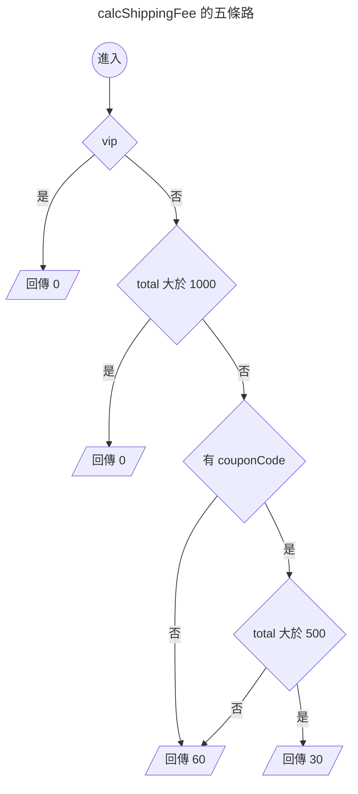

{.cover}

# AI 都幫我寫好了，還需要管複雜度嗎？( ・ิω・ิ)

大家好，我是鱈魚。%( ´ ▽ ` )ﾉ%

你朋友現在寫 code 是不是都把需求丟給 AI，十秒後交件，附測試，全綠，掃一眼就 merge。

先不管那個朋友是不是你自己。%(◐‿◑)%

總之你朋友都把需求丟給 AI，AI 都很乖，你說什麼它都照做。

第一週，它在那個函式裡加了一個 `if`。

第二週，又一個 `if`。

第三個月，打開那個函式，滾輪一路往下捲，捲到懷疑人生。%(ﾟдﾟ)%

每一次改動看起來都很合理，加起來就變成災難。

以前人工手寫不太會爛成這樣，同一個地方改到第五次，人自己就受不了了。

什麼？你說公司前人寫的祖傳程式碼都超過幾千行，早就習慣了？敬佩敬佩。%(́⊙◞౪◟⊙‵)%

其實有個 1976 年就發明出來的老指標，叫做圈複雜度（Cyclomatic Complexity）。

這篇會拿酷酷元件（[chill-component](https://chillcomponent.codlin.me/)）裡三個真實函式開刀，最後再回頭看 AI 時代還需不需要這個數字。

## 這數字到底怎麼算

一句話，程式裡的分支路徑有幾條。

名字裡的圈來自圖論，把程式流程畫成圖之後數獨立迴路有幾個。

聽起來很抽象很學術，實際上就是數分支啦。%(´,,•ω•,,)%

從 1 開始算，每遇到一個決策點就 +1：

- `if`、`else if`
- `for`、`while`、`do...while`
- `case`（每一個都算）
- `catch`
- 三元運算子 `? :`
- 邏輯運算子 `&&`、`||`、`??`
- 選擇性串連 `?.`

最多人搞錯的是 `else` 與 `default`，這兩個都不算。

看個例子。

```ts
function calcShippingFee(order: Order) { // 起手 1
  if (order.vip) { // +1 → 2
    return 0
  }
  if (order.total > 1000) { // +1 → 3
    return 0
  }
  if (order.couponCode && order.total > 500) { // +2 → 5
    return 30
  }
  return 60
}
```

5 分。畫成圖就很清楚，確實有五條走得完的路。



至於 `else`，加了也不會變。

```ts
function calcShippingFeeWithElse(order: Order) { // 起手 1
  if (order.vip) { // +1 → 2
    return 0
  }
  else { // 不算
    return 60
  }
}
```

只有 2 分。`if` 早就把路岔成兩條了，`else` 只是替其中一條取名字。%(ゝ∀・)b%

## 三十秒掃出自己專案的排行榜

ESLint 內建 `complexity` 規則，什麼都不用裝。

```js
// eslint.config.mjs
rules: {
  complexity: ['warn', { max: 10, variant: 'modified' }],
}
```

`variant` 是 ESLint 9.12 之後才有的選項，差別只在 `switch`。classic 模式每個 `case` 都 +1，一個十路 `switch` 直接 11 分起跳，可是那種扁平的對照表其實超好讀，被誤殺很冤。modified 模式把整個 `switch` 算成 1 分。

實測同一份程式碼：

| 寫法 | classic | modified |
|---|---|---|
| 三個 `if`（其中一個帶 `&&`） | 5 | 5 |
| 五個 `case` 加 `default` 的 `switch` | 6 | 2 |

不想動設定檔的話，臨時加規則跑一次也可以。

```bash
npx eslint . --rule '{"complexity":["warn",{"max":10,"variant":"modified"}]}'
```

我拿酷酷元件跑了一輪，45 個函式超標，前五名長這樣。

| 函式 | 分數 |
|---|---|
| `compileCreasePattern` | 61 |
| `createStem` | 39 |
| `createStemList` | 29 |
| `btn-attention-seeker` 的 watch | 27 |
| `updateAndRender` | 25 |

不過光看這一欄其實沒什麼鑑別度，`complexity` 最大的罩門在於它對巢狀沒感覺。

三個平行的 `if` 跟三層巢狀的 `if` 同樣都是 4 分，可是後者糾纏得多。

所以要再加上 `eslint-plugin-sonarjs` 的認知複雜度（Cognitive Complexity），它會對巢狀加權，越深扣越兇。

```js
// eslint.config.mjs
rules: {
  'complexity': ['warn', { max: 10, variant: 'modified' }],
  'sonarjs/cognitive-complexity': ['warn', 15],
}
```

兩欄一起量，接下來三個案例剛好落在三個不同的位置。

| 案例 | 圈複雜度 | 認知複雜度 | 最深巢狀 | 行數 |
|---|---|---|---|---|
| 案例一 `btn-attention-seeker` 的 watch | 27 | 5 | 2 | 28 |
| 案例二 `handleInput` | 17 | 12 | 2 | 47 |
| 案例三 `compileCreasePattern` | 61 | 135 | 5 | 326 |

一掃下去，馬上就被發現酷酷元件的程式碼我寫得有多隨便了。%(◐‿◑)%

## 案例一：27 分的 watch

[btn-attention-seeker](https://chillcomponent.codlin.me/components/btn-attention-seeker/) 是一顆很有事的按鈕，滑鼠靠近會湊過來，卡到視窗上下緣時會探個頭出來刷存在感。

它的核心是這段 watch。

```ts
watch(() => [distanceToFrame, frameBounding], () => {
  // 視窗邊界探頭
  if (isBoundary.value) {
    if (frameBounding.bottom < props.topOffset) {
      carrierPositionAnimatable?.x?.(0)
      carrierPositionAnimatable?.y?.(frameBounding.bottom * -1 + props.topOffset + frameBounding.height * 0.75)
      carrierPositionAnimatable?.rotate?.(-10)
      return
    }
    else if (frameBounding.top > (windowSize.height - props.bottomOffset)) {
      carrierPositionAnimatable?.x?.(0)
      carrierPositionAnimatable?.y?.(
        windowSize.height - frameBounding.top - frameBounding.height * 0.75 + props.bottomOffset,
      )
      carrierPositionAnimatable?.rotate?.(10)
      return
    }
  }

  if (isFollowing.value) {
    const x = frameWithMouse.elementX - frameWithMouse.elementWidth / 2
    const y = frameWithMouse.elementY - frameWithMouse.elementHeight / 2

    carrierPositionAnimatable?.x?.(x)
    carrierPositionAnimatable?.y?.(y)
    return
  }

  carrierPositionAnimatable?.x?.(0)
  carrierPositionAnimatable?.y?.(0)
  carrierPositionAnimatable?.rotate?.(0)
}, { deep: true })
```

有趣的是，這裡只有四個 `if`。第二欄更怪，認知複雜度只有 5 分。

27 對 5，代表這段程式的結構其實很扁平，分數卻高得嚇人。

那 22 分的落差是哪來的？%ლ（´口`ლ）%

我把所有 `?.` 換成直接呼叫再量一次，圈複雜度立刻剩個位數。

答案是 `carrierPositionAnimatable?.x?.()` 這種選擇性串連。

一開始我覺得指標在亂哀，想想好像也不算。%(́⊙◞౪◟⊙‵)%

`?.` 真的是分支，左邊是 `null` 就整條短路。

而這串三行的動畫呼叫，在同一個函式裡重複了四遍，所以問題點其實是多處重複。%(°ㅂ°)%

那就改善重複問題，讓每一段只負責算出目標位置，最後統一送給動畫。

```ts
interface Position { x: number; y: number; rotate: number }

const HOME_POSITION: Position = { x: 0, y: 0, rotate: 0 }

/** 探頭：視窗上下緣被遮住時，把按鈕推回可視範圍 */
function calcPeekPosition(): Position | undefined {
  if (frameBounding.bottom < props.topOffset) {
    return {
      x: 0,
      y: frameBounding.bottom * -1 + props.topOffset + frameBounding.height * 0.75,
      rotate: -10,
    }
  }

  if (frameBounding.top > windowSize.height - props.bottomOffset) {
    return {
      x: 0,
      y: windowSize.height - frameBounding.top - frameBounding.height * 0.75 + props.bottomOffset,
      rotate: 10,
    }
  }
}

/** 跟隨：滑鼠靠近時，按鈕往滑鼠方向偏移 */
function calcFollowPosition(): Position | undefined {
  if (!isFollowing.value) {
    return
  }

  return {
    x: frameWithMouse.elementX - frameWithMouse.elementWidth / 2,
    y: frameWithMouse.elementY - frameWithMouse.elementHeight / 2,
    rotate: 0,
  }
}

function updateCarrierPosition() {
  const { x, y, rotate } = calcPeekPosition() ?? calcFollowPosition() ?? HOME_POSITION

  carrierPositionAnimatable?.x?.(x)
  carrierPositionAnimatable?.y?.(y)
  carrierPositionAnimatable?.rotate?.(rotate)
}
```

重新量一次：

| 函式 | 圈複雜度 | 認知複雜度 |
|---|---|---|
| `updateCarrierPosition` | 9 | 0 |
| `calcPeekPosition` | 3 | 2 |
| `calcFollowPosition` | 2 | 1 |

程式碼變多了，可是四段重複的動畫呼叫收斂成一處，主線變成一行 `??` 串接，兩欄分數也一起掉到個位數。%( •̀ ω •́ )✧%

## 案例二：17 分的輸入法地獄

[input-decoding](https://chillcomponent.codlin.me/components/input-decoding/) 是打字時字元會亂碼跳動、最後解碼成正確文字的輸入框，看起來很駭客，實作起來要跟中文輸入法搏鬥。

它的 `handleInput` 是 17 分，分支全是邊界條件，`isComposing` 拼字中、`insertText` 一般輸入、`insertFromDrop` 拖曳、`delete` 刪除，還有拼音選字造成的 caret（游標）位置偏移。

這次兩欄很接近，圈複雜度 17，認知複雜度 12。

這 17 分是真材實料，每一條路徑都要算，沒有重複問題，每個 `if` 都對應一種真實存在的輸入行為。

所以這個案例要看的是測試。

### 這支函式到底該有幾條測試

圈複雜度還有另一個身分，走完所有線性獨立路徑要寫幾條測試，它就是幾分。

覆蓋率報告很容易忽略這件事，因為覆蓋率只算「這一行、這個分支跑過沒有」，但路徑才算「這些分支的組合走過沒有」。

17 分的函式，三、四條測試就能讓分支覆蓋率變得很好看，離 17 條獨立路徑還遠得很。

而輸入法的 bug 幾乎都藏在「拼字中又剛好按了刪除」這種組合裡。%(;´༎ຶД༎ຶ`)%

### 基線法：把分數轉換成測試清單

那實際上要怎麼寫這 17 條？

McCabe 提出圈複雜度的同一篇論文裡，也給了配套的測試設計法，叫基線法（baseline method）。做法只有兩步。

**第一步，走一條基線。** 挑最典型、最常發生的那條路徑，從函式入口一路走到結束。`handleInput` 的基線就是「沒在拼字，直接打一個英文字母」。

**第二步，回頭逐一翻轉。** 回到基線經過的第一個判斷點，只把它翻轉，其他條件全部照基線不動，走出來就是第二條路徑。接著回到第二個判斷點翻轉，得到第三條。每個判斷點各翻一次，全部翻完後就會得到圈複雜度的數值。

實際跑 `handleInput` 的前幾條長這樣。

| # | 翻的判斷點 | 情境 | 結果 |
|---|---|---|---|
| 1 | 基線 | 沒在拼字，直接打一個 `a` | 走完全程，插入字元 |
| 2 | `event` 型別守衛 | 丟一個普通 `Event` 進去 | 第一行就 return |
| 3 | `isComposing` | 注音打到一半觸發 | 第二個守衛 return |
| 4 | `caretStart !== caretEnd && isFirstComposed` | 選完字才送出 | caret 位置偏移一格 |
| 5 | `insertFromDrop` | 把文字拖進輸入框 | 走拖曳插入分支 |
| 6 | `inputType.includes('delete')` | 按 backspace | 走全部重建分支 |

每一列都對得上一個真實的使用者動作。測試清單不用憑空想，照著控制流走就會長出來。%(ゝ∀・)b%

**關鍵是一次只翻一個判斷點。**

一次翻兩個很誘人，測試數量看起來會少一半。可是那樣走出來的路徑不算新的獨立路徑，它等於前面兩條疊起來，不會多蓋到任何東西。

實務上的代價更直接。測試掛掉的時候你不知道是哪個條件出問題，還得再拆一次。%(°ㅂ°)%

### 可是有幾條翻不動

聽起來很機械，實際套到 `handleInput` 上就會卡住。

| 判斷點 | 翻得動嗎 |
|---|---|
| `event` 不是 `InputEvent` 也不是 `CompositionEvent` | 可以，丟普通 `Event` 進去 |
| `isComposing` | 可以，注音打到一半觸發 |
| `targetEl` 不是 `HTMLInputElement` | 翻不動，事件永遠來自那個 input |
| `caretStart !== caretEnd && isFirstComposed` | 可以，選字後的位置偏移 |
| `targetEl.selectionStart ?? ⋯` | 翻不動，`type="text"` 的 `selectionStart` 不會是 `null` |
| `targetEl.selectionEnd ?? ⋯` | 翻不動，同上 |
| `event.data ?? ''` | 可以，刪除事件的 `data` 本來就是 `null` |
| `'inputType' in event`（出現三次） | 翻不動，跟第一個守衛同義，是 `InputEvent` 就一定為真 |
| `insertText`、`compositionend`、`insertFromDrop`、`delete` | 可以，四種真實輸入行為 |

扣掉翻不動的，實際寫得出來的大概十一、二條。%(´・ω・`)%

這不代表指標算錯。17 是控制流上的路徑數，數學沒問題，只是其中幾條在這個元件的使用情境裡走不到，例如 `type="text"` 的 `selectionStart` 永遠有值，那兩個 `??` 就沒有另一半可以測。

所以 17 要當成上限。先照著翻，翻不動的一條一條寫下理由。

湊滿 17 條反而是危險訊號，代表有人在硬湊。%(;´༎ຶД༎ຶ`)%

而那些理由本身就是文件。哪天有人把 `type="text"` 改成 `type="email"`，`selectionStart` 就真的會變成 `null`，那兩條翻不動的路徑會立刻活過來。%(°ㅂ°)%

## 案例三：61 分的冠軍

`compileCreasePattern` 是 [transition-origami](https://chillcomponent.codlin.me/components/transition-origami/) 的摺紙圖樣編譯器，吃一組摺線定義，吐出可以拿去跑物理模擬的三角網格。

61 分，全專案冠軍。照前面的做法，先看第二欄。

認知複雜度 135，門檻的九倍，最深五層巢狀，整整 326 行，相當之可怕。

不過仔細看看內容，會發現它是一條從頭走到尾的管線，頂點吸附、逐段切割、去重、面萃取、三角化、正規化，九個階段一路做到底。

硬拆成九個函式，`vertexList`、`segmentList`、`snapEpsilon` 這些中間狀態就得全部變成參數傳來傳去。

<br>

路人：「因為是管線所以不應該拆嗎？」

鱈魚：「其實也該處理，尤其是那個五層巢狀，只是因為會動，我懶得處理。%∠( ᐛ 」∠)_%」

路人：「...(◉◞౪◟◉ )」

## AI 都幫我寫好了，還需要這個數字嗎

圈複雜度當年紅起來，很大一部分理由是人腦一次裝不下太多東西，函式太長就讀不動。

接下來直接假設最極端的情況：**程式完全交給 AI 寫，沒有人會再打開那個檔案**。

那條「人讀不動」的理由就整個消失了，這個指標剩下的價值得靠別的東西撐。

我原本有四個說法，寫下來才發現只有兩個站得住。

### 站得住的兩個

**一、圈複雜度等於獨立路徑數，也等於走完所有路徑要幾條測試。**

這是算術，跟誰寫的無關。AI 可以幫你把那 17 條寫出來，卻沒辦法讓 17 條變成 3 條。

**二、AI 判斷複雜度只能靠感覺。**

本篇三個案例我都先請 AI 算過，它每次都算錯。案例一的 27 分有 22 分來自 `?.`，AI 掃過去沒感覺；案例三它猜認知複雜度偏低，實測 135。

跑一行指令就有答案的事，不用花 token 請它猜。%(ゝ∀・)b%

### 剩下兩個只是我猜的

**猜測 A：複雜度越高，AI 改壞的機率越高。** 內部糾纏的狀態越多，改 A 分支弄壞 B 分支的機率應該越高。動 5 分的函式最多影響五條路，動 135 分的怪物就要先買一箱乖乖。%(´,,•ω•,,)%

**猜測 B：AI 面對新需求只會再塞一個 `if`。** 人改到第五次會想不開整個重寫，AI 不會，它只挑最小的 diff。每一步都是漂亮的局部最佳解，一路走進全域的爛攤子。

兩個聽起來都很合理。

## 那就來測

路人：「聽起來是很順，可是你有證據嗎？%(´・ω・`)%」

鱈魚：「當然有，我用感覺量的。%( ・ิω・ิ)%」

路人：「...那你不就跟你剛剛罵的 AI 一樣。%(◉◞౪◟◉ )%」

### 控制變因才是麻煩的地方

隨手找一支 61 分的函式跟一支 5 分的函式各叫 AI 改一次，測不出東西。61 分那支通常也比較長，業務邏輯本來就比較難，改壞了分不清該怪複雜度還是怪題目。

所以要做同義配對。同一個功能寫兩份，行為完全一致，只有形狀不同。

- 高分版：巢狀 `if`，每個分支各抄一份加價邏輯
- 低分版：查表、早退、拆成小函式

「行為完全一致」不能用嘴巴保證，要窮舉。把輸入的每個欄位排列組合展開，兩版跑同一組輸入比對輸出，四題合計 9090 組全部相同。

| 題目 | 高分版 圈 / 認知 / 巢狀 | 低分版 圈 / 認知 / 巢狀 |
|---|---|---|
| 運費計算 | 17 / 37 / 3 | 5 / 2 / 1 |
| 快捷鍵解析 | 33 / 97 / 5 | 11 / 18 / 2 |
| 權限判定 | 14 / 49 / 7 | 7 / 7 / 1 |
| 表單驗證 | 20 / 37 / 2 | 4 / 3 / 1 |

受試者是獨立的 Claude Sonnet，一人一份程式碼，看不到彼此，也不知道自己在做實驗。資料夾只有 `t01` 這種編號，路徑裡沒有任何字提到複雜度或版本。

判定方式先講好，免得我事後找理由：兩組沒有差距，就是複雜度對 AI 不重要，我照實寫。

### 單次改動：六輪都測不出差別

一次只動一個變因，每一次都跟標準答案窮舉比對，一個試驗要跑數百到數千組輸入，全對才算通過。

| 輪次 | 條件 | 高分版 | 低分版 |
|---|---|---|---|
| 一 | 新增一種情境，可以執行程式碼 | 16/16 | 16/16 |
| 二 | 同上，禁止執行 | 16/16 | 16/16 |
| 三 | 改既有規則，要同步改多處 | 16/16 | 16/16 |
| 四 | 題目改寫成陌生領域 | 8/8 | 8/8 |
| 五 | 量 token 成本 | 12/12 | 18/18 |
| 六 | 案例三的真程式碼 | 6/6 | 6/6 |

**154 次試驗，一次都沒有失手。**

猜測 A 死得很乾脆。74 次全對這種結果，真實失敗率若有 5%，發生機率不到 3%，所以差距就算存在也小於 4%。

後面幾輪本來是為了堵漏洞，順帶回答了別的問題。

**第四輪，題型記憶不是答案。** 我把快捷鍵那題整個換皮，`event` 變 `signal`、`'copy'` 變 `'clone'`、模式 `edit / view / readonly` 變 `active / idle / locked`。只換識別字與字串，控制流一個字沒動，忠實度用「改動筆數要跟第三輪完全相同」檢核。換完照樣全對。

**第五輪，成本沒站在複雜度這邊。** token 用量跟著字元數走。表單驗證的低分版字元多 226 個，就比高分版貴 903 個 token。工具呼叫次數也是高分版比較少，因為拆解過的版本要動的地方比較多。

**第六輪，真怪物也改得動。** 案例三那支 425 行、61 分、五層巢狀的 `compileCreasePattern` 搬上場，配對版本我自己重構，壓平巢狀但算術順序一個字沒動。差分測試 125 組輸入逐位元相同，兩版都 6/6。

### 文獻怎麼說

結果乾淨到我自己都不信，去翻了論文。

支持的有 ICSE 2026 的《The Hidden Cost of Readability》，十個模型比對「有排版」與「拔掉排版」的程式碼，正確率幾乎不動。還有《Beyond Accuracy》，人類定義的複雜度指標對 LLM 成功率的預測力，AUROC 只有 0.63。

反方更兇。牛津那篇《Are LLMs Robust in Understanding Code Against Semantics-Preserving Mutations?》跟我的設計幾乎同型，結論是控制流變換破壞力最大，最高掉 70 分。

差別可能在任務型態。那篇測的是「預測這段程式跑完會輸出什麼」，要在腦中模擬執行；我測的是「照需求改對」，可以靠模式對應。

### 連續改二十次：分家了

前面每一輪都從乾淨起點改一次。可是完全交給 AI 的專案不長這樣，它是一條需求接一條，每次都蓋在上一次的產出上。

所以第七輪換成序列實驗。四條軌跡，高複雜度起點兩條、低複雜度起點兩條，連續二十個需求，**中途錯了不修、不重來、不提示**。每一步跟 25920 組窮舉輸入比對。

| 軌跡 | 認知複雜度 | 失誤步 |
|---|---|---|
| highA | 37 → 94 | 無 |
| **highB** | 37 → 90 | **第 9 步起全錯** |
| lowA | 2 → 14 | 無 |
| lowB | 2 → 16 | 無 |

第 9 步要新增海外區域。那個 AI 把 `overseas` 併進既有的 `east` 與 `island` 分支，因為那條分支剛好也是「不適用滿額免運」。

可是那條分支裡還放著第 5 步加進去的規則：易碎加價 50。於是海外訂單的易碎加價變成 50，需求寫的是 30。

一個字都沒打錯，只是塞錯地方。

之後十二步全部蓋在這個錯誤上，正確率在 80% 到 95% 之間游移，再也沒回到 100%。

機制很具體：**分支結構會誘導 AI 把不相干的規則綁在一起**。海外跟東部只有「不適用免運」這一點相同，卻因為程式碼把它們放進同一個 `if`，連易碎加價都一起繼承了。低複雜度版沒有這個機會，免運名單是一個陣列，易碎金額是另一張查表。

鱈魚：「看吧，高複雜度果然會出事！%( •̀ ω •́ )✧%」

路人：「兩條裡壞一條，你什麼都證明不了。%(´_ゝ`)%」

路人對。1/2 對上 0/2，換成任何檢定都不顯著，這只能算一個有具體機制的個案。

### 沒有人會發現

這是整段實驗最值得停下來看的地方。

highB 從第 9 步開始就在算錯運費。它沒有丟例外、沒有讓程式當掉、沒有任何測試變紅，因為那個專案本來就沒有測試。

它只是安靜地算錯，然後被當成正確的基礎，繼續往上蓋十二層。

沒有人讀程式碼的話，這件事要靠什麼發現？剩下的只有兩種東西：跑得起來的測試，還有量得出來的指標。

### 那把分數拿去寫測試呢

測試既然這麼關鍵，那把圈複雜度餵給 AI，它寫的測試會不會比較好？

第八輪測這個。三組提示詞、同一支函式，比較產出的測試能抓到多少 bug。

- 隨意組：「請幫這支函式補測試。」
- 覆蓋率組：「請盡量寫完整，目標是每個分支都覆蓋到。」
- 基線法組：「這支函式的圈複雜度是 N，請用基線法列出 N 條獨立路徑。」

覆蓋率組是關鍵對照。少了它，就分不出「圈複雜度有用」與「只是要求比較嚴格」。

依變數用突變測試。做法是把原始碼的運算子、常數、布林值逐一改掉，產生一批帶 bug 的版本，再看那份測試抓得到幾個。三支函式合計 171 個有效突變體，等價的都濾掉了。

| 組別 | 平均案例數 | 平均殺傷率 |
|---|---|---|
| 隨意 | 22.4 | **98.9%** |
| 要求分支全覆蓋 | 20.7 | 97.5% |
| 給圈複雜度＋基線法 | 22.8 | **95.3%** |

**給了分數反而最差**，而且三題都是同一個方向。

看存活的突變體就知道原因，集中在 `>` 改成 `>=`、數字加一這種邊界值。基線法只翻轉每個判斷點的真假，保證分支覆蓋，不保證邊界覆蓋。

還有一個副作用。基線法組的案例數被分數綁死，快捷鍵那題三次都剛好 32 條，表單驗證三次都剛好 20 條。隨意組則是 12 到 34 條自由發揮。

所以案例二那套基線法，自己拿來列清單沒問題，餵給 AI 當指令反而扣分。

順帶一提，593 條案例的預期值全部正確，沒有一條算錯。所謂「AI 會隨便寫三、四條快樂路徑就收工」，至少在這個規模下沒發生。

### 這個實驗沒有回答的事

- 累積實驗每個起點只有兩條軌跡，要下結論得每個起點跑十條以上
- 二十條需求都是「再加一條規則」。真實專案還會刪規則、改介面、動到別的檔案
- 七題裡只有一題是真實演化出來的程式碼
- 需求是我寫的，寫得清清楚楚。現實中的需求常常很模糊
- 單一檔案，沒有跨檔案連動
- 受試者只有 Claude Sonnet 一種，temperature 也沒有固定
- 第七輪真正出事的是「兩個不相干的規則被塞進同一個 `if`」，這件事沒有任何現成指標量得出來，分數只是剛好跟它相關
- 第八輪每組只有三次，而且運費那題三組都殺光了突變體，天花板效應吃掉一題的鑑別度
- 第八輪的「隨意組」其實不夠隨意。文獻裡真正的隨手提示，突變殺傷率通常落在 40% 到 55%，我的隨意組拿到 98.9%，代表那句話背後還是給了不少上下文，三組的對比效度會被稀釋
- 第八輪的基線法組同時給了「結構化方法」與「一個具體數字 N」，這兩個變因我沒有分開。LLM 的錨定效應研究顯示給數字會讓輸出收斂，所以到底是方法有問題還是數字有問題，這個實驗答不出來

### 分數沒有預測到那次失敗

還有一個細節必須講，它直接限縮了結論。

第七輪壞掉的是 highB。可是出事前一步，highB 的認知複雜度 46、巢狀 2 層，沒壞的 highA 是 49、3 層。

| 步 | highA 圈 / 認知 / 巢狀 | highB | highB 狀態 |
|---|---|---|---|
| 8 | 26 / 49 / 3 | 29 / **46** / **2** | 好的 |
| 9 | 29 / 52 / 3 | 32 / 48 / 2 | **壞掉** |

**分數比較低的那條壞了。**

所以複雜度分得出「高分這一類比較容易出事」，卻分不出「這兩條裡哪一條會出事」。

這件事文獻講過。《Not All Code Is Equal》直接把複雜度定位成聚合層級的預測因子，個案層級不可靠；1999 年 Fenton 與 Neil 批判缺陷預測模型的經典，講的也是同一件事。

### 僅存的用途：當篩選器，不當預測器

八輪跑完，這個數字剩下的用途只有一種。它可以回答「這段程式碼要不要加派更嚴格的檢查」，回答不了「這次改動對不對」。

| 問題 | 答案 |
|---|---|
| 複雜度會提高 AI 改壞的機率 | 群體層級看得到，個案層級預測不了 |
| 複雜度會讓 AI 比較花錢 | 沒有，成本跟著字元數走 |
| AI 只會往上加，不會回頭整理 | 成立 |
| 圈複雜度可以指導 AI 寫測試 | **反效果，比不給還差** |

還撐得住的用法只有三個：

- 分數高的地方多跑一輪差分測試，多留一份對照
- 看趨勢不看絕對值。二十步下來 37 漲到 94，這個斜率有訊號；今天是 61 分，沒有
- 需求剛好逼 AI 動到那段邏輯時，順便叫它重構。文獻實測 AI 不主動重構的識別率只有 15.6%，明確要求就衝到 86.7%

### 那什麼才真的有用

沒有人讀程式碼的話，守得住的東西只剩下可以執行的驗證。照證據強度排。

**一、突變測試。** Google 在 76 萬次程式碼變更上做過，產生 1700 萬個突變體，約七成的真實 bug 有對應的突變體會示警。這是目前唯一有超大規模第一手驗證的品質訊號，而且它量的是測試本身夠不夠力，正好補上「覆蓋率亮綠燈不代表有用」那個洞。

**二、差分或蛻變測試。** 這是唯一對「安靜算錯」給出量化偵測率的手法，蛻變提示測試抓到 75% 的錯誤程式，誤報率 8.6%。

我自己的實驗就是活例子。highB 在第 9 步壞掉，沒噴例外、沒有測試變紅。當場抓到它的不是複雜度分數，是那支拿 25920 組輸入去跟標準答案比對的評分腳本，那就是一個差分 oracle。

**三、把隱性規則寫成機器檢查得到的形式。** 有篇叫 SilentProbe 的研究測了 AI agent 面對靜默失敗的反應：agent 自己只有 12% 的機率發現出事，41% 會回報成功，還有 12% 會捏造資料頂替。可是只要把約束從散文改寫成 schema 層級的列舉，陷阱任務的失敗率從 88/88 直接降到 0/89。

能寫成規格的就不要寫在註解裡。

回到第七輪那個 bug，真正抓得到它的是一條不變量：「新增海外區域之後，其他區域的易碎加價不准變」。這種契約沒有任何靜態指標量得出來。

### 沒有為 AI 設計的指標

我原本以為會翻到一批新指標，結果是還沒有。

搜尋 2024 年之後針對 LLM 設計的程式碼結構指標，找到的東西不是把圈複雜度重新包裝（函式長度、重複率、註解密度的加權組合），就是名字看起來對題但在講別的，有篇叫 Blast Radius 的論文其實在談 agent 的上下文記憶管理。

我踩到的病根倒是有名字。第七輪那個 bug 是「一個 `if` 綁了兩條不相干的規則」，學術上叫 concern-based cohesion 差，或者叫 tangling。2011 年有人提出 LCC 指標量這件事，實證比 LCOM 更能預測變更傾向，可是它停在類別層級，沒有人做到「函式內單一分支」這個粒度，工具支援也幾乎是零。

ESLint、SonarQube 這些主流工具完全沒有涵蓋這個維度。所以這是一個開放問題。%(´_ゝ`)%

## 總結 🐟

- 圈複雜度就是分支路徑數，從 1 起算，每個判斷 +1。
- 一定要~~配溫開水~~...配認知複雜度一起看。圈複雜度遠高於認知複雜度，代表分數是短路運算子堆出來的，打開來通常會看到重複，消除重複就好；反過來代表巢狀太深，該壓平的是縮排。
- 這個數字同時告訴你走完所有獨立路徑要幾條測試，覆蓋率亮綠燈不代表路徑走完了。
- 想把分數變成測試清單就用基線法，先走一條主線，再回頭讓每個判斷點各翻一次。這招自己列清單好用，餵給 AI 當指令反而扣分，實測突變殺傷率從 98.9% 掉到 95.3%。
- AI 判斷複雜度也只能靠感覺，而且沒辦法驗證自己準不準。跑一行指令就有答案的事，不用花 token 請它猜。
- 單次改動實測 154 次，複雜度不影響 AI 改對的機率，也不影響 token 成本，這兩條我原本都猜錯了。連 425 行、135 分的真怪物都改得動。
- 把時間拉長就不一樣了。連續改二十次的四條軌跡，唯一壞掉的那條是高複雜度起點，第 9 步把海外區域塞進東部那個 `if`，順手繼承了不該繼承的易碎加價，接下來十二步全部蓋在錯的基礎上，正確率再也沒回到 100%。
- 可是分數沒有預測到那一次。出事前一步，壞掉的那條認知複雜度反而比沒壞的低。這個數字分得出「高分這一類」，分不出「哪一個個案」，只能當篩選器，不能當預測器。
- 真正抓到那個 bug 的是差分測試，不是分數。沒有人讀程式碼的時候，守得住的只剩下可以執行的驗證：突變測試量測試夠不夠力，差分或蛻變測試抓安靜算錯，能寫成 schema 的約束就不要留在註解裡。

所以量了這兩欄之後，程式就永遠乾淨、AI 就再也不會亂加 `if` 了嗎？

當然不會，它還是會加。分數頂多告訴你該把哪一段盯緊一點，真正接住它的是那些跑得起來的測試。%(ゝ∀・)b%

有錯誤還請多多指教，感謝您讀到這裡，如果您覺得有收穫，歡迎分享出去。
