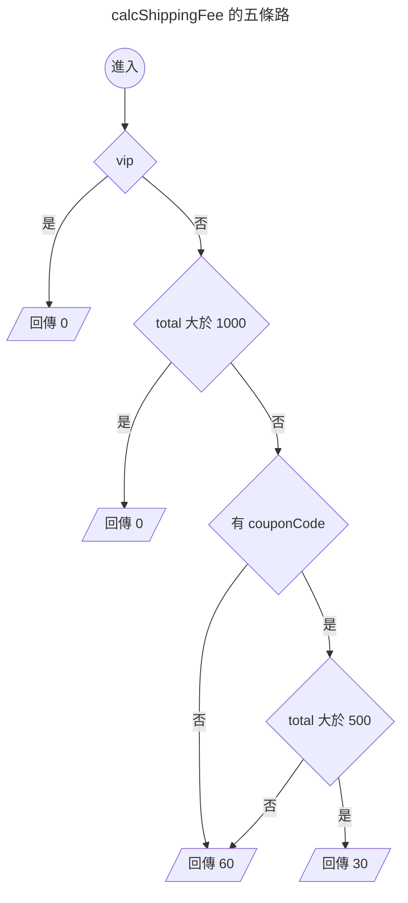

{.cover}

# AI 都幫我寫好了，還需要管複雜度嗎？( ・ิω・ิ)

大家好，我是鱈魚。%( ´ ▽ ` )ﾉ%

你朋友現在寫 code 是不是都把需求丟給 AI，十秒後交件，附測試，全綠，掃一眼就 merge。

先不管那個朋友是不是你自己。%(◐‿◑)%

總之你朋友都把需求丟給 AI，不過 AI 有沒有可能偷懶，只會疊，不會整理，越改越亂？

什麼？你說公司前人寫的祖傳程式碼都超過幾千行，早就習慣了？敬佩敬佩。%(́⊙◞౪◟⊙‵)%

有沒有什麼客觀指標，可以用來表示程式碼複雜度？

搜尋了一下，發現有個 1976 年就發明出來的老指標，叫做圈複雜度（Cyclomatic Complexity）。

這篇拿酷酷元件（[chill-component](https://chillcomponent.codlin.me/)）裡一支真實函式開刀，最後再回頭看 AI 時代還需不需要這個數字。

## 數字怎麼來

圈複雜度代表程式裡有幾條分支路徑。

名字裡的圈來自圖論，把程式流程畫成圖之後數獨立迴路有幾個。

聽起來很抽象很學術，實際上就是數分支啦。%(´,,•ω•,,)%

從 1 開始算，每遇到一個決策點就 +1：

- `if`、`else if`
- `for`、`while`、`do...while`
- `case`（每一個都算）
- `catch`
- 三元運算子 `? :`
- 邏輯運算子 `&&`、`||`、`??`
- 選擇性串連 `?.`

最多人搞錯 `else` 與 `default`，這兩個都不算。

看個例子。

```ts
function calcShippingFee(order: Order) { // 起手 1
  if (order.vip) { // +1 → 2
    return 0
  }
  if (order.total > 1000) { // +1 → 3
    return 0
  }
  if (order.couponCode && order.total > 500) { // +2 → 5
    return 30
  }
  return 60
}
```

5 分。畫成圖就很清楚，確實有五條走得完的路。



至於 `else`，加了也不會變。

```ts
function calcShippingFeeWithElse(order: Order) { // 起手 1
  if (order.vip) { // +1 → 2
    return 0
  }
  else { // 不算
    return 60
  }
}
```

只有 2 分。`if` 早就把路岔成兩條了，`else` 只是替其中一條取名字。%(ゝ∀・)b%

## 三十秒掃出自己專案的排行榜

ESLint 內建 `complexity` 規則，什麼都不用裝。

```js
// eslint.config.mjs
rules: {
  complexity: ['warn', { max: 10, variant: 'modified' }],
}
```

`variant` 是 ESLint 9.12 之後才有的選項，差別只在 `switch`。classic 模式每個 `case` 都 +1，一個十路 `switch` 直接 11 分起跳，可是那種扁平的對照表其實超好讀，被誤殺很冤。modified 模式把整個 `switch` 算成 1 分。

實測同一份程式碼：

| 寫法 | classic | modified |
|---|---|---|
| 三個 `if`（其中一個帶 `&&`） | 5 | 5 |
| 五個 `case` 加 `default` 的 `switch` | 6 | 2 |

不想動設定檔的話，臨時加規則跑一次也可以。

```bash
npx eslint . --rule '{"complexity":["warn",{"max":10,"variant":"modified"}]}'
```

規則設 warn 不設 error，讓它當雷達用，只把超標的函式標出來。設成 error 就變成閘門，超標直接擋下 CI。

我拿酷酷元件跑了一輪，45 個函式超標，前五名長這樣。

| 函式 | 分數 |
|---|---|
| `compileCreasePattern` | 61 |
| `createStem` | 39 |
| `createStemList` | 29 |
| `btn-attention-seeker` 的 watch | 27 |
| `updateAndRender` | 25 |

一掃下去，酷酷元件的程式碼我寫得有多隨便，馬上就露餡了。%(◐‿◑)%

不過光看這一欄其實沒什麼鑑別度，`complexity` 最大的罩門在於它對巢狀沒感覺。

~~不是因為他腳麻~~，是因為深度要交給 `cognitive-complexity`。%(´・ω・`)%

三個平行的 `if` 跟三層巢狀的 `if` 同樣都是 4 分，可是後者糾纏得多。

加上 `eslint-plugin-sonarjs`，計算認知複雜度（Cognitive Complexity），它會對巢狀加權，越深加越重。

```js
// eslint.config.mjs
rules: {
  'complexity': ['warn', { max: 10, variant: 'modified' }],
  'sonarjs/cognitive-complexity': ['warn', 15],
}
```

兩欄一起量，就拿排行榜第四名那段 watch 開刀，圈複雜度 27、認知複雜度 5、最深巢狀 2、只有 28 行。

## 案例：27 分的 watch

[btn-attention-seeker](https://chillcomponent.codlin.me/components/btn-attention-seeker/) 是一顆很有事的按鈕，滑鼠靠近會湊過來，卡到視窗上下緣時會探個頭出來刷存在感。

它的核心是這段 watch。

```ts
watch(() => [distanceToFrame, frameBounding], () => {
  // 視窗邊界探頭
  if (isBoundary.value) {
    if (frameBounding.bottom < props.topOffset) {
      carrierPositionAnimatable?.x?.(0)
      carrierPositionAnimatable?.y?.(frameBounding.bottom * -1 + props.topOffset + frameBounding.height * 0.75)
      carrierPositionAnimatable?.rotate?.(-10)
      return
    }
    else if (frameBounding.top > (windowSize.height - props.bottomOffset)) {
      carrierPositionAnimatable?.x?.(0)
      carrierPositionAnimatable?.y?.(
        windowSize.height - frameBounding.top - frameBounding.height * 0.75 + props.bottomOffset,
      )
      carrierPositionAnimatable?.rotate?.(10)
      return
    }
  }

  if (isFollowing.value) {
    const x = frameWithMouse.elementX - frameWithMouse.elementWidth / 2
    const y = frameWithMouse.elementY - frameWithMouse.elementHeight / 2

    carrierPositionAnimatable?.x?.(x)
    carrierPositionAnimatable?.y?.(y)
    return
  }

  carrierPositionAnimatable?.x?.(0)
  carrierPositionAnimatable?.y?.(0)
  carrierPositionAnimatable?.rotate?.(0)
}, { deep: true })
```

可是這裡只有四個 `if`。認知複雜度更怪，只有 5 分。

27 對 5，代表這段程式的結構其實很扁平，分數卻高得嚇人。

那 22 分的落差是哪來的？%ლ（´口`ლ）%

我把所有 `?.` 換成直接呼叫再量一次，圈複雜度立刻剩個位數。

答案是 `carrierPositionAnimatable?.x?.()` 這種選擇性串連。

一開始我覺得指標在亂哀，想想好像也不算。%(́⊙◞౪◟⊙‵)%

`?.` 真的是分支，左邊是 `null` 就整條短路。

而這串三行的動畫呼叫，在同一個函式裡重複了四遍，所以問題點其實是多處重複。%(°ㅂ°)%

那就改善重複問題，讓每一段只負責算出目標位置，最後統一送給動畫。

```ts
interface Position { x: number; y: number; rotate: number }

const HOME_POSITION: Position = { x: 0, y: 0, rotate: 0 }

/** 探頭：視窗上下緣被遮住時，把按鈕推回可視範圍 */
function calcPeekPosition(): Position | undefined {
  if (frameBounding.bottom < props.topOffset) {
    return {
      x: 0,
      y: frameBounding.bottom * -1 + props.topOffset + frameBounding.height * 0.75,
      rotate: -10,
    }
  }

  if (frameBounding.top > windowSize.height - props.bottomOffset) {
    return {
      x: 0,
      y: windowSize.height - frameBounding.top - frameBounding.height * 0.75 + props.bottomOffset,
      rotate: 10,
    }
  }
}

/** 跟隨：滑鼠靠近時，按鈕往滑鼠方向偏移 */
function calcFollowPosition(): Position | undefined {
  if (!isFollowing.value) {
    return
  }

  return {
    x: frameWithMouse.elementX - frameWithMouse.elementWidth / 2,
    y: frameWithMouse.elementY - frameWithMouse.elementHeight / 2,
    rotate: 0,
  }
}

function updateCarrierPosition() {
  const { x, y, rotate } = calcPeekPosition() ?? calcFollowPosition() ?? HOME_POSITION

  carrierPositionAnimatable?.x?.(x)
  carrierPositionAnimatable?.y?.(y)
  carrierPositionAnimatable?.rotate?.(rotate)
}
```

重新量一次：

| 函式 | 圈複雜度 | 認知複雜度 |
|---|---|---|
| `updateCarrierPosition` | 9 | 0 |
| `calcPeekPosition` | 3 | 2 |
| `calcFollowPosition` | 2 | 1 |

程式碼變多了，可是四段重複的動畫呼叫收斂成一處，主線變成一行 `??` 串接，兩欄分數也一起掉到個位數。%( •̀ ω •́ )✧%

## AI 都幫我寫好了，還需要這個數字嗎

當初發明圈複雜度，很大一部分理由是人腦一次裝不下太多東西。接下來直接假設最極端的情況，**程式完全交給 AI 寫，沒有人會再打開那個檔案**。「人讀不動」這條理由不再成立，還有其他理由嗎？%( ・ิω・ิ)%

把問題丟給 AI，它講得頭頭是道，複雜度越高越容易改壞別的分支、每次只塞一個 `if` 最後會疊成爛攤子。AI 最擅長瞎掰道理，還是實際實驗看看。%ԅ( ˘ω˘ԅ)%

### 十二個專案，跑二十週

題目是完整的訂單伺服器，NestJS 加 SQLite。12 個專案隨機分成三組，CLAUDE.md 是唯一變因。最小改動派不用任何指標，只做需求要求的事；自律派也不用指標，每次做完要把整份 src 整理到自己滿意；指標派設圈複雜度 10、認知複雜度 15 當門檻，超標 CI 就紅，不准調高也不准略過。

每週開一個全新的 Claude Sonnet 5（2026 年 9 月透過 Claude Code 啟動），只給它專案資料夾、CLAUDE.md 與當週需求，上週的測試我也收走，做完跑 `npm run ci` 就結束，錯了不修也不提示。

關鍵機制叫**全域慣例**。前六週各立一條「之後新增的每一個 X 都適用」的慣例，像是寫入要留稽核紀錄、刪除一律軟刪除、有狀態的資源要有歷程路由。第 7 週起不斷加新資源，需求文件**一次都不再提起這些慣例**。CLAUDE.md 只提醒「有這種全域規則，之後不會再講」，沒有列出是哪幾條，AI 得自己從既有程式碼找出來。

評分不靠人工計算。另外維護一份參考伺服器當標準答案，每週產生 400 條固定種子的請求序列，逐個呼叫比對狀態碼與回應內容，二十週合計 96000 條。

### 結果：錯了，可是錯在別的地方 %(́⊙◞౪◟⊙‵)%

前四週三組全對，第 5 週開始失誤，第 6 週起 12 個專案週週都有失誤。扣最多分的全是新資源缺少的歷程路由與 `includeDeleted`，三組扣分的地方幾乎一樣；每週明寫在需求裡的路由、欄位、錯誤碼，三組幾乎全做對，240 次交件裡沒有一次把上週做對的東西改壞。

**這些洞沒有一個跟複雜度有關。** 全是加新資源時忘了接上舊慣例，函式太糾纏所以改壞的那一種，二十週一次都沒發生，門檻壓到 5 也擋不掉。%( ˙꒳​˙)%

漏與不漏的規律很清楚。稽核做成守衛、重播檢查做成攔截器，這兩種都是每個請求進來會自動經過的一層，不用每條路由各自呼叫；分頁做成共用函式。新路由都自動套用這幾條，二十週零錯誤。反過來，歷程路由、`includeDeleted` 這種要在每個新資源各接一次線的，三組全滅。會不會漏，取決於慣例能不能做成機制，跟函式多複雜無關。

自律派的準則要求它每週重讀整份 src，三組裡就屬它最接近「回頭檢查」，漏掉的東西照樣跟另外兩組一模一樣。連每週把程式碼從頭讀一遍都救不回來，靠複雜度門檻更不可能。%(´・ω・`)%

### 那門檻到底有沒有用？還是測不到

前八週表面上指標派贏了，不符數只有最小改動派的 0.61 倍。可是三組漏掉同樣五個洞，每個專案的不符總數只有 786 或 277 兩種值，差別只在有沒有多漏其中一個。0.61 其實只是「多漏的專案三個對一個對一個」，四個樣本跟擲硬幣沒兩樣。%(´・ω・`)%

更根本的問題是**門檻幾乎沒有東西可擋**，沒設門檻的兩組八週合計 64 次交件只有 11 次寫出超標函式，指標派幾乎沒有需要重構的時候。前八週的比值講不了什麼。

後半段就不一樣了。程式碼長到五千行之後，最小改動派 80 次交件裡超標 46 次、自律派 45 次，指標派 0 次，它的 CI 二十週沒紅過，門檻對它一直是事前的約束，不曾當過事後的閘門。指標派的圈複雜度全程停在 9，最小改動派最高衝到 19、認知複雜度 29。形狀差到這種程度，正確率呢？

| 週次 | 最小改動派 | 自律派 | 指標派 | 指標派對最小改動派 |
|---|---|---|---|---|
| 第 1 到 8 週 | 2635 | 1729 | 1617 | 0.61 |
| 第 9 到 20 週 | 14563 | 13384 | 13017 | 0.89 |

另外兩組天天超標之後，比值反而從 0.61 走到 0.89，往「沒有差別」的方向跑。而且後半段剩下的差距也跟門檻無關。到第 20 週，每個專案不符的序列有八成是前幾週漏掉的洞照常扣分，剩下的差距集中在四個專案的兩個洞，都跟慣例無關，最小改動派有兩個專案忘了替商品的版本號加一，指標派有兩個專案算錯訂單狀態。只算漏掉慣例造成的不符，後半段指標派對最小改動派是 0.97。%(´・ω・`)%

門檻管得住最大值，管不住總量。指標派的函式數比最小改動派多兩成二、行數多 9%，圈複雜度總和 976.5 看起來也是三組最高，可是每個函式起手就有 1 分，扣掉起手分後三組是最小改動派 459.5、自律派 425、指標派 446.5，幾乎一樣。門檻把大函式切小，分支總量沒有變少，只是攤到更多函式。成本三組一樣，指標派的總 token 只比最小改動派多 2%，最貴的反而是每週重讀整份 src 的自律派。而自律派的圈複雜度也只壓到 13.5，離門檻的 10 還很遠，叫 AI 自己判斷，專案一大就不管用了。%(›´ω`‹ )%

### 讀結論前先打折

這個實驗有幾個地方要先講清楚。%(´・ω・`)%

- **沒有測「把慣例寫進 CLAUDE.md」這一組。** 現實裡最便宜的做法就是列在 CLAUDE.md，這裡刻意不列才逼得出遺漏，所以「AI 會漏舊慣例」只在沒人把慣例寫下來的前提下成立。
- **複雜度最高只到 38。** 這次最小改動派二十週最高只到圈複雜度 19、認知 29，NestJS 的 controller、service、DTO 分層本身就是一道隱性門檻。前幾批純函式的題目有爬到 38，同樣零錯誤。前面那支 61 分的函式從沒出現過，所以「複雜度不影響 AI 正確率」只在 38 分以下有資料。
- **只跑到第 20 週。** 原本設計裡最可能讓「函式太糾纏所以改壞」發生的，是第 24、26 週那種回頭改舊行為的需求，這次沒跑到，「沒有一次改壞上週做對的東西」這句話的份量要跟著打折。
- **第 9 到 20 週是看過前八週結果才決定延長的。** 那一段只能當觀察，不能拿來下定論。
- **兩次環境洩漏。** 第 1 週專案資料夾放在實驗的 git repo 裡，`git show` 讀得到參考伺服器；第 17 週有一位受試者用 grep 看到需求與參考的檔案路徑。兩位都自述沒有進一步查看，細節都在報告裡。

完整設計與每週資料都在[實驗報告](https://github.com/Codfisher/cod-aquarium/blob/main/docs/cyclomatic-complexity-in-the-ai-era.md)。

## 別人的研究怎麼說

我的實驗有三個發現，逐一去翻論文對照。%(´・ω・`)%

**發現一，有沒有門檻，AI 寫錯的機率量不出差別。** 論文跟這個一致。[Pan 等人](https://arxiv.org/abs/2508.13666)（ICSE 2026）把程式碼的縮排、空白、換行全部拔掉再餵給十個模型，答對率最多只掉 4.2%，模型不太在意程式長什麼樣子。[Xie 等人](https://arxiv.org/abs/2602.07882)（ICML 2026）直接檢驗圈複雜度這類傳統指標能不能預測 LLM 覺得一段程式難不難，結論是沒有一致的關聯。[Ashrafi](https://arxiv.org/abs/2606.00308) 讓六種架構的 AI 代理人寫同一批題目，寫出來的複雜度差了 50% 到 130%，答對率卻沒差。三篇的結論一樣，圈複雜度只能反映人讀起來多累，跟 AI 會不會寫錯無關。

**發現二，明寫的需求不會錯，不再重述的舊慣例會穩定遺漏。** 這一點文獻講得比我更清楚。[Codified Context](https://arxiv.org/abs/2602.20478) 直接指出 AI 代理人沒有跨場次的記憶，每一場都從零開始，忘記專案慣例、重犯已知錯誤。[20574 場真實開發場次的分析](https://arxiv.org/abs/2605.29442)發現 41% 的回合使用者得回頭糾正它，而九成以上的問題要等到人明講才解得掉。[RoadmapBench](https://arxiv.org/abs/2605.15846) 用真實的版本升級當題目，中位數要改 51 個檔案 3700 行，Claude Opus 4.7 只解得掉 39.1%，常見的失敗是完成一部分目標之後卡在整合。我這個實驗把同一件事做得更乾淨，慣例都寫在需求裡、AI 也讀過，隔幾週新資源出現時照樣漏掉。

**發現三，沒有門檻，複雜度就會往上跑。** 最小改動派爬到 16，自律派 13.5，指標派二十週都停在 9。2026 年的 [SlopCodeBench](https://arxiv.org/abs/2603.24755) 跟這個實驗最像，讓 15 個 AI 代理人在 196 個檢查點反覆擴充自己的程式碼，判定結構劣化的門檻剛好也是圈複雜度 10。沒有任何指引時，77% 的專案越跑越劣化；加一段品質指引，劣化少了 57.6%，成本只多 12.1%。劣化歸劣化，答對率沒有跟著掉，這一半跟我「形狀變了、正確率沒變」的結果一樣。另一半我沒複現。那段品質指引在我這裡就是自律派的準則，可是專案長到五千行之後，自律派的複雜度壓不到門檻以內，八十次交件裡照樣超標 45 次。

| 我的發現 | 論文 | 對照 |
|---|---|---|
| 有沒有門檻，正確率量不出差別 | 傳統複雜度指標與 LLM 表現沒有一致關聯 | 一致 |
| 明寫的需求不會錯 | 九成以上的問題要人明講才解得掉 | 一致 |
| 不再重述的舊慣例會漏掉 | 代理人沒有跨場次記憶，忘記專案慣例 | 一致 |
| 一段文字指引就能壓住劣化 | 77% 專案劣化，一段指引降 57.6% | 我沒複現，專案一大就失效 |

回到標題，AI 都幫我寫好了，還需要管複雜度嗎？拆成三個問題才答得準。

- **能不能讓 AI 少寫錯？量不到。** 我的實驗跟論文都量不到關聯。AI 只會在加新功能時漏掉幾週前立的規矩，這種錯跟函式多複雜無關，另外兩組天天超標之後差距反而更小。要擋這種錯，得把規矩做成攔截器，或者一開始就寫進 CLAUDE.md，門檻幫不上忙。
- **能不能防止程式越疊越亂？能，管得住最大值。** 設門檻那組二十週沒有一次超標，另外兩組後半段週週超標。只是分支總量沒有變少，程式碼反而更多。
- **人還讀不讀得懂？這一條完全沒變。** 圈複雜度本來就是為人設計的，論文沒有推翻這一點，前面幾節那套判斷照用。

## 總結 🐟

AI 都幫我寫好了，還需要管複雜度嗎？結論是看有沒有人要讀那份程式碼。%(´・ω・`)%

- **有人要讀，就要管，方法照舊。** 圈複雜度就是數分支，`else` 不算，`?.` 與 `&&` 都算，ESLint 三十秒掃出整個專案的排行榜；它對巢狀沒感覺，要搭配認知複雜度一起看，兩欄一起高才代表真的糾纏。
- **沒有人要讀，門檻有沒有用還量不到。** 十二個專案跑二十週，設門檻的那組程式碼最整齊，漏掉的規矩卻跟另外兩組一模一樣；會因為函式太糾纏而改壞的那種錯，二十週一次都沒發生，門檻擋不擋得住也無從量起。
- **AI 錯在別的地方，門檻擋不到。** 它幾乎不會把明寫的需求做錯，也不曾因為函式太長改壞東西，只會在加新功能時漏掉幾週前立的規矩；要擋這種錯，得把規矩做成攔截器。
- **門檻留著不虧，別指望它擋錯。** 它壓得住最大複雜度，程式碼雖然多一成，token 沒有跟著多，也沒有多錯；它只是把分支分散到更多函式，總量不會變少。

有錯誤還請多多指教，感謝您讀到這裡，如果您覺得有收穫，歡迎分享出去。%( ´ ▽ ` )ﾉ%
