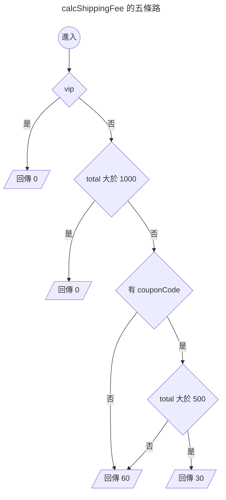

{.cover}

# AI 都幫我寫好了，還需要管複雜度嗎？( ・ิω・ิ)

大家好，我是鱈魚。%( ´ ▽ ` )ﾉ%

你朋友現在寫 code 是不是都把需求丟給 AI，十秒後交件，附測試，全綠，掃一眼就 merge。

先不管那個朋友是不是你自己。%(◐‿◑)%

總之你朋友都把需求丟給 AI，AI 都很乖，你說什麼它都照做。

第一週，它在那個函式裡加了一個 `if`。

第二週，又一個 `if`。

第三個月，打開那個函式，滾輪一路往下捲，捲到懷疑人生。%(ﾟдﾟ)%

每一次改動看起來都很合理，加起來就變成災難。

以前人工手寫不太會爛成這樣，同一個地方改到第五次，人自己就受不了了。

什麼？你說公司前人寫的祖傳程式碼都超過幾千行，早就習慣了？敬佩敬佩。%(́⊙◞౪◟⊙‵)%

其實有個 1976 年就發明出來的老指標，叫做圈複雜度（Cyclomatic Complexity）。

這篇會拿酷酷元件（[chill-component](https://chillcomponent.codlin.me/)）裡三個真實函式開刀，最後再回頭看 AI 時代還需不需要這個數字。

## 這數字到底怎麼算

一句話，程式裡的分支路徑有幾條。

名字裡的圈來自圖論，把程式流程畫成圖之後數獨立迴路有幾個。

聽起來很抽象很學術，實際上就是數分支啦。%(´,,•ω•,,)%

從 1 開始算，每遇到一個決策點就 +1：

- `if`、`else if`
- `for`、`while`、`do...while`
- `case`（每一個都算）
- `catch`
- 三元運算子 `? :`
- 邏輯運算子 `&&`、`||`、`??`
- 選擇性串連 `?.`

最多人搞錯的是 `else` 與 `default`，這兩個都不算。

看個例子。

```ts
function calcShippingFee(order: Order) { // 起手 1
  if (order.vip) { // +1 → 2
    return 0
  }
  if (order.total > 1000) { // +1 → 3
    return 0
  }
  if (order.couponCode && order.total > 500) { // +2 → 5
    return 30
  }
  return 60
}
```

5 分。畫成圖就很清楚，確實有五條走得完的路。



至於 `else`，加了也不會變。

```ts
function calcShippingFeeWithElse(order: Order) { // 起手 1
  if (order.vip) { // +1 → 2
    return 0
  }
  else { // 不算
    return 60
  }
}
```

只有 2 分。`if` 早就把路岔成兩條了，`else` 只是替其中一條取名字。%(ゝ∀・)b%

## 三十秒掃出自己專案的排行榜

ESLint 內建 `complexity` 規則，什麼都不用裝。

```js
// eslint.config.mjs
rules: {
  complexity: ['warn', { max: 10, variant: 'modified' }],
}
```

`variant` 是 ESLint 9.12 之後才有的選項，差別只在 `switch`。classic 模式每個 `case` 都 +1，一個十路 `switch` 直接 11 分起跳，可是那種扁平的對照表其實超好讀，被誤殺很冤。modified 模式把整個 `switch` 算成 1 分。

實測同一份程式碼：

| 寫法 | classic | modified |
|---|---|---|
| 三個 `if`（其中一個帶 `&&`） | 5 | 5 |
| 五個 `case` 加 `default` 的 `switch` | 6 | 2 |

不想動設定檔的話，臨時加規則跑一次也可以。

```bash
npx eslint . --rule '{"complexity":["warn",{"max":10,"variant":"modified"}]}'
```

我拿酷酷元件跑了一輪，45 個函式超標，前五名長這樣。

| 函式 | 分數 |
|---|---|
| `compileCreasePattern` | 61 |
| `createStem` | 39 |
| `createStemList` | 29 |
| `btn-attention-seeker` 的 watch | 27 |
| `updateAndRender` | 25 |

不過光看這一欄其實沒什麼鑑別度，`complexity` 最大的罩門在於它對巢狀沒感覺。

三個平行的 `if` 跟三層巢狀的 `if` 同樣都是 4 分，可是後者糾纏得多。

所以要再加上 `eslint-plugin-sonarjs` 的認知複雜度（Cognitive Complexity），它會對巢狀加權，越深扣越兇。

```js
// eslint.config.mjs
rules: {
  'complexity': ['warn', { max: 10, variant: 'modified' }],
  'sonarjs/cognitive-complexity': ['warn', 15],
}
```

兩欄一起量，接下來三個案例剛好落在三個不同的位置。

| 案例 | 圈複雜度 | 認知複雜度 | 最深巢狀 | 行數 |
|---|---|---|---|---|
| 案例一 `btn-attention-seeker` 的 watch | 27 | 5 | 2 | 28 |
| 案例二 `handleInput` | 17 | 12 | 2 | 47 |
| 案例三 `compileCreasePattern` | 61 | 135 | 5 | 326 |

一掃下去，馬上就被發現酷酷元件的程式碼我寫得有多隨便了。%(◐‿◑)%

## 案例一：27 分的 watch

[btn-attention-seeker](https://chillcomponent.codlin.me/components/btn-attention-seeker/) 是一顆很有事的按鈕，滑鼠靠近會湊過來，卡到視窗上下緣時會探個頭出來刷存在感。

它的核心是這段 watch。

```ts
watch(() => [distanceToFrame, frameBounding], () => {
  // 視窗邊界探頭
  if (isBoundary.value) {
    if (frameBounding.bottom < props.topOffset) {
      carrierPositionAnimatable?.x?.(0)
      carrierPositionAnimatable?.y?.(frameBounding.bottom * -1 + props.topOffset + frameBounding.height * 0.75)
      carrierPositionAnimatable?.rotate?.(-10)
      return
    }
    else if (frameBounding.top > (windowSize.height - props.bottomOffset)) {
      carrierPositionAnimatable?.x?.(0)
      carrierPositionAnimatable?.y?.(
        windowSize.height - frameBounding.top - frameBounding.height * 0.75 + props.bottomOffset,
      )
      carrierPositionAnimatable?.rotate?.(10)
      return
    }
  }

  if (isFollowing.value) {
    const x = frameWithMouse.elementX - frameWithMouse.elementWidth / 2
    const y = frameWithMouse.elementY - frameWithMouse.elementHeight / 2

    carrierPositionAnimatable?.x?.(x)
    carrierPositionAnimatable?.y?.(y)
    return
  }

  carrierPositionAnimatable?.x?.(0)
  carrierPositionAnimatable?.y?.(0)
  carrierPositionAnimatable?.rotate?.(0)
}, { deep: true })
```

有趣的是，這裡只有四個 `if`。第二欄更怪，認知複雜度只有 5 分。

27 對 5，代表這段程式的結構其實很扁平，分數卻高得嚇人。

那 22 分的落差是哪來的？%ლ（´口`ლ）%

我把所有 `?.` 換成直接呼叫再量一次，圈複雜度立刻剩個位數。

答案是 `carrierPositionAnimatable?.x?.()` 這種選擇性串連。

一開始我覺得指標在亂哀，想想好像也不算。%(́⊙◞౪◟⊙‵)%

`?.` 真的是分支，左邊是 `null` 就整條短路。

而這串三行的動畫呼叫，在同一個函式裡重複了四遍，所以問題點其實是多處重複。%(°ㅂ°)%

那就改善重複問題，讓每一段只負責算出目標位置，最後統一送給動畫。

```ts
interface Position { x: number; y: number; rotate: number }

const HOME_POSITION: Position = { x: 0, y: 0, rotate: 0 }

/** 探頭：視窗上下緣被遮住時，把按鈕推回可視範圍 */
function calcPeekPosition(): Position | undefined {
  if (frameBounding.bottom < props.topOffset) {
    return {
      x: 0,
      y: frameBounding.bottom * -1 + props.topOffset + frameBounding.height * 0.75,
      rotate: -10,
    }
  }

  if (frameBounding.top > windowSize.height - props.bottomOffset) {
    return {
      x: 0,
      y: windowSize.height - frameBounding.top - frameBounding.height * 0.75 + props.bottomOffset,
      rotate: 10,
    }
  }
}

/** 跟隨：滑鼠靠近時，按鈕往滑鼠方向偏移 */
function calcFollowPosition(): Position | undefined {
  if (!isFollowing.value) {
    return
  }

  return {
    x: frameWithMouse.elementX - frameWithMouse.elementWidth / 2,
    y: frameWithMouse.elementY - frameWithMouse.elementHeight / 2,
    rotate: 0,
  }
}

function updateCarrierPosition() {
  const { x, y, rotate } = calcPeekPosition() ?? calcFollowPosition() ?? HOME_POSITION

  carrierPositionAnimatable?.x?.(x)
  carrierPositionAnimatable?.y?.(y)
  carrierPositionAnimatable?.rotate?.(rotate)
}
```

重新量一次：

| 函式 | 圈複雜度 | 認知複雜度 |
|---|---|---|
| `updateCarrierPosition` | 9 | 0 |
| `calcPeekPosition` | 3 | 2 |
| `calcFollowPosition` | 2 | 1 |

程式碼變多了，可是四段重複的動畫呼叫收斂成一處，主線變成一行 `??` 串接，兩欄分數也一起掉到個位數。%( •̀ ω •́ )✧%

## 案例二：17 分的輸入法地獄

[input-decoding](https://chillcomponent.codlin.me/components/input-decoding/) 是打字時字元會亂碼跳動、最後解碼成正確文字的輸入框，看起來很駭客，實作起來要跟中文輸入法搏鬥。

它的 `handleInput` 是 17 分，分支全是邊界條件，`isComposing` 拼字中、`insertText` 一般輸入、`insertFromDrop` 拖曳、`delete` 刪除，還有拼音選字造成的 caret（游標）位置偏移。

這次兩欄很接近，圈複雜度 17，認知複雜度 12。

這 17 分是真材實料，每一條路徑都要算，沒有重複問題，每個 `if` 都對應一種真實存在的輸入行為。

所以這個案例要看的是測試。

### 這支函式到底該有幾條測試

圈複雜度還有另一個身分，走完所有線性獨立路徑要寫幾條測試，它就是幾分。

覆蓋率報告很容易忽略這件事，因為覆蓋率只算「這一行、這個分支跑過沒有」，但路徑才算「這些分支的組合走過沒有」。

17 分的函式，三、四條測試就能讓分支覆蓋率變得很好看，離 17 條獨立路徑還遠得很。

而輸入法的 bug 幾乎都藏在「拼字中又剛好按了刪除」這種組合裡。%(;´༎ຶД༎ຶ`)%

### 基線法：把分數轉換成測試清單

那實際上要怎麼寫這 17 條？

McCabe 提出圈複雜度的同一篇論文裡，也給了配套的測試設計法，叫基線法（baseline method）。做法只有兩步。

**第一步，走一條基線。** 挑最典型、最常發生的那條路徑，從函式入口一路走到結束。`handleInput` 的基線就是「沒在拼字，直接打一個英文字母」。

**第二步，回頭逐一翻轉。** 回到基線經過的第一個判斷點，只把它翻轉，其他條件全部照基線不動，走出來就是第二條路徑。接著回到第二個判斷點翻轉，得到第三條。每個判斷點各翻一次，全部翻完後就會得到圈複雜度的數值。

實際跑 `handleInput` 的前幾條長這樣。

| # | 翻的判斷點 | 情境 | 結果 |
|---|---|---|---|
| 1 | 基線 | 沒在拼字，直接打一個 `a` | 走完全程，插入字元 |
| 2 | `event` 型別守衛 | 丟一個普通 `Event` 進去 | 第一行就 return |
| 3 | `isComposing` | 注音打到一半觸發 | 第二個守衛 return |
| 4 | `caretStart !== caretEnd && isFirstComposed` | 選完字才送出 | caret 位置偏移一格 |
| 5 | `insertFromDrop` | 把文字拖進輸入框 | 走拖曳插入分支 |
| 6 | `inputType.includes('delete')` | 按 backspace | 走全部重建分支 |

每一列都對得上一個真實的使用者動作。測試清單不用憑空想，照著控制流走就會長出來。%(ゝ∀・)b%

**關鍵是一次只翻一個判斷點。**

一次翻兩個很誘人，測試數量看起來會少一半。可是那樣走出來的路徑不算新的獨立路徑，它等於前面兩條疊起來，不會多蓋到任何東西。

實務上的代價更直接。測試掛掉的時候你不知道是哪個條件出問題，還得再拆一次。%(°ㅂ°)%

### 可是有幾條翻不動

聽起來很機械，實際套到 `handleInput` 上就會卡住。

| 判斷點 | 翻得動嗎 |
|---|---|
| `event` 不是 `InputEvent` 也不是 `CompositionEvent` | 可以，丟普通 `Event` 進去 |
| `isComposing` | 可以，注音打到一半觸發 |
| `targetEl` 不是 `HTMLInputElement` | 翻不動，事件永遠來自那個 input |
| `caretStart !== caretEnd && isFirstComposed` | 可以，選字後的位置偏移 |
| `targetEl.selectionStart ?? ⋯` | 翻不動，`type="text"` 的 `selectionStart` 不會是 `null` |
| `targetEl.selectionEnd ?? ⋯` | 翻不動，同上 |
| `event.data ?? ''` | 可以，刪除事件的 `data` 本來就是 `null` |
| `'inputType' in event`（出現三次） | 翻不動，跟第一個守衛同義，是 `InputEvent` 就一定為真 |
| `insertText`、`compositionend`、`insertFromDrop`、`delete` | 可以，四種真實輸入行為 |

扣掉翻不動的，實際寫得出來的大概十一、二條。%(´・ω・`)%

這不代表指標算錯。17 是控制流上的路徑數，數學沒問題，只是其中幾條在這個元件的使用情境裡走不到，例如 `type="text"` 的 `selectionStart` 永遠有值，那兩個 `??` 就沒有另一半可以測。

所以 17 要當成上限。先照著翻，翻不動的一條一條寫下理由。

湊滿 17 條反而是危險訊號，代表有人在硬湊。%(;´༎ຶД༎ຶ`)%

而那些理由本身就是文件。哪天有人把 `type="text"` 改成 `type="email"`，`selectionStart` 就真的會變成 `null`，那兩條翻不動的路徑會立刻活過來。%(°ㅂ°)%

## 案例三：61 分的冠軍

`compileCreasePattern` 是 [transition-origami](https://chillcomponent.codlin.me/components/transition-origami/) 的摺紙圖樣編譯器，吃一組摺線定義，吐出可以拿去跑物理模擬的三角網格。

61 分，全專案冠軍。照前面的做法，先看第二欄。

認知複雜度 135，門檻的九倍，最深五層巢狀，整整 326 行，相當之可怕。

不過仔細看看內容，會發現它是一條從頭走到尾的管線，頂點吸附、逐段切割、去重、面萃取、三角化、正規化，九個階段一路做到底。

硬拆成九個函式，`vertexList`、`segmentList`、`snapEpsilon` 這些中間狀態就得全部變成參數傳來傳去。

<br>

路人：「因為是管線所以不應該拆嗎？」

鱈魚：「其實也該處理，尤其是那個五層巢狀，只是因為會動，我懶得處理。%∠( ᐛ 」∠)_%」

路人：「...(◉◞౪◟◉ )」

## AI 都幫我寫好了，還需要這個數字嗎

圈複雜度當年紅起來，很大一部分理由是人腦一次裝不下太多東西，函式太長就讀不動。

接下來直接假設最極端的情況，**程式完全交給 AI 寫，沒有人會再打開那個檔案**。

「人讀不動」這條理由整個消失，指標剩下的價值得靠別的東西撐。

我把問題丟給 AI，它講得頭頭是道，說守門員能擋住 AI 亂塞分支，程式拆乾淨，接手的 AI 才不會改壞。聽起來都對，可是這種事用嘴巴講沒用，要拿數據來。%( ・ิω・ิ)%

### 三種 CLAUDE.md，各開六個專案

做法是把立場寫進 CLAUDE.md，其他條件全部相同，讓 AI 從開頭那支 5 分的運費函式起步，連續實作 21 條需求。

| 立場 | CLAUDE.md 怎麼寫 |
|---|---|
| 最小改動派 | 不用任何指標，測試全綠就是好程式碼，只做需求要求的事，不重構 |
| 自律派 | 不用任何指標，每次做完必須檢視整份 src，整理到自己滿意為止 |
| 指標派 | ESLint 設圈複雜度 10、認知複雜度 15 當門檻，超標 CI 就紅，不准關規則 |

每個立場六條軌跡，共 18 個專案。每一週都換一個全新的 Claude Sonnet 接手，沒有記憶，資料夾只有編號，它不知道自己在實驗裡。錯了不修、不提示，一路疊到第 21 週。

判分不靠人看。我另外維護一份參考實作，每週把所有欄位的取值全部組合一遍，逐筆比對 AI 寫的函式，21 週合計 1 億零 787 萬筆。第 21 週的需求刻意只給兩個數字，其餘規則要 AI 從既有程式碼讀出來，模擬接手。

開跑前另外請兩個 Opus 分別扮演擁護派與廢除派，先審設計、寫預測、寫認輸條件，全部 commit 才開跑。跑完各自對照自己的預測寫判決，再由第三個 Opus 裁定。

### 結果：零錯誤

| 項目 | 最小改動派 | 自律派 | 指標派 |
|---|---|---|---|
| 21 週窮舉比對的錯誤數 | 0 | 0 | 0 |
| 第 21 週最大圈複雜度（中位數） | 28.5 | 7 | 6 |
| 21 週內超過門檻的次數 | 93 / 126 | 0 / 126 | 0 / 126 |
| 第 21 週圈複雜度總和（中位數） | 38 | 32.5 | 44.5 |
| 每週耗時（以最小改動派為 1） | 1.00 | 1.68 | 1.20 |
| 全新 AI 接手心算 28 題 | 全對 | 全對 | 全對 |

三個立場、18 條軌跡、378 次交件，正確率全部滿分。接手的 AI 讀一支圈複雜度 38 的函式，跟讀拆成 13 個函式的版本，心算 28 題都全對，花的 token 也一樣。

擁護派開跑前押「最小改動派至少四條會出錯」，結果是零，它的十條認輸條件成立了九條，照自己寫的條文認輸。廢除派的認輸條件全沒觸發，卻不認為自己贏了，因為它事前就寫了「三組全部零失誤是天花板效應，什麼都沒證明」。裁判也這樣裁，守門員有沒有用，這個難度、這個模型下**測不到**。

鱈魚：「所以我燒了 3300 萬個 token，證明了……測不到？%( ˘•ω•˘ )%」

路人：「你這結果講出去會被笑欸。%(´・ω・`)%」

鱈魚：「錢沒白燒，另外測到了三件事。%(ゝ∀・)b%」

- **沒有數字，AI 也整理得很乾淨。** 自律派沒有任何門檻，準則只寫「整理到自己滿意」，六條軌跡 126 週裡沒有一次超過指標派的門檻，最大圈複雜度全程不超過 9。最小改動派則從第 4 週起週週超標，有一條疊到 38 分。
- **門檻壓低的是最大值，總量反而更高。** 指標派最大圈複雜度最低，圈複雜度總和卻是三組裡最高，判斷離島、海外這類地區的程式碼散落到 15 個地方，自律派只有 2 個。門檻逼 AI 把複雜度切碎攤開，沒有讓它變少。
- **守門員很便宜，自律很貴。** 指標派比最小改動派多花兩成時間，兩位審查者事前都押至少四成，全部高估；叫 AI 自己檢視整份程式碼則多花近七成，三組裡最貴。

開頭那句「一週加一個 `if`，最後捲到懷疑人生」也被打臉了，這個模型身上沒有出現。378 次交件最深巢狀只有 1 或 2，最糟的那支是 71 行平坦的 `else if` 長串，醜歸醜，AI 照樣讀得懂、改得對。%(◐‿◑)%

錯誤很可能是測試擋住的。每一組的 AI 都自己補測試補到 116 至 172 條，21 週累計跑了 28,786 次、零失敗。測試少一點之後結論還成不成立，這次沒測。

完整設計、每週資料、兩位審查者的判決與裁判裁定，都在[實驗報告](https://github.com/Codfisher/cod-aquarium/blob/main/docs/cyclomatic-complexity-in-the-ai-era.md)。

## 總結 🐟

- 圈複雜度就是數分支，`else` 不算，`?.` 與 `&&` 都算，ESLint 內建規則三十秒就能掃出整個專案的排行榜。
- 它對巢狀沒感覺，要搭配認知複雜度一起看，27 對 5 是重複，61 對 135 才是真的糾纏。
- 分數等於走完所有路徑要幾條測試，用基線法一次翻一個判斷點就能長出清單，翻不動的寫下理由當文件。
- 全 AI 開發的實驗裡，指標守門員對正確率的影響測不到，測得到的是它把複雜度切碎攤開、多花兩成時間；叫 AI 自己整理更乾淨，但更貴。
- 錯誤其實是測試擋住的。先把測試補足，再決定門檻要設 warn 當雷達，還是設 error 當閘門。

有錯誤還請多多指教，感謝您讀到這裡，如果您覺得有收穫，歡迎分享出去。%( ´ ▽ ` )ﾉ%
