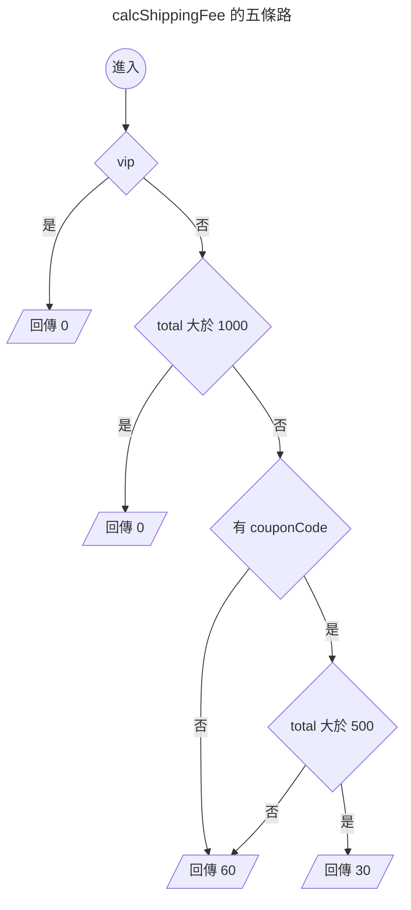

{.cover}

# AI 都幫我寫好了，還需要管複雜度嗎？( ・ิω・ิ)

大家好，我是鱈魚。%( ´ ▽ ` )ﾉ%

你朋友現在寫 code 是不是都把需求丟給 AI，十秒後交件，附測試，全綠，掃一眼就 merge。

先不管那個朋友是不是你自己。%(◐‿◑)%

總之你朋友都把需求丟給 AI，不過 AI 有沒有可能偷懶，只會疊，不會整理，越改越亂？

什麼？你說公司前人寫的祖傳程式碼都超過幾千行，早就習慣了？敬佩敬佩。%(́⊙◞౪◟⊙‵)%

有沒有什麼客觀指標，可以用來表示程式碼複雜度？

搜尋了一下，發現有個 1976 年就發明出來的老指標，叫做圈複雜度（Cyclomatic Complexity）。

這篇拿酷酷元件（[chill-component](https://chillcomponent.codlin.me/)）裡一支真實函式開刀，最後再回頭看 AI 時代還需不需要這個數字。

## 數字怎麼來

圈複雜度代表程式裡有幾條分支路徑。

名字裡的圈來自圖論，把程式流程畫成圖之後數獨立迴路有幾個。

聽起來很抽象很學術，實際上就是數分支啦。%(´,,•ω•,,)%

從 1 開始算，每遇到一個決策點就 +1：

- `if`、`else if`
- `for`、`while`、`do...while`
- `case`（每一個都算）
- `catch`
- 三元運算子 `? :`
- 邏輯運算子 `&&`、`||`、`??`
- 選擇性串連 `?.`

最多人搞錯 `else` 與 `default`，這兩個都不算。

看個例子。

```ts
function calcShippingFee(order: Order) { // 起手 1
  if (order.vip) { // +1 → 2
    return 0
  }
  if (order.total > 1000) { // +1 → 3
    return 0
  }
  if (order.couponCode && order.total > 500) { // +2 → 5
    return 30
  }
  return 60
}
```

5 分。畫成圖就很清楚，確實有五條走得完的路。



至於 `else`，加了也不會變。

```ts
function calcShippingFeeWithElse(order: Order) { // 起手 1
  if (order.vip) { // +1 → 2
    return 0
  }
  else { // 不算
    return 60
  }
}
```

只有 2 分。`if` 早就把路岔成兩條了，`else` 只是替其中一條取名字。%(ゝ∀・)b%

## 三十秒掃出自己專案的排行榜

ESLint 內建 `complexity` 規則，什麼都不用裝。

```js
// eslint.config.mjs
rules: {
  complexity: ['warn', { max: 10, variant: 'modified' }],
}
```

`variant` 是 ESLint 9.12 之後才有的選項，差別只在 `switch`。classic 模式每個 `case` 都 +1，一個十路 `switch` 直接 11 分起跳，可是那種扁平的對照表其實超好讀，被誤殺很冤。modified 模式把整個 `switch` 算成 1 分。

實測同一份程式碼：

| 寫法 | classic | modified |
|---|---|---|
| 三個 `if`（其中一個帶 `&&`） | 5 | 5 |
| 五個 `case` 加 `default` 的 `switch` | 6 | 2 |

不想動設定檔的話，臨時加規則跑一次也可以。

```bash
npx eslint . --rule '{"complexity":["warn",{"max":10,"variant":"modified"}]}'
```

規則設 warn 不設 error，讓它當雷達用，只把超標的函式標出來。設成 error 就變成閘門，超標直接擋下 CI。

我拿酷酷元件跑了一輪，45 個函式超標，前五名長這樣。

| 函式 | 分數 |
|---|---|
| `compileCreasePattern` | 61 |
| `createStem` | 39 |
| `createStemList` | 29 |
| `btn-attention-seeker` 的 watch | 27 |
| `updateAndRender` | 25 |

一掃下去，酷酷元件的程式碼我寫得有多隨便，馬上就露餡了。%(◐‿◑)%

不過光看這一欄其實沒什麼鑑別度，`complexity` 最大的罩門在於它對巢狀沒感覺。

~~不是因為他腳麻~~，是因為深度要交給 `cognitive-complexity`。%(´・ω・`)%

三個平行的 `if` 跟三層巢狀的 `if` 同樣都是 4 分，可是後者糾纏得多。

加上 `eslint-plugin-sonarjs`，計算認知複雜度（Cognitive Complexity），它會對巢狀加權，越深扣越兇。

```js
// eslint.config.mjs
rules: {
  'complexity': ['warn', { max: 10, variant: 'modified' }],
  'sonarjs/cognitive-complexity': ['warn', 15],
}
```

兩欄一起量，就拿排行榜第四名那段 watch 開刀，圈複雜度 27、認知複雜度 5、最深巢狀 2、只有 28 行。

## 案例：27 分的 watch

[btn-attention-seeker](https://chillcomponent.codlin.me/components/btn-attention-seeker/) 是一顆很有事的按鈕，滑鼠靠近會湊過來，卡到視窗上下緣時會探個頭出來刷存在感。

它的核心是這段 watch。

```ts
watch(() => [distanceToFrame, frameBounding], () => {
  // 視窗邊界探頭
  if (isBoundary.value) {
    if (frameBounding.bottom < props.topOffset) {
      carrierPositionAnimatable?.x?.(0)
      carrierPositionAnimatable?.y?.(frameBounding.bottom * -1 + props.topOffset + frameBounding.height * 0.75)
      carrierPositionAnimatable?.rotate?.(-10)
      return
    }
    else if (frameBounding.top > (windowSize.height - props.bottomOffset)) {
      carrierPositionAnimatable?.x?.(0)
      carrierPositionAnimatable?.y?.(
        windowSize.height - frameBounding.top - frameBounding.height * 0.75 + props.bottomOffset,
      )
      carrierPositionAnimatable?.rotate?.(10)
      return
    }
  }

  if (isFollowing.value) {
    const x = frameWithMouse.elementX - frameWithMouse.elementWidth / 2
    const y = frameWithMouse.elementY - frameWithMouse.elementHeight / 2

    carrierPositionAnimatable?.x?.(x)
    carrierPositionAnimatable?.y?.(y)
    return
  }

  carrierPositionAnimatable?.x?.(0)
  carrierPositionAnimatable?.y?.(0)
  carrierPositionAnimatable?.rotate?.(0)
}, { deep: true })
```

可是這裡只有四個 `if`。認知複雜度更怪，只有 5 分。

27 對 5，代表這段程式的結構其實很扁平，分數卻高得嚇人。

那 22 分的落差是哪來的？%ლ（´口`ლ）%

我把所有 `?.` 換成直接呼叫再量一次，圈複雜度立刻剩個位數。

答案是 `carrierPositionAnimatable?.x?.()` 這種選擇性串連。

一開始我覺得指標在亂哀，想想好像也不算。%(́⊙◞౪◟⊙‵)%

`?.` 真的是分支，左邊是 `null` 就整條短路。

而這串三行的動畫呼叫，在同一個函式裡重複了四遍，所以問題點其實是多處重複。%(°ㅂ°)%

那就改善重複問題，讓每一段只負責算出目標位置，最後統一送給動畫。

```ts
interface Position { x: number; y: number; rotate: number }

const HOME_POSITION: Position = { x: 0, y: 0, rotate: 0 }

/** 探頭：視窗上下緣被遮住時，把按鈕推回可視範圍 */
function calcPeekPosition(): Position | undefined {
  if (frameBounding.bottom < props.topOffset) {
    return {
      x: 0,
      y: frameBounding.bottom * -1 + props.topOffset + frameBounding.height * 0.75,
      rotate: -10,
    }
  }

  if (frameBounding.top > windowSize.height - props.bottomOffset) {
    return {
      x: 0,
      y: windowSize.height - frameBounding.top - frameBounding.height * 0.75 + props.bottomOffset,
      rotate: 10,
    }
  }
}

/** 跟隨：滑鼠靠近時，按鈕往滑鼠方向偏移 */
function calcFollowPosition(): Position | undefined {
  if (!isFollowing.value) {
    return
  }

  return {
    x: frameWithMouse.elementX - frameWithMouse.elementWidth / 2,
    y: frameWithMouse.elementY - frameWithMouse.elementHeight / 2,
    rotate: 0,
  }
}

function updateCarrierPosition() {
  const { x, y, rotate } = calcPeekPosition() ?? calcFollowPosition() ?? HOME_POSITION

  carrierPositionAnimatable?.x?.(x)
  carrierPositionAnimatable?.y?.(y)
  carrierPositionAnimatable?.rotate?.(rotate)
}
```

重新量一次：

| 函式 | 圈複雜度 | 認知複雜度 |
|---|---|---|
| `updateCarrierPosition` | 9 | 0 |
| `calcPeekPosition` | 3 | 2 |
| `calcFollowPosition` | 2 | 1 |

程式碼變多了，可是四段重複的動畫呼叫收斂成一處，主線變成一行 `??` 串接，兩欄分數也一起掉到個位數。%( •̀ ω •́ )✧%

## AI 都幫我寫好了，還需要這個數字嗎

圈複雜度的出現，很大一部分理由是人腦一次裝不下太多東西，函式太長就會看得很厭世。%(›´ω`‹ )%

接下來直接假設最極端的情況，**程式完全交給 AI 寫，沒有人會再打開那個檔案**。

「人讀不動」這條理由不再成立，這樣還有其他理由嗎？%( ・ิω・ิ)%

我把問題丟給 AI，它講得頭頭是道：

- 圈複雜度等於獨立路徑數，也等於走完所有路徑要幾條測試，這是算術，跟誰寫的無關。
- AI 判斷複雜度只能靠感覺，跑一行指令就有答案的事，不用花 token 請它猜。
- 複雜度越高，AI 改壞的機率越高，改 A 分支就弄壞 B 分支。
- AI 面對新需求只會再塞一個 `if`，每一步都是局部最佳解，一路走進全域的爛攤子。

聽起來很有道理，不過 AI 最擅長瞎掰道理，我們還是實際實驗看看好了。%ԅ( ˘ω˘ԅ)%

### 一個完整的伺服器，八週，十二個專案

前面試過幾種題目，從單一函式到跨檔案耦合都試過，AI 全部滿分，什麼都看不出來。這次把題目換成完整的訂單伺服器，NestJS 加 SQLite，跑八週。

這次的關鍵機制叫**全域慣例**。前六週每週建立一條規則，寫法都是「現在與之後新增的每一個 X 都適用」。

| 週 | 慣例 |
|---|---|
| 1 | 所有寫入路由都要帶 `X-Actor`，每次成功寫入留一筆稽核紀錄 |
| 2 | 所有寫入路由都接受 `Idempotency-Key`，帶同一個鍵重播就回原本的回應 |
| 3 | 任何資源的 `DELETE` 都是軟刪除，列表要支援 `includeDeleted` 查詢 |
| 4 | 每一次庫存變動都寫一筆異動紀錄，各種操作各有固定的字串 |
| 5 | 任何有 `status` 的資源，狀態每次改變都寫一筆歷程，並提供查詢路由 |
| 6 | 所有列表路由都回 `{ page, pageSize, total, itemList }` 這個信封 |

第 7 週之後不斷新增資源與路由，優惠券、供應商、進貨單、會員等級，需求文件**一次都不再提起這六條慣例**。新資源要不要寫稽核、要不要支援查詢已刪除的資料、要不要有歷程路由，AI 得自己記得。

流程跟前幾次一樣。每週開一個全新的 Sonnet，只給它專案資料夾、一份 CLAUDE.md 與一份當週需求。它看不到前幾週的需求文件，上週自己寫的測試我也收走了，做完跑 `npm run ci` 就結束，錯了不修也不提示。

12 個專案盲化分成三組，每組四個，CLAUDE.md 是唯一變因。

| 立場 | CLAUDE.md 怎麼寫 |
|---|---|
| 最小改動派 | 不用任何指標，測試全綠就是好程式碼，只做需求要求的事，不重構 |
| 自律派 | 不用任何指標，每次做完必須檢視整份 src，整理到自己滿意為止 |
| 指標派 | ESLint 設圈複雜度 10、認知複雜度 15 當門檻，超標 CI 就紅，不准調高也不准略過 |

評分不靠人工計算。另外維護一份參考伺服器當標準答案，每週產生 400 條固定種子的請求序列，一條平均五十幾個呼叫，對受試者與參考各跑一次，逐個呼叫比對狀態碼與回應內容。八週合計 38400 條序列。每週還會做一次遷移檢查，拿上週的資料庫交給本週的程式碼啟動。

參考伺服器本身也請五位獨立的 AI 驗證過。它們只讀需求、不看參考的原始碼，寫測試去打它，總共找出九處需求講得不夠精確的地方與四個參考自己的錯誤，全部修完才開跑。

### 結果：錯了，可是錯在別的地方 %(́⊙◞౪◟⊙‵)%

前四週三組全對。第 5 週開始出現失誤，第 6 週起 12 個專案無一倖免。

| 週 | 最小改動派 | 自律派 | 指標派 |
|---|---|---|---|
| 1 到 3 | 0/4 | 0/4 | 0/4 |
| 4 | 0/4 | 1/4 | 0/4 |
| 5 | 3/4 | 2/4 | 1/4 |
| 6 到 8 | 4/4 | 4/4 | 4/4 |

錯的東西高度一致，三組撞上完全相同的五個洞。

| 漏掉什麼 | 出自哪一週的慣例 |
|---|---|
| 退貨把庫存加回去，卻沒寫庫存異動 | 第 4 週 |
| 優惠券列表不支援 `includeDeleted` | 第 3 週 |
| 供應商列表不支援 `includeDeleted` | 第 3 週 |
| 進貨單沒有狀態歷程路由 | 第 5 週 |
| 訂單的狀態歷程查不到 | 第 5 週 |

全部是前幾週建立、後來不再提醒的慣例。而每週明寫在需求裡的路由、欄位、錯誤碼、檢查順序，96 次交件裡**一個都沒錯**，迴歸零次，八週的遷移檢查全過。

漏與不漏有很清楚的規律。

- **做成中央機制的慣例，零漂移。** 稽核做成守衛、冪等做成攔截器、分頁做成共用函式，新路由自動穿過，八週零錯誤。
- **每個新資源要各接一次線的慣例，全滅。** 軟刪除的查詢參數、狀態歷程路由、庫存異動的固定字串，沒辦法收斂成一個機制，只能靠 AI 記得需求裡那一句，結果三組全部失守。

**這五個洞沒有一個跟複雜度有關。**

忘了寫庫存異動、忘了支援查詢已刪除的資料、忘了開歷程路由，全部是忘記接線。函式太糾纏所以改壞的那一種，八週一次都沒發生。就算把門檻從 10 壓到 5，這五個洞一個都擋不掉。折騰五批終於製造出錯誤，錯的卻是另一個題目。%( ˙꒳​˙)%

會不會漏，取決於慣例能不能做成一個機制，跟寫慣例的那個函式有多複雜無關。

### 那門檻到底有沒有用？還是測不到

表面上指標派贏了，不符數只有最小改動派的 0.61 倍。可是把數字拆開就沒了。

三組撞同樣五個洞。每個專案的不符總數只有兩種值，786 或 277，差別在於第 5 週有沒有漏掉退貨的庫存異動。

| 組 | 四個專案各自的不符總數 |
|---|---|
| 最小改動派 | 786、786、786、277 |
| 自律派 | 786、389、277、277 |
| 指標派 | 786、277、277、277 |

0.61 這個比值，等於「三個中招對一個對一個」這個計數。四個樣本，跟擲硬幣沒兩樣。%(´・ω・`)%

更根本的問題是**門檻幾乎沒有觸發**。統計沒設門檻的那兩組，64 個專案週裡只有 11 次出現超過門檻的函式。

| 組 | 假想守門會被擋的專案週 |
|---|---|
| 最小改動派 | 2/32 |
| 自律派 | 9/32 |
| 指標派 | 0/32 |

也就是說即使沒有 CI 擋著，Sonnet 寫出來的程式碼本來就幾乎都在門檻之內，指標派根本沒有幾次需要重構。兩位審查者開跑前各自寫下的判準都講了同一件事，這種情況下這個比值沒有效力。

門檻確實管住了形狀。指標派的最大圈複雜度八週紋風不動停在 7，最小改動派 9.5，自律派從 7.5 一路爬到 11.5。代價是函式數多出一成三、行數多 8%，而圈複雜度總和反而略高。它把複雜度分散到更多函式，總量沒有變少。

成本三組一樣，後三週對前三週的 token 比值分別是 1.09、1.01、1.09。

自律派這次墊底。前一批用單一函式當題目時，「整理到自己滿意」整理得最乾淨；換成兩千多行的伺服器之後，同一句話換來全場最高的複雜度。叫 AI 自己判斷，規模一大就不管用了。%(›´ω`‹ )%

完整設計、每週資料、兩位審查者的預測與認輸條件，都在[實驗報告](https://github.com/Codfisher/cod-aquarium/blob/main/docs/cyclomatic-complexity-in-the-ai-era.md)。

## 別人的研究怎麼說

我的實驗有三個發現，逐一去翻論文對照。%(´・ω・`)%

**發現一，有沒有門檻，AI 寫錯的機率量不出差別。** 論文跟這個一致。[Pan 等人](https://arxiv.org/abs/2508.13666)（ICSE 2026）把程式碼的縮排、空白、換行全部拔掉再餵給十個模型，答對率最多只掉 4.2%，模型不太在意程式長什麼樣子。[Xie 等人](https://arxiv.org/abs/2602.07882)（ICML 2026）直接檢驗圈複雜度這類傳統指標能不能預測 LLM 覺得一段程式難不難，結論是沒有一致的關聯。[Ashrafi](https://arxiv.org/abs/2606.00308) 讓六種架構的 AI 代理人寫同一批題目，寫出來的複雜度差了 50% 到 130%，答對率卻沒差。三篇的結論一樣，圈複雜度只能反映人讀起來多累，跟 AI 會不會寫錯無關。

**發現二，明寫的需求不會錯，不再重述的舊約定會穩定遺漏。** 這一點文獻講得比我更清楚。[Codified Context](https://arxiv.org/abs/2602.20478) 直接指出 AI 代理人沒有跨場次的記憶，每一場都從零開始，忘記專案慣例、重犯已知錯誤。[20574 場真實開發場次的分析](https://arxiv.org/abs/2605.29442)發現 41% 的回合使用者得回頭糾正它，而九成以上的問題要等到人明講才解得掉。[RoadmapBench](https://arxiv.org/abs/2605.15846) 用真實的版本升級當題目，中位數要改 51 個檔案 3700 行，Claude Opus 4.7 只解得掉 39.1%，常見的失敗是完成一部分目標之後卡在整合。我這個實驗把同一件事做得更乾淨，慣例都寫在需求裡、AI 也讀過，隔幾週新資源出現時照樣漏掉。

**發現三，沒有門檻，複雜度就會往上跑。** 最小改動派停在 9.5，自律派一路爬到 11.5，指標派八週都是 7。2026 年的 [SlopCodeBench](https://arxiv.org/abs/2603.24755) 跟這個實驗最像，讓 15 個 AI 代理人在 196 個檢查點反覆擴充自己的程式碼，判定結構劣化的門檻剛好也是圈複雜度 10。沒有任何指引時，77% 的專案越跑越劣化；加一段品質指引，劣化少了 57.6%，成本只多 12.1%。劣化歸劣化，答對率沒有跟著掉，這一半跟我「形狀變了、正確率沒變」的結果一樣。另一半我沒複現。那段品質指引在我這裡就是自律派的準則，題目換成兩千多行的伺服器之後，它的複雜度反而爬得比誰都高。[GitClear](https://www.gitclear.com/ai_assistant_code_quality_2025_research) 分析 2025 年 2.11 億行真實 commit，AI 普及後重構佔比從 25% 掉到不到 10%，只加不整理是普遍現象。

| 我的發現 | 論文 | 對照 |
|---|---|---|
| 有沒有門檻，正確率量不出差別 | 傳統複雜度指標與 LLM 表現沒有一致關聯 | 一致 |
| 明寫的需求不會錯 | 九成以上的問題要人明講才解得掉 | 一致 |
| 不再重述的舊約定會漏掉 | 代理人沒有跨場次記憶，忘記專案慣例 | 一致 |
| 一段文字指引就能壓住劣化 | 77% 專案劣化，一段指引降 57.6% | 我沒複現，專案一大就失效 |

回到標題，AI 都幫我寫好了，還需要管複雜度嗎？拆成四個問題才答得準。

- **能不能讓 AI 少寫錯？量不到關聯。** 我的實驗跟論文都一樣。這次終於製造出錯誤，錯的原因卻跟複雜度無關。想靠門檻換正確率，目前沒有證據。
- **能不能讓 AI 記得舊約定？門檻幫不上忙，架構才有用。** 做成中央機制的慣例零漂移，散在各處的全滅。與其設門檻，不如把約定寫成一個攔截器。
- **能不能防止程式越疊越亂？門檻壓得住最大值。** 只是它把複雜度分散到更多函式，總量沒有變少；而「叫 AI 自己整理」在專案一大之後就失控了，這次反而爬到三組最高。想控制形狀，門檻比口頭指引可靠。
- **人還讀不讀得懂？這一條完全沒變。** 圈複雜度本來就是為人設計的，這些論文都沒有推翻這一點，前面幾節那套判斷照用。

## 總結 🐟

還需要管複雜度嗎？答案看有沒有人要讀那份程式碼。

- **有人要讀就要管，方法照舊。** 圈複雜度就是數分支，`else` 不算，`?.` 與 `&&` 都算，ESLint 三十秒掃出整個專案的排行榜；它對巢狀沒感覺，要搭配認知複雜度一起看，27 對 5 代表重複，兩欄一起高才代表糾纏。
- **完全交給 AI、沒有人會打開，這次量不到好處。** 12 個專案跑八週、96 次交件，門檻對正確率的影響測不出來，而且 Sonnet 本來就幾乎不寫超標的函式，門檻大多時候根本不會響。
- **實驗終於製造出錯誤，可是那些錯跟複雜度無關。** 五個洞全是新資源忘了接上幾週前立的規矩，門檻從 10 壓到 5 也擋不掉。
- **要管就管跨時間的約定有沒有做成機制。** 稽核與冪等寫成攔截器，八週零漂移；要在每個新資源各接一次線的規則，三組全滅。
- **門檻很便宜，留著當雷達不虧。** 它把最大複雜度壓在 7，成本跟不設一樣，只是別指望它幫你擋下錯誤。

有錯誤還請多多指教，感謝您讀到這裡，如果您覺得有收穫，歡迎分享出去。%( ´ ▽ ` )ﾉ%
