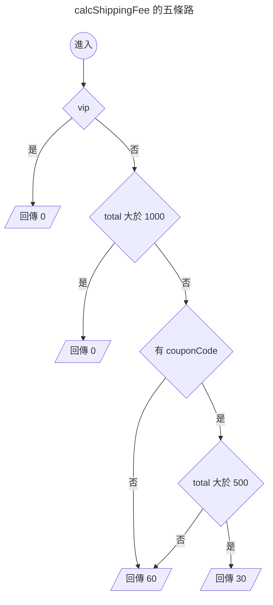

{.cover}

# AI 都幫我寫好了，還需要管複雜度嗎？( ・ิω・ิ)

大家好，我是鱈魚。%( ´ ▽ ` )ﾉ%

你朋友現在寫 code 是不是都把需求丟給 AI，十秒後交件，附測試，全綠，掃一眼就 merge。

先不管那個朋友是不是你自己。%(◐‿◑)%

總之你朋友都把需求丟給 AI，AI 都很乖，你說什麼它都照做。

第一週，它在那個函式裡加了一個 `if`。

第二週，又一個 `if`。

第三個月，打開那個函式，滾輪一路往下捲，捲到懷疑人生。%(ﾟдﾟ)%

每一次改動看起來都很合理，加起來就變成災難。

以前人工手寫不太會爛成這樣，同一個地方改到第五次，人自己就受不了了，會停下來整個重寫。

什麼？你說公司前人寫的祖傳程式碼都超過幾千行，早就習慣了？敬佩敬佩。%(́⊙◞౪◟⊙‵)%

其實有個 1976 年就發明出來的老指標，叫做圈複雜度（Cyclomatic Complexity）。

這篇會拿酷酷元件（[chill-component](https://chillcomponent.codlin.me/)）裡三個真實函式開刀，最後再回頭看 AI 時代還需不需要這個數字。

## 這數字到底怎麼算

一句話，程式裡的分支路徑有幾條。

從 1 開始算，每遇到一個決策點就 +1：

- `if`、`else if`
- `for`、`while`、`do...while`
- `case`（每一個都算）
- `catch`
- 三元運算子 `? :`
- 邏輯運算子 `&&`、`||`、`??`
- 選擇性串連 `?.`

最多人搞錯的是 `else` 與 `default`，這兩個都不算。

看個例子。

```ts
function calcShippingFee(order: Order) { // 起手 1
  if (order.vip) { // +1 → 2
    return 0
  }
  if (order.total > 1000) { // +1 → 3
    return 0
  }
  if (order.couponCode && order.total > 500) { // +2 → 5
    return 30
  }
  return 60
}
```

5 分。畫成圖就很清楚，確實有五條走得完的路。



至於 `else`，加了也不會變。

```ts
function calcShippingFeeWithElse(order: Order) { // 起手 1
  if (order.vip) { // +1 → 2
    return 0
  }
  else { // 不算
    return 60
  }
}
```

只有 2 分。`if` 早就把路岔成兩條了，`else` 只是替其中一條取名字。%(ゝ∀・)b%

## 三十秒掃出自己專案的排行榜

ESLint 內建 `complexity` 規則，什麼都不用裝。

```js
// eslint.config.mjs
rules: {
  complexity: ['warn', { max: 10, variant: 'modified' }],
}
```

`variant` 是 ESLint 9.12 之後才有的選項，差別只在 `switch`。classic 模式每個 `case` 都 +1，一個十路 `switch` 直接 11 分起跳，可是那種扁平的對照表其實超好讀，被誤殺很冤。modified 模式把整個 `switch` 算成 1 分。

實測同一份程式碼：

| 寫法 | classic | modified |
|---|---|---|
| 三個 `if`（其中一個帶 `&&`） | 5 | 5 |
| 五個 `case` 加 `default` 的 `switch` | 6 | 2 |

不想動設定檔的話，臨時掛規則跑一次也可以。

```bash
npx eslint . --rule '{"complexity":["warn",{"max":10,"variant":"modified"}]}'
```

我拿酷酷元件跑了一輪，45 個函式超標，前五名長這樣。

| 函式 | 分數 |
|---|---|
| `compileCreasePattern` | 61 |
| `createStem` | 39 |
| `createStemList` | 29 |
| `btn-attention-seeker` 的 watch | 27 |
| `updateAndRender` | 25 |

不過光看這一欄會誤判。

`complexity` 最大的罩門在於它對巢狀沒感覺。三個平行的 `if` 跟三層巢狀的 `if` 同樣都是 4 分，可是後者難讀太多。

所以我又掛了一條 `eslint-plugin-sonarjs` 的認知複雜度（Cognitive Complexity），它會對巢狀加權，越深扣越兇。

```js
// eslint.config.mjs
rules: {
  'complexity': ['warn', { max: 10, variant: 'modified' }],
  'sonarjs/cognitive-complexity': ['warn', 15],
}
```

兩欄一起量，接下來三個案例剛好落在三個不同的位置。

| 案例 | 圈複雜度 | 認知複雜度 | 最深巢狀 | 行數 |
|---|---|---|---|---|
| 案例一 `btn-attention-seeker` 的 watch | 27 | 5 | 2 | 28 |
| 案例二 `handleInput` | 17 | 12 | 2 | 47 |
| 案例三 `compileCreasePattern` | 61 | 135 | 5 | 326 |

三個都超標，處置方式卻完全不同。%(´,,•ω•,,)%

## 案例一：27 分的 watch

[btn-attention-seeker](https://chillcomponent.codlin.me/components/btn-attention-seeker/) 是一顆很有事的按鈕，滑鼠靠近會湊過來，卡到視窗上下緣時會探個頭出來刷存在感。

它的核心是這段 watch。

```ts
watch(() => [distanceToFrame, frameBounding], () => {
  // 視窗邊界探頭
  if (isBoundary.value) {
    if (frameBounding.bottom < props.topOffset) {
      carrierPositionAnimatable?.x?.(0)
      carrierPositionAnimatable?.y?.(frameBounding.bottom * -1 + props.topOffset + frameBounding.height * 0.75)
      carrierPositionAnimatable?.rotate?.(-10)
      return
    }
    else if (frameBounding.top > (windowSize.height - props.bottomOffset)) {
      carrierPositionAnimatable?.x?.(0)
      carrierPositionAnimatable?.y?.(
        windowSize.height - frameBounding.top - frameBounding.height * 0.75 + props.bottomOffset,
      )
      carrierPositionAnimatable?.rotate?.(10)
      return
    }
  }

  if (isFollowing.value) {
    const x = frameWithMouse.elementX - frameWithMouse.elementWidth / 2
    const y = frameWithMouse.elementY - frameWithMouse.elementHeight / 2

    carrierPositionAnimatable?.x?.(x)
    carrierPositionAnimatable?.y?.(y)
    return
  }

  carrierPositionAnimatable?.x?.(0)
  carrierPositionAnimatable?.y?.(0)
  carrierPositionAnimatable?.rotate?.(0)
}, { deep: true })
```

有趣的是，這裡只有四個 `if`。第二欄更怪，認知複雜度只有 5 分。

27 對 5，代表這段程式其實很好讀，分數卻高得嚇人。那 22 分是哪來的？

我把所有 `?.` 換成直接呼叫再量一次，圈複雜度立刻剩個位數。

答案是 `carrierPositionAnimatable?.x?.()` 這種選擇性串連。

一開始我覺得指標在亂哀，想想好像也不算。%(́⊙◞౪◟⊙‵)%

`?.` 真的是分支，左邊是 `null` 就整條短路。

而這串三行的動畫呼叫，在同一個函式裡抄了整整四遍，所以問題點其實是多處重複。%(°ㅂ°)%

那就改善重複問題，讓每一段只負責算出目標位置，最後統一送給動畫。

```ts
interface Position { x: number; y: number; rotate: number }

const HOME_POSITION: Position = { x: 0, y: 0, rotate: 0 }

/** 探頭：視窗上下緣被遮住時，把按鈕推回可視範圍 */
function calcPeekPosition(): Position | undefined {
  if (frameBounding.bottom < props.topOffset) {
    return {
      x: 0,
      y: frameBounding.bottom * -1 + props.topOffset + frameBounding.height * 0.75,
      rotate: -10,
    }
  }

  if (frameBounding.top > windowSize.height - props.bottomOffset) {
    return {
      x: 0,
      y: windowSize.height - frameBounding.top - frameBounding.height * 0.75 + props.bottomOffset,
      rotate: 10,
    }
  }
}

/** 跟隨：滑鼠靠近時，按鈕往滑鼠方向偏移 */
function calcFollowPosition(): Position | undefined {
  if (!isFollowing.value) {
    return
  }

  return {
    x: frameWithMouse.elementX - frameWithMouse.elementWidth / 2,
    y: frameWithMouse.elementY - frameWithMouse.elementHeight / 2,
    rotate: 0,
  }
}

function updateCarrierPosition() {
  const { x, y, rotate } = calcPeekPosition() ?? calcFollowPosition() ?? HOME_POSITION

  carrierPositionAnimatable?.x?.(x)
  carrierPositionAnimatable?.y?.(y)
  carrierPositionAnimatable?.rotate?.(rotate)
}
```

重新量一次：

| 函式 | 圈複雜度 |
|---|---|
| `updateCarrierPosition` | 9 |
| `calcPeekPosition` | 3 |
| `calcFollowPosition` | 2 |

27 掉到個位數，主線變成一行 `??` 串接，優先順序直接寫在臉上。

整段程式碼是不是看起來好讀、精簡很多呢？%( •̀ ω •́ )✧%

而且那四個 `if` 原本埋在動畫呼叫堆裡，收乾淨才看清楚這個 watch 一直在做四件事，探上緣、探下緣、跟隨滑鼠、歸位。%(・∀・)%

圈複雜度高、認知複雜度低，代表分數灌了水，消除重複就對了。

## 案例二：17 分的輸入法地獄

[input-decoding](https://chillcomponent.codlin.me/components/input-decoding/) 是打字時字元會亂碼跳動、最後解碼成正確文字的輸入框，看起來很駭客，實作起來要跟中文輸入法搏鬥。

它的 `handleInput` 是 17 分，分支全是邊界條件，`isComposing` 拼字中、`insertText` 一般輸入、`insertFromDrop` 拖曳、`delete` 刪除，還有拼音選字造成的 caret（游標）位置偏移。

這次兩欄咬得很緊，圈複雜度 17，認知複雜度 12。這 17 分是真材實料，每一條路徑都得算。

這裡沒有重複可以收，每個 `if` 都對應一種真實存在的輸入行為。所以這個案例要看的是另外兩件事。

### 17 分就是 17 條測試的下界

圈複雜度還有另一個身分。走完所有線性獨立路徑要寫幾條測試，它就是幾分。

覆蓋率報告很容易把這件事蓋過去。覆蓋率算的是「這一行、這個分支跑過沒有」，路徑算的是「這些分支的組合走過沒有」。17 分的函式，三、四條測試就能讓分支覆蓋率變得很好看，離 17 條獨立路徑還遠得很。

而輸入法的 bug 幾乎都藏在「拼字中又剛好按了刪除」這種組合裡。%(;´༎ຶД༎ຶ`)%

### 複雜度的代價出現在哪裡

原始碼裡留著這些。

```ts
// console.log(`🚀 ~ [handleInput] event:`, event)
// console.log(`🚀 ~ [handleInput] charList:`, charList)
// console.log(`🚀 ~ [handleInput] caretStart:`, caretStart)
// console.log(`🚀 ~ [handleInput] caretEnd:`, caretEnd)
// console.log(`🚀 ~ [handleInput] isComposing:`, isComposing)
// console.log(`🚀 ~ [handleInput] isFirstComposed:`, isFirstComposed)
```

整整六行，我還捨不得刪，因為下次出包還要再開一次。

查一個 bug 得先印六個變數，才知道當下走在哪一條路上。

這六行就是那 17 條測試的替代品。差別在於測試會自己跑，`console.log` 要人半夜打開 devtool 一行一行對。

複雜度的代價不會出現在 CI 報告上，只會出現在查 bug 的時間裡。%(ﾟдﾟ)%

## 案例三：61 分的冠軍

`compileCreasePattern` 是 [transition-paper](https://chillcomponent.codlin.me/components/transition-paper/) 的摺紙圖樣編譯器，吃一組摺線定義，吐出可以拿去跑物理模擬的三角網格。

61 分，全專案冠軍，比第二名高出一大截。照前面的做法，先看第二欄。

認知複雜度 135，門檻的九倍。最深巢狀五層。整整 326 行。

三項全紅。案例一那種落差代表灌水，這裡整個反過來，61 分還不足以形容它有多難讀。%(°ㅂ°)%

打開來看，它是一條從頭走到尾的管線，頂點吸附、逐段切割、去重、面萃取、三角化、正規化，九個階段一路做到底。

每一段都吃上一段的產出。硬拆成九個函式，`vertexList`、`segmentList`、`snapEpsilon` 這些中間狀態就得全部變成參數傳來傳去，讀的人反而要在九個地方跳來跳去。

鱈魚：「你看，管線就是不能拆，這個冠軍很無辜。%( •̀ ω •́ )✧%」

路人：「它只是不能那樣拆而已。」

鱈魚：「⋯⋯對，這兩件事差很多。%( ˘•ω•˘ )%」

「管線」只回答了一件事，它不該切成九個階段函式。至於能不能放著不管，管線兩個字一個字都沒說。

難讀的來源是那五層巢狀，跟階段多寡無關，該做的是用 early return 把縮排拉回來。管線還是一條管線，讀的人卻不用一路往右捲。

那我為什麼到今天還沒動它？

因為我懶。%(´_ゝ`)%

不過懶到現在還沒出事，這點確實有跡可循。它的曲線很平，這個檔案至今只有三個 commit，摺紙的幾何運算不會因為有人想到新點子就變。三千行的怪物是三年來一次一個 `if` 疊出來的，那種才會愈拖愈糟。

61 分很醜，可是它從第一天就是 61 分。要盯的是曲線斜率，某一天的絕對值意義不大。

問題還在那裡，只是還沒輪到它。%(。-`ω´-)%

## 那分數高到底算不算有問題

三個案例看完，回頭校準一下這個數字的準度。

27 分確實灌了水，可是那 22 分背後真的躺著四份重複。17 分是真材實料，17 條路徑條條都得測。61 分一分都沒虛，實際讀起來還更糟。

三個都超標，三個都真的有事。分數高在這三次沒有誤報過，變的只有問題的種類跟急迫性。%(°ㅂ°)%

之所以會像誤報，通常是因為只看了一欄。案例一單看圈複雜度會以為要大拆特拆，案例三單看圈複雜度會以為 61 分就是壞消息的全部。

## AI 都幫我寫好了，還需要這個數字嗎

先講老實話。圈複雜度當年紅起來，很大一部分理由是人腦一次裝不下太多東西，函式太長就讀不動。現在 AI 讀三百行的巨獸眼睛都不眨一下，這個理由確實弱掉了。

不過還有三個理由活得好好的，其中第三個是 AI 時代才長出來的。

### 一、測試數量的下界是數學

17 條獨立路徑就是 17 條，AI 寫的也是 17 條。

這條規則只跟控制流有關，跟程式碼是誰打的無關。AI 可以幫你把那 17 條測試寫出來，卻沒辦法讓 17 條變成 3 條。

### 二、預測 AI 自己的改動失誤率

認知複雜度越高，內部糾纏的狀態就越多，改 A 分支順手弄壞 B 分支的機率也越高。

所以這兩欄合起來就是爆炸半徑的量尺。

請 AI 動 5 分的函式，最多影響五條路，出事了掃一眼就知道。請它動 `compileCreasePattern` 那種 135 分的怪物，那就自己保重。%(´,,•ω•,,)%

### 三、抓得到 AI 特有的退化模式

人類工程師改同一個函式改到第五次，會開始煩躁，會忍不住整個重寫。那股煩躁其實是很寶貴的訊號，在說這段程式的結構撐不住新需求了。

現在那個函式已經沒有人類讀者了。AI 面對新需求，最自然的反應是再塞一個 `if`，因為那是最小的 diff，看起來最安全，也最不容易打壞現有測試。每一步都是漂亮的局部最佳解，一路走進全域的爛攤子。

鱈魚：「原來 AI 這麼懶，都不肯重寫。%( ˘•ω•˘ )%」

路人：「它超勤勞好嗎，每個需求都乖乖幫你加一個 `if`，一個都不漏。」

鱈魚：「⋯⋯這樣講怎麼更可怕了。%(°ㅂ°)%」

以前那股「這函式我看不下去了」的煩躁，要有人親手讀過才會冒出來。現在程式碼由 AI 讀、AI 改，沒人再從頭看一遍，訊號就這樣消失了。

複雜度曲線剛好補上這個缺口。單看某次 PR，`+1` 分不痛不癢；把三個月的趨勢畫成一條線，它會很誠實地告訴你發生了什麼事。

## 門檻該怎麼設

三個建議，可以直接照抄。

**設 `warn` 不要設 `error`**：當雷達用，不要當閘門。設成 `error` 的下場，是有人為了讓 CI 變綠，把一個函式硬切成兩個互相呼叫的半截函式。分數漂亮了，程式更難讀。

**兩欄一起看**：單看圈複雜度會誤判。案例一 27 分其實很好讀，案例三 61 分其實比看起來難讀得多。落差往哪邊倒，決定你要消除重複還是壓平巢狀。

**盯趨勢，不盯絕對值**：這次 PR 讓最高分從 61 變成 65，比 61 分本身更值得追問。把每次掃描結果存成 JSON 丟進 CI artifact，跟上一版比一下就夠用了。

至於 SonarQube，個人專案我會說先不用。要跑 JVM、要接 PostgreSQL、要養一台 server，換來的洞察是比較多，但沒多到值得。%乁( ◔ ௰◔)「%

## 總結 🐟

- 圈複雜度就是分支路徑數，從 1 起算，每個判斷 +1，`else` 與 `default` 都不算。`?.`、`&&`、`??` 也會算，所以分數常常虛胖。
- 一定要配認知複雜度一起看。圈複雜度遠高於認知複雜度，代表分數灌水，消除重複就好；反過來代表巢狀太深，該壓平的是縮排。
- 圈複雜度同時是走完所有獨立路徑所需要的測試條數，覆蓋率亮綠燈不代表路徑走完了。
- AI 面對新需求傾向再加一個 `if`，因為那是最小 diff。以前是人讀到受不了才動手重寫，現在沒人讀了，複雜度曲線正好補上這個缺掉的訊號。
- 設 `warn` 當雷達，盯趨勢不盯絕對值。分數高代表這裡真的有事，打開來才知道是要消除重複、壓平巢狀，還是補上測試。

所以掛上這兩條規則之後，程式就永遠乾淨、AI 就再也不會亂加 `if` 了嗎？

當然不會，它還是會加，只是這次你看得到。%(ゝ∀・)b%

有錯誤還請多多指教，感謝您讀到這裡，如果您覺得有收穫，歡迎分享出去。
