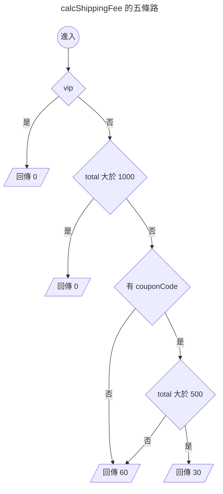

{.cover}

# AI 都幫我寫好了，還需要管複雜度嗎？( ・ิω・ิ)

大家好，我是鱈魚。%( ´ ▽ ` )ﾉ%

你朋友現在寫 code 是不是都把需求丟給 AI，十秒後交件，附測試，全綠，掃一眼就 merge。

先不管那個朋友是不是你自己。%(◐‿◑)%

總之你朋友都把需求丟給 AI，AI 都很乖，你說什麼它都照做。

第一週，它在那個函式裡加了一個 `if`。

第二週，又一個 `if`。

第三個月，打開那個函式，滾輪一路往下捲，捲到懷疑人生。%(ﾟдﾟ)%

每一次改動看起來都很合理，加起來就變成災難。

以前人工手寫不太會爛成這樣，同一個地方改到第五次，人自己就受不了了。

什麼？你說公司前人寫的祖傳程式碼都超過幾千行，早就習慣了？敬佩敬佩。%(́⊙◞౪◟⊙‵)%

其實有個 1976 年就發明出來的老指標，叫做圈複雜度（Cyclomatic Complexity）。

這篇會拿酷酷元件（[chill-component](https://chillcomponent.codlin.me/)）裡三個真實函式開刀，最後再回頭看 AI 時代還需不需要這個數字。

## 這數字到底怎麼算

一句話，程式裡的分支路徑有幾條。

名字裡的圈來自圖論，把程式流程畫成圖之後數獨立迴路有幾個。聽起來很硬，實際算起來就是數分支。

從 1 開始算，每遇到一個決策點就 +1：

- `if`、`else if`
- `for`、`while`、`do...while`
- `case`（每一個都算）
- `catch`
- 三元運算子 `? :`
- 邏輯運算子 `&&`、`||`、`??`
- 選擇性串連 `?.`

最多人搞錯的是 `else` 與 `default`，這兩個都不算。

看個例子。

```ts
function calcShippingFee(order: Order) { // 起手 1
  if (order.vip) { // +1 → 2
    return 0
  }
  if (order.total > 1000) { // +1 → 3
    return 0
  }
  if (order.couponCode && order.total > 500) { // +2 → 5
    return 30
  }
  return 60
}
```

5 分。畫成圖就很清楚，確實有五條走得完的路。



至於 `else`，加了也不會變。

```ts
function calcShippingFeeWithElse(order: Order) { // 起手 1
  if (order.vip) { // +1 → 2
    return 0
  }
  else { // 不算
    return 60
  }
}
```

只有 2 分。`if` 早就把路岔成兩條了，`else` 只是替其中一條取名字。%(ゝ∀・)b%

## 三十秒掃出自己專案的排行榜

ESLint 內建 `complexity` 規則，什麼都不用裝。

```js
// eslint.config.mjs
rules: {
  complexity: ['warn', { max: 10, variant: 'modified' }],
}
```

`variant` 是 ESLint 9.12 之後才有的選項，差別只在 `switch`。classic 模式每個 `case` 都 +1，一個十路 `switch` 直接 11 分起跳，可是那種扁平的對照表其實超好讀，被誤殺很冤。modified 模式把整個 `switch` 算成 1 分。

實測同一份程式碼：

| 寫法 | classic | modified |
|---|---|---|
| 三個 `if`（其中一個帶 `&&`） | 5 | 5 |
| 五個 `case` 加 `default` 的 `switch` | 6 | 2 |

不想動設定檔的話，臨時加規則跑一次也可以。

```bash
npx eslint . --rule '{"complexity":["warn",{"max":10,"variant":"modified"}]}'
```

我拿酷酷元件跑了一輪，45 個函式超標，前五名長這樣。

| 函式 | 分數 |
|---|---|
| `compileCreasePattern` | 61 |
| `createStem` | 39 |
| `createStemList` | 29 |
| `btn-attention-seeker` 的 watch | 27 |
| `updateAndRender` | 25 |

不過光看這一欄其實沒什麼鑑別度，`complexity` 最大的罩門在於它對巢狀沒感覺。

三個平行的 `if` 跟三層巢狀的 `if` 同樣都是 4 分，可是後者難讀太多。

所以要再加上 `eslint-plugin-sonarjs` 的認知複雜度（Cognitive Complexity），它會對巢狀加權，越深扣越兇。

```js
// eslint.config.mjs
rules: {
  'complexity': ['warn', { max: 10, variant: 'modified' }],
  'sonarjs/cognitive-complexity': ['warn', 15],
}
```

兩欄一起量，接下來三個案例剛好落在三個不同的位置。

| 案例 | 圈複雜度 | 認知複雜度 | 最深巢狀 | 行數 |
|---|---|---|---|---|
| 案例一 `btn-attention-seeker` 的 watch | 27 | 5 | 2 | 28 |
| 案例二 `handleInput` | 17 | 12 | 2 | 47 |
| 案例三 `compileCreasePattern` | 61 | 135 | 5 | 326 |

一掃下去，馬上就被發現酷酷元件的程式碼我寫得有多隨便了。%(◐‿◑)%

## 案例一：27 分的 watch

[btn-attention-seeker](https://chillcomponent.codlin.me/components/btn-attention-seeker/) 是一顆很有事的按鈕，滑鼠靠近會湊過來，卡到視窗上下緣時會探個頭出來刷存在感。

它的核心是這段 watch。

```ts
watch(() => [distanceToFrame, frameBounding], () => {
  // 視窗邊界探頭
  if (isBoundary.value) {
    if (frameBounding.bottom < props.topOffset) {
      carrierPositionAnimatable?.x?.(0)
      carrierPositionAnimatable?.y?.(frameBounding.bottom * -1 + props.topOffset + frameBounding.height * 0.75)
      carrierPositionAnimatable?.rotate?.(-10)
      return
    }
    else if (frameBounding.top > (windowSize.height - props.bottomOffset)) {
      carrierPositionAnimatable?.x?.(0)
      carrierPositionAnimatable?.y?.(
        windowSize.height - frameBounding.top - frameBounding.height * 0.75 + props.bottomOffset,
      )
      carrierPositionAnimatable?.rotate?.(10)
      return
    }
  }

  if (isFollowing.value) {
    const x = frameWithMouse.elementX - frameWithMouse.elementWidth / 2
    const y = frameWithMouse.elementY - frameWithMouse.elementHeight / 2

    carrierPositionAnimatable?.x?.(x)
    carrierPositionAnimatable?.y?.(y)
    return
  }

  carrierPositionAnimatable?.x?.(0)
  carrierPositionAnimatable?.y?.(0)
  carrierPositionAnimatable?.rotate?.(0)
}, { deep: true })
```

有趣的是，這裡只有四個 `if`。第二欄更怪，認知複雜度只有 5 分。

27 對 5，代表這段程式其實不會太難讀，分數卻高得嚇人。

那 22 分的落差是哪來的？%ლ（´口`ლ）%

我把所有 `?.` 換成直接呼叫再量一次，圈複雜度立刻剩個位數。

答案是 `carrierPositionAnimatable?.x?.()` 這種選擇性串連。

一開始我覺得指標在亂哀，想想好像也不算。%(́⊙◞౪◟⊙‵)%

`?.` 真的是分支，左邊是 `null` 就整條短路。

而這串三行的動畫呼叫，在同一個函式裡重複了四遍，所以問題點其實是多處重複。%(°ㅂ°)%

那就改善重複問題，讓每一段只負責算出目標位置，最後統一送給動畫。

```ts
interface Position { x: number; y: number; rotate: number }

const HOME_POSITION: Position = { x: 0, y: 0, rotate: 0 }

/** 探頭：視窗上下緣被遮住時，把按鈕推回可視範圍 */
function calcPeekPosition(): Position | undefined {
  if (frameBounding.bottom < props.topOffset) {
    return {
      x: 0,
      y: frameBounding.bottom * -1 + props.topOffset + frameBounding.height * 0.75,
      rotate: -10,
    }
  }

  if (frameBounding.top > windowSize.height - props.bottomOffset) {
    return {
      x: 0,
      y: windowSize.height - frameBounding.top - frameBounding.height * 0.75 + props.bottomOffset,
      rotate: 10,
    }
  }
}

/** 跟隨：滑鼠靠近時，按鈕往滑鼠方向偏移 */
function calcFollowPosition(): Position | undefined {
  if (!isFollowing.value) {
    return
  }

  return {
    x: frameWithMouse.elementX - frameWithMouse.elementWidth / 2,
    y: frameWithMouse.elementY - frameWithMouse.elementHeight / 2,
    rotate: 0,
  }
}

function updateCarrierPosition() {
  const { x, y, rotate } = calcPeekPosition() ?? calcFollowPosition() ?? HOME_POSITION

  carrierPositionAnimatable?.x?.(x)
  carrierPositionAnimatable?.y?.(y)
  carrierPositionAnimatable?.rotate?.(rotate)
}
```

重新量一次：

| 函式 | 圈複雜度 | 認知複雜度 |
|---|---|---|
| `updateCarrierPosition` | 9 | 0 |
| `calcPeekPosition` | 3 | 2 |
| `calcFollowPosition` | 2 | 1 |

27 掉到個位數，主線變成一行 `??` 串接，優先順序一眼就看得出來。

雖然程式碼變多，但整段程式碼結構是不是看起來更好理解了呢？%( •̀ ω •́ )✧%

## 案例二：17 分的輸入法地獄

[input-decoding](https://chillcomponent.codlin.me/components/input-decoding/) 是打字時字元會亂碼跳動、最後解碼成正確文字的輸入框，看起來很駭客，實作起來要跟中文輸入法搏鬥。

它的 `handleInput` 是 17 分，分支全是邊界條件，`isComposing` 拼字中、`insertText` 一般輸入、`insertFromDrop` 拖曳、`delete` 刪除，還有拼音選字造成的 caret（游標）位置偏移。

這次兩欄很接近，圈複雜度 17，認知複雜度 12。

這 17 分是真材實料，每一條路徑都要算，沒有重複問題，每個 `if` 都對應一種真實存在的輸入行為。

所以這個案例要看的是測試。

### 這支函式到底該有幾條測試

圈複雜度還有另一個身分。走完所有線性獨立路徑要寫幾條測試，它就是幾分。

覆蓋率報告很容易忽略這件事，因為覆蓋率只算「這一行、這個分支跑過沒有」，但路徑才算「這些分支的組合走過沒有」。

17 分的函式，三、四條測試就能讓分支覆蓋率變得很好看，離 17 條獨立路徑還遠得很。

而輸入法的 bug 幾乎都藏在「拼字中又剛好按了刪除」這種組合裡。%(;´༎ຶД༎ຶ`)%

### 基線法：把分數轉換成測試清單

那實際上要怎麼寫這 17 條？

McCabe 提出圈複雜度的同一篇論文裡，也給了配套的測試設計法，叫基線法（baseline method）。做法只有兩步。

**第一步，走一條基線。** 挑最典型、最常發生的那條路徑，從函式入口一路走到結束。`handleInput` 的基線就是「沒在拼字，直接打一個英文字母」。

**第二步，回頭逐一翻轉。** 回到基線經過的第一個判斷點，只把它翻轉，其他條件全部照基線不動，走出來就是第二條路徑。接著回到第二個判斷點翻轉，得到第三條。每個判斷點各翻一次，全部翻完後就會得到圈複雜度的數值。

實際跑 `handleInput` 的前幾條長這樣。

| # | 翻的判斷點 | 情境 | 結果 |
|---|---|---|---|
| 1 | 基線 | 沒在拼字，直接打一個 `a` | 走完全程，插入字元 |
| 2 | `event` 型別守衛 | 丟一個普通 `Event` 進去 | 第一行就 return |
| 3 | `isComposing` | 注音打到一半觸發 | 第二個守衛 return |
| 4 | `caretStart !== caretEnd && isFirstComposed` | 選完字才送出 | caret 位置偏移一格 |
| 5 | `insertFromDrop` | 把文字拖進輸入框 | 走拖曳插入分支 |
| 6 | `inputType.includes('delete')` | 按 backspace | 走全部重建分支 |

每一列都對得上一個真實的使用者動作。測試清單不用憑空想，照著控制流走就會長出來。%(ゝ∀・)b%

**關鍵是一次只翻一個判斷點。**

一次翻兩個很誘人，測試數量看起來會少一半。可是那樣走出來的路徑不算新的獨立路徑，它等於前面兩條疊起來，不會多蓋到任何東西。

實務上的代價更直接。測試掛掉的時候你不知道是哪個條件出問題，還得再拆一次。%(°ㅂ°)%

### 可是有幾條翻不動

聽起來很機械，實際套到 `handleInput` 上就會卡住。

| 判斷點 | 翻得動嗎 |
|---|---|
| `event` 不是 `InputEvent` 也不是 `CompositionEvent` | 可以，丟普通 `Event` 進去 |
| `isComposing` | 可以，注音打到一半觸發 |
| `targetEl` 不是 `HTMLInputElement` | 翻不動，事件永遠來自那個 input |
| `caretStart !== caretEnd && isFirstComposed` | 可以，選字後的位置偏移 |
| `targetEl.selectionStart ?? ⋯` | 翻不動，`type="text"` 的 `selectionStart` 不會是 `null` |
| `targetEl.selectionEnd ?? ⋯` | 翻不動，同上 |
| `event.data ?? ''` | 可以，刪除事件的 `data` 本來就是 `null` |
| `'inputType' in event`（出現三次） | 翻不動，跟第一個守衛同義，是 `InputEvent` 就一定為真 |
| `insertText`、`compositionend`、`insertFromDrop`、`delete` | 可以，四種真實輸入行為 |

扣掉翻不動的，實際寫得出來的大概十一、二條。%(´・ω・`)%

這不代表指標算錯。17 是控制流上的路徑數，數學沒問題，只是其中幾條在這個元件的使用情境裡走不到，例如 `type="text"` 的 `selectionStart` 永遠有值，那兩個 `??` 就沒有另一半可以測。

所以 17 要當成上限。先照著翻，翻不動的一條一條寫下理由。

湊滿 17 條反而是危險訊號，代表有人在硬湊。%(;´༎ຶД༎ຶ`)%

而那些理由本身就是文件。哪天有人把 `type="text"` 改成 `type="email"`，`selectionStart` 就真的會變成 `null`，那兩條翻不動的路徑會立刻活過來。%(°ㅂ°)%

## 案例三：61 分的冠軍

`compileCreasePattern` 是 [transition-origami](https://chillcomponent.codlin.me/components/transition-origami/) 的摺紙圖樣編譯器，吃一組摺線定義，吐出可以拿去跑物理模擬的三角網格。

61 分，全專案冠軍。照前面的做法，先看第二欄。

認知複雜度 135，門檻的九倍，最深五層巢狀，整整 326 行，相當之可怕。

不過仔細看看內容，會發現它是一條從頭走到尾的管線，頂點吸附、逐段切割、去重、面萃取、三角化、正規化，九個階段一路做到底。

硬拆成九個函式，`vertexList`、`segmentList`、`snapEpsilon` 這些中間狀態就得全部變成參數傳來傳去。

<br>

路人：「因為是管線所以不應該拆嗎？」

鱈魚：「其實也該處理，尤其是那個五層巢狀，只是因為會動，我懶得處理。%∠( ᐛ 」∠)_%」

路人：「...(◉◞౪◟◉ )」

## AI 都幫我寫好了，還需要這個數字嗎

圈複雜度當年紅起來，很大一部分理由是人腦一次裝不下太多東西，函式太長就讀不動。

現在 AI 可能輕輕鬆鬆讀完幾千行程式碼，這個理由其實不太成立了。

不過還有三個理由讓它可以派上用場。

### 一、控制流與測試相關

17 條獨立路徑就是 17 條，AI 寫的也是 17 條。

這條規則只跟控制流有關，跟程式碼是誰打的無關。AI 可以幫你把那 17 條測試寫出來，卻沒辦法讓 17 條變成 3 條。

實際跟 AI 協作時，這個數字最大的用處是當停止條件。

直接說「幫我補測試」，它可能會變出三、四條快樂路徑，覆蓋率變綠就快樂收工。

這是因為沒有一個客觀的量測資料，而圈複雜度可以作為客觀的參照值。%( ´ ▽ ` )ﾉ%

```text
先量這支函式的圈複雜度：
npx eslint 那支檔案 --rule '{"complexity":["warn",{"max":0}]}'

接著用 McCabe 基線法，列出跟分數等量的測試案例。
先不要寫程式碼，用表格給我清單：

| # | 翻轉的判斷點 | 輸入 | 預期結果 |

如果某條路徑實務上走不到，照樣列出來，
在預期結果欄寫「不可行」並說明原因。
```

不過有個重要前提記得和 AI 說，不然 AI 會走捷徑。

就是「允許它說做不到」，否則分數 17 ，AI 就硬湊 17 條。

可能會瞎掰或鑽牛角尖，嘗試走不到的路徑，浪費時間也浪費 token。%( ・ิω・ิ)%

驗收也很簡單，數清單幾列，跟分數對不上就回頭多問，多問多健康。%(ゝ∀・)b%

### 二、預測 AI 的改動失誤率

認知複雜度越高，內部糾纏的狀態就越多，改 A 分支順手弄壞 B 分支的機率也越高。

所以這兩欄合起來就是爆炸半徑的量尺。

請 AI 動 5 分的函式，最多影響五條路，出事了掃一眼就知道。

請它動 `compileCreasePattern` 那種 135 分的怪物，記得先買一箱乖乖、燒香。%(´,,•ω•,,)%

### 三、抓得到 AI 特有的退化模式

人類工程師改同一個函式改到第五次，會開始煩躁，會想不開整個重寫。%乁( ◔ ௰◔)「%

現在那個函式已經沒有人類讀者了，AI 面對新需求，最自然的反應是再塞一個 `if`，因為那是最小的 diff，看起來最安全，也最不容易打壞現有測試。

每一步都是漂亮的局部最佳解，一路走進全域的爛攤子。

複雜度趨勢可以反映這一點，提供一個客觀的量測指標。

## 總結 🐟

- 圈複雜度就是分支路徑數，從 1 起算，每個判斷 +1，`else` 與 `default` 都不算。`?.`、`&&`、`??` 也會算，所以分數常常虛胖。
- 一定要配認知複雜度一起看。圈複雜度遠高於認知複雜度，代表分數灌水，消除重複就好；反過來代表巢狀太深，該壓平的是縮排。
- 圈複雜度同時告訴你走完所有獨立路徑要幾條測試，扣掉走不到的路徑，剩下的就是實際該寫的條數。覆蓋率亮綠燈不代表路徑走完了。
- AI 面對新需求傾向再加一個 `if`，因為那是最小 diff。以前是人讀到受不了才動手重寫，現在沒人讀了，複雜度曲線正好補上這個缺掉的訊號。
- 設 `warn` 當雷達，盯趨勢不盯絕對值。分數高代表這裡真的有事，打開來才知道是要消除重複、壓平巢狀，還是補上測試。

所以加上這兩條規則之後，程式就永遠乾淨、AI 就再也不會亂加 `if` 了嗎？

當然不會，它還是會加，只是這次你看得到。%(ゝ∀・)b%

有錯誤還請多多指教，感謝您讀到這裡，如果您覺得有收穫，歡迎分享出去。
