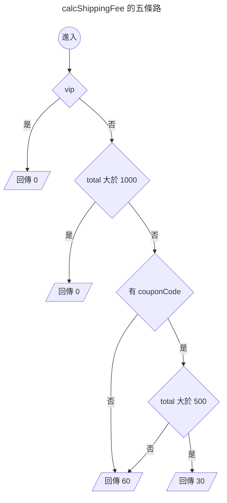

{.cover}

# AI 都幫我寫好了，還需要管複雜度嗎？( ・ิω・ิ)

大家好，我是鱈魚。%( ´ ▽ ` )ﾉ%

你朋友現在寫 code 是不是都把需求丟給 AI，十秒後交件，附測試，全綠，掃一眼就 merge。

先不管那個朋友是不是你自己。%(◐‿◑)%

總之你朋友都把需求丟給 AI，AI 都很乖，你說什麼它都照做。

第一週，它在那個函式裡加了一個 `if`。

第二週，又一個 `if`。

第三個月，打開那個函式，滾輪一路往下捲，捲到懷疑人生。%(ﾟдﾟ)%

每一次改動看起來都很合理，加起來就變成災難。

以前人工手寫不太會爛成這樣，同一個地方改到第五次，人自己就受不了了。

什麼？你說公司前人寫的祖傳程式碼都超過幾千行，早就習慣了？敬佩敬佩。%(́⊙◞౪◟⊙‵)%

其實有個 1976 年就發明出來的老指標，叫做圈複雜度（Cyclomatic Complexity）。

這篇會拿酷酷元件（[chill-component](https://chillcomponent.codlin.me/)）裡一支真實函式開刀，最後再回頭看 AI 時代還需不需要這個數字。

## 這數字到底怎麼算

一句話，程式裡的分支路徑有幾條。

名字裡的圈來自圖論，把程式流程畫成圖之後數獨立迴路有幾個。

聽起來很抽象很學術，實際上就是數分支啦。%(´,,•ω•,,)%

從 1 開始算，每遇到一個決策點就 +1：

- `if`、`else if`
- `for`、`while`、`do...while`
- `case`（每一個都算）
- `catch`
- 三元運算子 `? :`
- 邏輯運算子 `&&`、`||`、`??`
- 選擇性串連 `?.`

最多人搞錯的是 `else` 與 `default`，這兩個都不算。

看個例子。

```ts
function calcShippingFee(order: Order) { // 起手 1
  if (order.vip) { // +1 → 2
    return 0
  }
  if (order.total > 1000) { // +1 → 3
    return 0
  }
  if (order.couponCode && order.total > 500) { // +2 → 5
    return 30
  }
  return 60
}
```

5 分。畫成圖就很清楚，確實有五條走得完的路。



至於 `else`，加了也不會變。

```ts
function calcShippingFeeWithElse(order: Order) { // 起手 1
  if (order.vip) { // +1 → 2
    return 0
  }
  else { // 不算
    return 60
  }
}
```

只有 2 分。`if` 早就把路岔成兩條了，`else` 只是替其中一條取名字。%(ゝ∀・)b%

## 三十秒掃出自己專案的排行榜

ESLint 內建 `complexity` 規則，什麼都不用裝。

```js
// eslint.config.mjs
rules: {
  complexity: ['warn', { max: 10, variant: 'modified' }],
}
```

`variant` 是 ESLint 9.12 之後才有的選項，差別只在 `switch`。classic 模式每個 `case` 都 +1，一個十路 `switch` 直接 11 分起跳，可是那種扁平的對照表其實超好讀，被誤殺很冤。modified 模式把整個 `switch` 算成 1 分。

實測同一份程式碼：

| 寫法 | classic | modified |
|---|---|---|
| 三個 `if`（其中一個帶 `&&`） | 5 | 5 |
| 五個 `case` 加 `default` 的 `switch` | 6 | 2 |

不想動設定檔的話，臨時加規則跑一次也可以。

```bash
npx eslint . --rule '{"complexity":["warn",{"max":10,"variant":"modified"}]}'
```

我拿酷酷元件跑了一輪，45 個函式超標，前五名長這樣。

| 函式 | 分數 |
|---|---|
| `compileCreasePattern` | 61 |
| `createStem` | 39 |
| `createStemList` | 29 |
| `btn-attention-seeker` 的 watch | 27 |
| `updateAndRender` | 25 |

一掃下去，酷酷元件的程式碼我寫得有多隨便，馬上就露餡了。%(◐‿◑)%

不過光看這一欄其實沒什麼鑑別度，`complexity` 最大的罩門在於它對巢狀沒感覺。

三個平行的 `if` 跟三層巢狀的 `if` 同樣都是 4 分，可是後者糾纏得多。

所以要再加上 `eslint-plugin-sonarjs` 的認知複雜度（Cognitive Complexity），它會對巢狀加權，越深扣越兇。

```js
// eslint.config.mjs
rules: {
  'complexity': ['warn', { max: 10, variant: 'modified' }],
  'sonarjs/cognitive-complexity': ['warn', 15],
}
```

兩欄一起量，先拿排行榜第四名那段 watch 開刀，圈複雜度 27、認知複雜度 5、最深巢狀 2、只有 28 行。

## 案例：27 分的 watch

[btn-attention-seeker](https://chillcomponent.codlin.me/components/btn-attention-seeker/) 是一顆很有事的按鈕，滑鼠靠近會湊過來，卡到視窗上下緣時會探個頭出來刷存在感。

它的核心是這段 watch。

```ts
watch(() => [distanceToFrame, frameBounding], () => {
  // 視窗邊界探頭
  if (isBoundary.value) {
    if (frameBounding.bottom < props.topOffset) {
      carrierPositionAnimatable?.x?.(0)
      carrierPositionAnimatable?.y?.(frameBounding.bottom * -1 + props.topOffset + frameBounding.height * 0.75)
      carrierPositionAnimatable?.rotate?.(-10)
      return
    }
    else if (frameBounding.top > (windowSize.height - props.bottomOffset)) {
      carrierPositionAnimatable?.x?.(0)
      carrierPositionAnimatable?.y?.(
        windowSize.height - frameBounding.top - frameBounding.height * 0.75 + props.bottomOffset,
      )
      carrierPositionAnimatable?.rotate?.(10)
      return
    }
  }

  if (isFollowing.value) {
    const x = frameWithMouse.elementX - frameWithMouse.elementWidth / 2
    const y = frameWithMouse.elementY - frameWithMouse.elementHeight / 2

    carrierPositionAnimatable?.x?.(x)
    carrierPositionAnimatable?.y?.(y)
    return
  }

  carrierPositionAnimatable?.x?.(0)
  carrierPositionAnimatable?.y?.(0)
  carrierPositionAnimatable?.rotate?.(0)
}, { deep: true })
```

可是這裡只有四個 `if`。認知複雜度更怪，只有 5 分。

27 對 5，代表這段程式的結構其實很扁平，分數卻高得嚇人。

那 22 分的落差是哪來的？%ლ（´口`ლ）%

我把所有 `?.` 換成直接呼叫再量一次，圈複雜度立刻剩個位數。

答案是 `carrierPositionAnimatable?.x?.()` 這種選擇性串連。

一開始我覺得指標在亂哀，想想好像也不算。%(́⊙◞౪◟⊙‵)%

`?.` 真的是分支，左邊是 `null` 就整條短路。

而這串三行的動畫呼叫，在同一個函式裡重複了四遍，所以問題點其實是多處重複。%(°ㅂ°)%

那就改善重複問題，讓每一段只負責算出目標位置，最後統一送給動畫。

```ts
interface Position { x: number; y: number; rotate: number }

const HOME_POSITION: Position = { x: 0, y: 0, rotate: 0 }

/** 探頭：視窗上下緣被遮住時，把按鈕推回可視範圍 */
function calcPeekPosition(): Position | undefined {
  if (frameBounding.bottom < props.topOffset) {
    return {
      x: 0,
      y: frameBounding.bottom * -1 + props.topOffset + frameBounding.height * 0.75,
      rotate: -10,
    }
  }

  if (frameBounding.top > windowSize.height - props.bottomOffset) {
    return {
      x: 0,
      y: windowSize.height - frameBounding.top - frameBounding.height * 0.75 + props.bottomOffset,
      rotate: 10,
    }
  }
}

/** 跟隨：滑鼠靠近時，按鈕往滑鼠方向偏移 */
function calcFollowPosition(): Position | undefined {
  if (!isFollowing.value) {
    return
  }

  return {
    x: frameWithMouse.elementX - frameWithMouse.elementWidth / 2,
    y: frameWithMouse.elementY - frameWithMouse.elementHeight / 2,
    rotate: 0,
  }
}

function updateCarrierPosition() {
  const { x, y, rotate } = calcPeekPosition() ?? calcFollowPosition() ?? HOME_POSITION

  carrierPositionAnimatable?.x?.(x)
  carrierPositionAnimatable?.y?.(y)
  carrierPositionAnimatable?.rotate?.(rotate)
}
```

重新量一次：

| 函式 | 圈複雜度 | 認知複雜度 |
|---|---|---|
| `updateCarrierPosition` | 9 | 0 |
| `calcPeekPosition` | 3 | 2 |
| `calcFollowPosition` | 2 | 1 |

程式碼變多了，可是四段重複的動畫呼叫收斂成一處，主線變成一行 `??` 串接，兩欄分數也一起掉到個位數。%( •̀ ω •́ )✧%

## AI 都幫我寫好了，還需要這個數字嗎

圈複雜度當年紅起來，很大一部分理由是人腦一次裝不下太多東西，函式太長就讀不動。

接下來直接假設最極端的情況，**程式完全交給 AI 寫，沒有人會再打開那個檔案**。

「人讀不動」這條理由不再成立，指標的剩餘價值找找看有沒有其他理由。

我把問題丟給 AI，它講得頭頭是道，說守門員能擋住 AI 亂塞分支，程式拆乾淨，接手的 AI 才不會改壞。聽起來都對，可是這種事用嘴巴講沒用，要拿數據來。%( ・ิω・ิ)%

### 三種 CLAUDE.md，各開六個專案

做法是把立場寫進 CLAUDE.md，其他條件全部相同，讓 AI 從開頭那支 5 分的運費函式起步，連續實作 21 條需求。

| 立場 | CLAUDE.md 怎麼寫 |
|---|---|
| 最小改動派 | 不用任何指標，測試全綠就是好程式碼，只做需求要求的事，不重構 |
| 自律派 | 不用任何指標，每次做完必須檢視整份 src，整理到自己滿意為止 |
| 指標派 | ESLint 設圈複雜度 10、認知複雜度 15 當門檻，超標 CI 就紅，不准關規則 |

每個立場六條軌跡，共 18 個專案。每一週都換一個全新的 Claude Sonnet 接手，沒有記憶，資料夾只有編號，它不知道自己在實驗裡。錯了不修、不提示，一路疊到第 21 週。

判分不靠人看。我另外維護一份參考實作，每週把所有欄位的取值全部組合一遍，逐筆比對 AI 寫的函式，21 週合計 1 億零 787 萬筆。第 21 週的需求刻意只給兩個數字，其餘規則要 AI 從既有程式碼讀出來，模擬接手。

開跑前另外請兩個 Opus 分別扮演擁護派與廢除派，先審設計、寫預測、寫認輸條件，全部 commit 才開跑。跑完各自對照自己的預測寫判決，再由第三個 Opus 裁定。

### 結果：零錯誤

| 項目 | 最小改動派 | 自律派 | 指標派 |
|---|---|---|---|
| 21 週窮舉比對的錯誤數 | 0 | 0 | 0 |
| 第 21 週最大圈複雜度（中位數） | 28.5 | 7 | 6 |
| 21 週內超過門檻的次數 | 93 / 126 | 0 / 126 | 0 / 126 |
| 第 21 週圈複雜度總和（中位數） | 38 | 32.5 | 44.5 |
| 每週耗時（以最小改動派為 1） | 1.00 | 1.68 | 1.20 |
| 全新 AI 接手心算 28 題 | 全對 | 全對 | 全對 |

三個立場、18 條軌跡、378 次交件，正確率全部滿分。接手的 AI 讀一支圈複雜度 38 的函式，跟讀拆成 13 個函式的版本，心算 28 題都全對，花的 token 也一樣。

擁護派開跑前押「最小改動派至少四條會出錯」，結果是零，它的十條認輸條件成立了九條，照自己寫的條文認輸。廢除派的認輸條件全沒觸發，卻不認為自己贏了，因為它事前就寫了「三組全部零失誤是天花板效應，什麼都沒證明」。裁判也這樣裁，守門員有沒有用，這個難度、這個模型下**測不到**。

鱈魚：「所以我燒了 3300 萬個 token，證明了……測不到？%( ˘•ω•˘ )%」

路人：「你這結果講出去會被笑欸。%(´・ω・`)%」

鱈魚：「錢沒白燒，另外測到了三件事。%(ゝ∀・)b%」

- **沒有數字，AI 也整理得很乾淨。** 自律派沒有任何門檻，準則只寫「整理到自己滿意」，六條軌跡 126 週裡沒有一次超過指標派的門檻，最大圈複雜度全程不超過 9。最小改動派則從第 4 週起週週超標，有一條疊到 38 分。
- **門檻壓低的是最大值，總量反而更高。** 指標派最大圈複雜度最低，圈複雜度總和卻是三組裡最高，判斷離島、海外這類地區的程式碼散落到 15 個地方，自律派只有 2 個。門檻逼 AI 把複雜度分散到十幾個函式裡，總量沒有變少。
- **守門員很便宜，自律很貴。** 指標派比最小改動派多花兩成時間，兩位審查者事前都押至少四成，全部高估；叫 AI 自己檢視整份程式碼則多花近七成，三組裡最貴。

開頭那句「一週加一個 `if`，最後捲到懷疑人生」也被打臉了，這個模型身上沒有出現。378 次交件最深巢狀只有 1 或 2，最糟的那支是 71 行平坦的 `else if` 長串，醜歸醜，AI 照樣讀得懂、改得對。%(◐‿◑)%

那零失誤到底是誰擋下來的？隔天又跑了兩輪去查。

**第一輪把測試拿掉。** 改成由我維護、每週只覆蓋當週需求的 10 條驗收測試，AI 不准補歷史迴歸測試。三條軌跡跑滿 21 週，996 萬筆比對，零失誤。CI 執行 64 次、失敗 0 次，每一週的第一版就已經正確，測試從頭到尾沒擋下任何東西。

**第二輪把題目換掉。** 改成五個檔案、四個模組互相依賴，「改一個地方要牽動三個檔案」變成常態。第 18 週埋了個陷阱，需求寫「重量超過 30 公斤且地區不是本島就不配送」，三條軌跡當週全部照著寫下 `region !== 'main'`。第 21 週新增地區時，需求只說「其餘比照本島」，沒指名任何檔案，三條全部自己回頭把那一行找出來改對。1017 萬筆比對，還是零失誤。

鱈魚：「所以測試不是關鍵，跨檔案也不是關鍵。%( ˘•ω•˘ )%」

路人：「那到底是什麼？%(´・ω・`)%」

鱈魚：「這個難度對現在的模型來說，就是不難。%(ゝ∀・)b%」

完整設計、每週資料、兩位審查者的判決與裁判裁定，都在[實驗報告](https://github.com/Codfisher/cod-aquarium/blob/main/docs/cyclomatic-complexity-in-the-ai-era.md)。

## 別人的研究怎麼說

零錯誤、零差異，講出去很像在護航，所以去翻了論文。%(´・ω・`)%

**對人類，這兩個數字量得到多難，量不到會不會錯。** 分支幾條、巢狀幾層，算出來就是那樣，爭議在拿它預測什麼。[Shepperd](https://digital-library.theiet.org/doi/10.1049/sej.1988.0003) 1988 年就指出，拿圈複雜度預測缺陷數與工時，多數軟體用行數預測得一樣好；[Landman 等人](https://onlinelibrary.wiley.com/doi/abs/10.1002/smr.1760)2016 年用 1,760 萬個 Java 方法重驗，它跟行數只有中等相關，量到的面向確實不同，只是沒換成更準的預測。

認知複雜度也一樣，[Muñoz Barón 等人](https://arxiv.org/abs/2007.12520)整合兩萬多筆人類受試資料，它跟理解時間、主觀難度正相關，跟答對率的關聯混雜；[Lavazza 等人](https://www.sciencedirect.com/science/article/abs/pii/S0164121222002370)再驗，預測看不看得懂沒有明顯贏過行數。文章前面揪出重複、當雷達找函式，靠的都是「數分支」這個事實，跟預測 bug 無關，所以站得住。我的實驗量的是「會不會錯」，零差異，跟人類的研究同方向。

**給人看的形狀，LLM 大多無感。** [Pan 等人](https://arxiv.org/abs/2508.13666)（ICSE 2026）把縮排、空白、換行全拔掉餵給十個模型，Pass@1 最多掉 4.2%。[Xie 等人](https://arxiv.org/abs/2602.07882)（ICML 2026）直接問傳統複雜度指標反不反映 LLM 覺得多難，答案是沒有一致的相關。[Ashrafi](https://arxiv.org/abs/2606.00308) 在 HumanEval 上比六種多代理人架構，複雜度差了 50% 到 130%，正確率沒差。

**但語意保留變換另當別論。** [Orvalho 與 Kwiatkowska](https://arxiv.org/abs/2505.10443)把 for 改 while、交換 if-else，九個模型預測程式輸出的表現最多掉 70%；[Spiess 等人](https://arxiv.org/abs/2604.16320)測 GPT-5.2，擾動後掉 20 幾個百分點；[Haroon 等人](https://arxiv.org/abs/2504.04372)的錯誤定位實驗，變換後 78% 的案例找不到原本找得到的錯。這跟我的心算測驗是同一種任務，結果相反，差別在他們是刻意反直覺的改寫，我只是拆或不拆函式。所以我能說的只有「拆不拆函式不在脆弱區」。%(◐‿◑)%

**長序列劣化的確存在，指引壓得住。** 跟我最像的是 2026 年的 [SlopCodeBench](https://arxiv.org/abs/2603.24755)，196 個檢查點讓 15 個代理人反覆擴充自己的程式碼，「結構侵蝕」的門檻剛好也是圈複雜度 10。沒有指引時 77% 的軌跡侵蝕上升，一段品質指引把它降 57.6%、成本多 12.1%，而且正確率與劣化各走各的，四項都跟我對得上。[GitClear](https://www.gitclear.com/ai_assistant_code_quality_2025_research) 2025 年的 2.11 億行資料也同方向，重構佔比從 25% 掉到不到 10%。

| 我的發現 | 文獻 | 判定 |
|---|---|---|
| 三組正確率沒有差異 | 正確率與劣化各走各的；傳統指標與 LLM 表現無一致相關 | 相符 |
| 沒有指引只加不整理，叫它整理就乾淨 | 77% 軌跡侵蝕上升；文字指引降侵蝕 57.6% | 相符 |
| 門檻多兩成成本 | 指引多 12.1% | 量級相符 |
| 讀 38 分跟讀 6 分一樣準 | 語意保留變換能讓模型大幅失準 | 部分相符 |

文獻沒有人比過「數字門檻」跟「文字指引」，這一格是我補上的，兩者都把複雜度壓在門檻下，門檻便宜得多。%(ゝ∀・)b%

## 總結 🐟

- 圈複雜度就是數分支，`else` 不算，`?.` 與 `&&` 都算，ESLint 內建規則三十秒就能掃出整個專案的排行榜。
- 它對巢狀沒感覺，要搭配認知複雜度一起看，27 對 5 代表重複，兩欄一起高才代表糾纏。
- 全 AI 開發的實驗裡，指標守門員對正確率的影響測不到，測得到的是它把複雜度分散到更多函式、多花兩成時間；叫 AI 自己整理更乾淨，但更貴。
- 拿掉測試、換成跨檔案耦合各跑一輪，錯誤率還是零，這個難度對現在的模型就是不難。門檻該設 warn 當雷達還是 error 當閘門，這個實驗回答不了，人要讀的程式碼還是照前面幾節的方法判斷。

有錯誤還請多多指教，感謝您讀到這裡，如果您覺得有收穫，歡迎分享出去。%( ´ ▽ ` )ﾉ%
