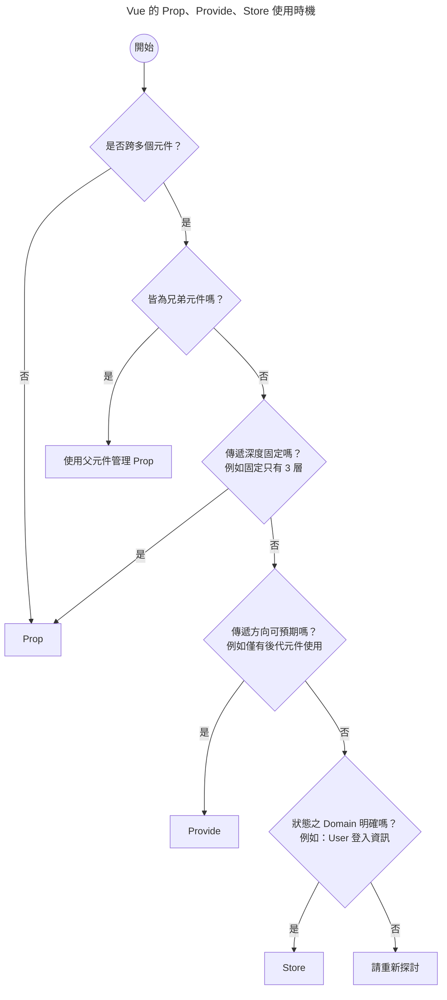

# 關於 Vue 資料流那檔事

實際開發時，常常會遇到怎麼規劃資料流的問題。

此文是筆記，不是指南，希望大家可以多多討論，一起進步。

::: tip
[軟體開發沒有銀彈](https://zh.wikipedia.org/zh-tw/%E6%B2%A1%E6%9C%89%E9%93%B6%E5%BC%B9)，沒有絕對的對錯，只有適不適合，實務上要根據專案規模、需求持續調整。
:::

未來某天可能會發現目前的寫法不好、考量不夠完整，所以本文會持續不定期更新。(´,,•ω•,,)

接下來讓我們根據情境或 Vue API 來討論資料流的概念與實作吧。੭ ˙ᗜ˙ )੭

## 依照 API

Vue 中基本傳遞資料的方式有 Prop（emit）、Provide、Store

我自己列了一個簡易的流程圖，簡化思考。

### 甚麼時候使用 store？

這裡的 store 只的是像 Vuex、Pinia 這類的狀態管理套件，其資料為全域共享。

方便歸方便，但是也容易造成資料流不清晰，所以在使用時要特別注意。

## 依情境

## 兄弟元件溝通

元件設計時，應該盡量元件單一化，也就是從元件的角度出發，元件只關心 props 進來的參數，不關心外部狀態。

## 總結 🐟
