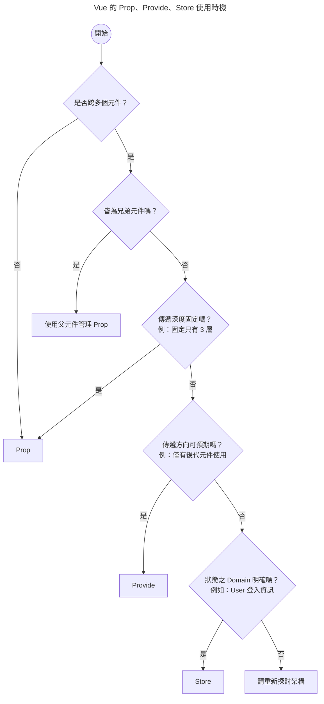

# 關於 Vue 資料流那檔事

實際開發時，常常會遇到怎麼規劃資料流的問題。

此文筆記了一些曾經遇過的情境，不是規範指南，希望大家可以多多討論，一起進步。(*´∀`)~♥

可能某天會發現寫法不好、考量不夠周到，所以本文會持續不定期更新。(´,,•ω•,,)

::: tip 軟體開發沒有銀彈
[軟體開發沒有銀彈](https://zh.wikipedia.org/zh-tw/%E6%B2%A1%E6%9C%89%E9%93%B6%E5%BC%B9)，沒有絕對的對錯，只有適不適合，實務上要根據專案規模、需求持續調整。
:::

接下來讓我們根據情境或 Vue API （Vue 3）來討論資料流的概念與實作吧。੭ ˙ᗜ˙ )੭

::: tip 強烈推薦 TypeScript
有 TypeScript 協助檢查，直接少一大半問題 (´,,•ω•,,)
:::

## 依照 API

Vue 中基本傳遞資料的方式有 Prop（emit）、Provide、Store

我自己列了一個簡易的流程圖，簡化思考。

### 經典的 Prop

Prop 的目的在於元件不用管外部狀態如何，只關心內部資料如何使用。

透過固定的資料定義，讓元件可以任意拔插。

當然實作上很常遇到「隨著各種追加需求，參數指數增加，為了向下相容，導致參數越來越歪」的問題。

這個未來有機會再另開文章，筆記一下元件設計問題。...(›´ω`‹ )

### 甚麼時候使用 store？

這裡的 store 指的是像 Vuex、Pinia 這類的狀態管理套件，其資料為全域共享。

除了全域共享外，個人覺得與 Prop 最大的不同在於：「在元件內部依賴指定資料」

意思是此元件不能獨立運作，必須依賴 store 才能正常運作。

沒有不好，需要看情況討論，我的心得是：

- 基礎元件（或稱 [Atom 元件](https://medium.com/@kevinkurniawan97/atomic-design-with-vue-fa1b50a1251e)不要資賴 store

    Button、Input 這類基礎元件內部不要依賴 store、外部 API 等等，最好使用 Prop 傳遞資料

- 傳遞深度未知、需全域共享且領域清晰的的資料會用 store

    User 登入資訊、購物車資訊等等

如果需共享的資料資料來自於外部 API，也可以考慮使用 [Tanstack Query](https://tanstack.com/query/v5/docs/framework/vue/overview#motivation)（舊稱 Vue Query），不只省去 store，還有很多實用功能。

::: tip Vue 3 不需要 store？
有看過有人說「Vue 3 的響應式系統配合 ESModule，就可以共享資料了，根本不需要使用 store」

這個說法其實沒錯，如果網頁只是一個很簡單的一頁式活動頁面，還真的不需要。

但是若不確定專案會不會持續增長，還是建議使用 Pinia。

因為隨著專案成長，你可能會開始需要解決以下問題：

- 如何除錯
- HMR 問題（保留、更新資料等等）
- 將 store 資料自動儲存至 localStorage（資料持久化）
- 追蹤資料變更

甚至 SSR 相關問題等等。

以上問題解決後會發現：恭喜！重工了一個 Pinia！ヽ(́◕◞౪◟◕‵)ﾉ

而且沒辦法使用 Pinia 現有生態系（各種外掛、工具），後續接手的人可能會很痛苦。

Pinia 已經設計得相當簡易了，所以一般情況下還是用 Pinia 吧。(´● ω ●`)
:::

### Provide？

Provide 的用法在[官方文件](https://vuejs.org/guide/components/provide-inject)解釋得很清楚。

主要目的是解決層層傳遞的問題，但是也有與 store 類似的問題，就是資料流不清晰。

::: tip
從[實作的角度](https://github.com/vuejs/pinia/blob/2071db285569a3119cf62c5be16a63fb7b681b1d/packages/pinia/src/createPinia.ts#L29)來看，store 就是依靠 Provide 從 App 層注入，實現所有元件資料共享功能。
:::

## 依情境

以下是目前曾經遇到的一些情境，歡迎補充討論。( ´ ▽ ` )ﾉ

### 兄弟元件溝通

元件設計時，應該盡量元件單一化，也就是從元件的角度出發，元件只關心 props 進來的參數，不關心外部狀態。

### Composable 共享資料

### 切換頁面傳值

## 總結 🐟
