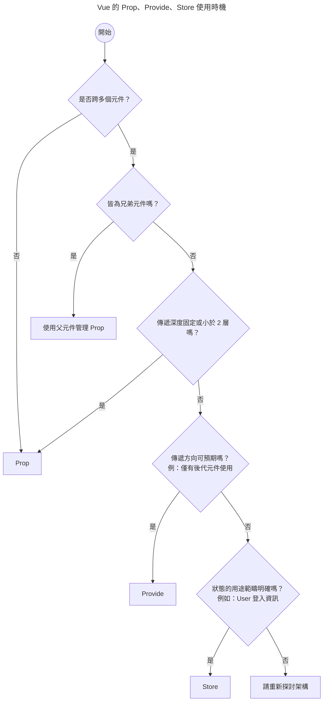

# 關於 Vue 資料流那檔事

{.cover}

實際開發時，常常會遇到怎麼規劃資料流的問題。

::: tip 強烈推薦 TypeScript
有 TypeScript 協助檢查，直接少一大半問題 %(´,,•ω•,,)%
:::

此文筆記了一些曾經遇過的情境，不是規範指南，希望大家可以多多討論，一起進步。%(*´∀`)~♥%

可能某天會發現寫法不好、考量不夠周到，所以本文會持續不定期更新。%(´,,•ω•,,)%

::: tip 軟體開發沒有銀彈
[軟體開發沒有銀彈](https://zh.wikipedia.org/zh-tw/%E6%B2%A1%E6%9C%89%E9%93%B6%E5%BC%B9)，沒有絕對的對錯，只有適不適合，實務上要根據專案規模、需求持續調整。
:::

接下來讓我們根據情境或 Vue API （Vue 3）來討論資料流的概念與實作吧。%੭ ˙ᗜ˙ )੭%

## 依 API

Vue 中基本傳遞資料的方式有 Prop（emit）、Provide、Store

其實官方文件已經有很詳細的[說明](https://vuejs.org/v2/guide/components.html#Passing-Data-with-Props)，這裡只是根據實務經驗整理一下。

我自己列了一個簡易的流程圖，簡化思考。



### 經典的 Prop

Prop 的目的在於元件不用管外部狀態如何，只關心內部資料如何使用。

透過固定的資料定義，讓元件可以任意拔插。

當然實作上很常遇到「隨著各種追加需求，參數瘋狂增加，為了向下相容，導致參數越來越歪」的問題。

這個未來有機會再另開文章，筆記一下元件設計問題。...(›´ω`‹ )

### 甚麼時候使用 store？

這裡的 store 指的是 Vuex、Pinia 這類的狀態管理套件，其資料為全域共享。

除了全域共享外，個人覺得 store 與 Prop 最大的不同在於：「在元件內部依賴指定資料」

意思是此元件不能獨立運作，必須依賴 store 才能正常運作。

好不好需要看情況討論，我的心得是：

- 基礎元件（或稱 [Atom 元件](https://medium.com/@kevinkurniawan97/atomic-design-with-vue-fa1b50a1251e)）不要資賴 store

    Button、Input 這類基礎元件內部不要依賴 store、外部 API 等等，最好使用 Prop 傳遞資料

- 傳遞深度未知、需全域共享且領域清晰的的資料會用 store

    User 登入資訊、購物車資訊等等

如果需共享的資料資料來自於外部 API，也可以考慮使用 [Tanstack Query](https://tanstack.com/query/v5/docs/framework/vue/overview#motivation)（舊稱 Vue Query），不只省去 store，還有很多實用功能。%ˋ( ° ▽、° )%

#### Vue 3 不需要 store？

有看過有人說「Vue 3 的響應式系統配合 ES Module，就可以共享資料了，根本不需要使用 store」

這個可以分成兩個部分來看：

- 專案不一定需要 store
- 我不想要用 Pinia、Vuex 作為 store management 方案

不是每個專案規模都需要 store，如果網頁只是一個很簡單的一頁式活動頁面，還真的不需要。

簡單專案中使用 store，反而可能會讓專案變得更複雜。

但是「使用 Pinia、Vuex 以外的 store management 方案」，這個就需要思考了。

的確可以「Vue 3 響應式系統配合 ES Module」實現資料共享，我在[酷酷元件的落雪元件](https://chillcomponent.codlin.me/components/bg-snow/)中就是這樣實作。

這麼做是因為此為內聚性高的獨立元件，若要求使用者在使用此元件前，必須先安裝 Pinia，這樣就太過於繁瑣了。

但若是一般網頁專案，在不確定專案會不會持續增長的情況下，還是建議使用 Pinia。

因為隨著專案成長，你可能會開始需要解決以下問題：

- 如何除錯
- [HMR 問題](https://pinia.vuejs.org/cookbook/hot-module-replacement.html)（保留、更新資料等等）
- [如何測試](https://pinia.vuejs.org/cookbook/testing.html)
- 如何加入 plugin
- 追蹤資料變更

甚至 SSR 相關問題等等。

以上問題解決後會發現：恭喜！重工了一個 Pinia！%ヽ(́◕◞౪◟◕‵)ﾉ%

但是沒辦法使用 Pinia 現有生態系（各種外掛、工具），後續接手的人可能會很痛苦。

Pinia 已設計得相當簡易了，除非你的情境真的很不適合 Pinia，不然還是乖乖用吧。%(´● ω ●`)%

### Provide？

Provide 的用法在[官方文件](https://vuejs.org/guide/components/provide-inject)解釋得很清楚。

主要目的是解決層層傳遞的問題，但是也有與 store 類似的問題，就是依賴耦合問題。

::: tip
從[實作的角度](https://github.com/vuejs/pinia/blob/2071db285569a3119cf62c5be16a63fb7b681b1d/packages/pinia/src/createPinia.ts#L29)來看，store 就是依靠 Provide 從 App 層注入，實現所有元件資料共享功能。
:::

我自己只有在「依賴方向明確，深度未知的強耦合的元件」才會使用 Provide。

例如：

#### Quasar 的 QForm

Quasar 的 [`QForm`](https://quasar.dev/vue-components/form#child-communication) 與 [`useFormChild`](https://quasar.dev/vue-composables/use-form-child)，其內部實作就是使用 Provide。

只要 `QForm` 內部含有 `QField` 或使用 `useFormChild` 之元件，無論元件多深層，提交時若有錯誤，都會自動阻擋，相當方便。

#### 酷酷元件的 card-futuristic

此[元件](https://chillcomponent.codlin.me/components/card-futuristic/)由多個子元件組成，父子元件為強耦合關係。

作為容器的父元件使用 Provide 提供綁定邏輯給子元件，[子元件綁定](https://gitlab.com/side_project/chill-component/-/blob/main/src/components/card-futuristic/use-card-part.ts)完成後由父元件統一調度動畫。

藉此實現酷炫、複雜的動畫效果。

<iframe width="100%" height="500" src="https://www.youtube.com/embed/msMc0czVGWs?si=_BeWpj0GbEE_8xoj&amp;controls=0" title="YouTube video player" frameborder="0" allow="accelerometer; autoplay; clipboard-write; encrypted-media; gyroscope; picture-in-picture; web-share" referrerpolicy="strict-origin-when-cross-origin" allowfullscreen></iframe>

## 依情境

接下來根據情境來討論資料流的概念與實作。

### 兄弟元件溝通

如果資料只需在兩三個元件間共享且傳遞深度很淺，就不建議使用 store，而是由父元件提供資料。

若元件很深層則可在父元件使用 Provide 提供資料。

例如：拆分成多個 tab 的表單，由父元件提供資料給各分頁即可。

```vue
<template>
  <div>
    <tab-step1
      v-model="data"
      name="step-1"
    />
    <tab-step2
      v-model="data"
      name="step-2"
    />
  </div>
</template>

<script setup>
import { ref } from 'vue'
import TabStep1 from './TabStep1.vue'
import TabStep2 from './TabStep2.vue'

const data = ref({})
</script>
```

### Composable 共享資料？

有人說可以使用 Composable 共享資料，只要把資料放在 Composable 的 function 外面就可以，像這樣：

```ts
const data = ref(0) // [!code ++]

export function useSharedData() {
  const data = ref(0) // [!code --]
  return { data }
}
```

實際上這個與使用 ES Module 共享資料的方式相同，[官方文件](https://vuejs.org/guide/scaling-up/state-management#simple-state-management-with-reactivity-api)也有提到這種用法。

但是這樣做一樣會遇到先前提到的問題（如何除錯、追蹤資料變更等等），所以我自己的約定是：共享資料統一交給 store，Composable API 專注於組合、邏輯複用

開發時 store 一定是全域共享，Composable API 則可放心使用，不用怕污染。

避免到處都有全域共享資料，後續接手的人可能會一頭霧水。

如果 Composable 需要共享資料，則在內部使用 store 即可。

::: tip
Pinia 也可以寫成 [setup 風格](https://pinia.vuejs.org/cookbook/composables.html#Setup-Stores)（或稱 Composable API 風格），所以若 Composable 需要共享資料，可以直接使用 setup store 即可。
:::

#### 善用 MaybeRefOrGetter

傳遞 Composable API 參數時，若同時支援傳入一般數值、`ref` 或 `getter`，可以增加彈性。

不過大家可能會說：「這樣要判斷 3 種情境，很麻煩欸！%(°口°〃)%」

這時候可以使用 Vue 提供的 [`toValue`](https://vuejs.org/api/reactivity-utilities#tovalue)，輕鬆解決。

::: tip
v3.3 版本前的朋友，可以考慮使用 VueUse 提供的 [`toValue`](https://vueuse.org/shared/toValue/#tovalue)。
:::

所以有甚麼好處呢？例如 VueUse 的 [`useIntervalFn`](https://vueuse.org/shared/useIntervalFn/)。

用法與 `setInterval` 相同：

```ts
useIntervalFn(() => {
  // 定時任務
}, 1000)
```

但是如果你把 `1000` 改成 ref 或 getter，就可以動態改變間隔時間。

```ts
const interval = ref(1000)

useIntervalFn(() => {
  // 定時任務
}, interval)
```

這樣就會在 `interval` 變更時，自動調整間隔時間。

官方文件也有這方面的說明，可以參考[這裡](https://vuejs.org/guide/reusability/composables#accepting-reactive-state)。

### 切換頁面傳值

切換 router 有時候需要傳遞資料，一般來說優先使用以下方法：

- query string 或 path params
- Vue Router 之 [`Passing Props`](https://router.vuejs.org/guide/essentials/passing-props.html)

不過有時候可能會需要傳遞複雜一點的物件資料。

例如：從「商品列表」轉跳至「商品細節」，除了 path params 加上商品 ID 外，如果同時傳遞列表頁中的商品資料，細節頁面就不用特別在讀取一次商品資料。

這個時候就可以使用 `history.state` 來傳遞資料。

商品列表頁跳轉邏輯可能如下：

```ts
async function toProductDetail(product: Product) {
  router.push({
    name: 'product-detail',
    state: {
      /**
       * state 不能傳遞複雜類型，structuredClone 確保轉為一般物件
       *
       * [Release Note](https://github.com/vuejs/router/releases/tag/v4.1.0)
       */
      product: structuredClone(product),
    }
  })
}
```

商品細節頁取得資料可能如下：

```ts
const productId = useRouteParams('id')

function isProduct(data: any): data is Product {
  // 驗證資料是否為 Product
}

const {
  isLoading,
  state: product,
} = useAsyncState(async () => {
  const data = history.state?.product

  if (isProduct(data)) {
    return data
  }

  // 沒有 product 資料，從 API 取得
  return getProduct(productId.value)
}, undefined)
```

::: tip
[history.state 相關功能正在 RFC 中](https://github.com/vuejs/rfcs/discussions/400)，未來可能新增更多 API 支援，大家可以關注關注。
:::

## 總結 🐟

- 通用元件盡量不要依賴 store 或外部 API
- 元件優先關心 Prop 來的資料
- 依賴方向明確、傳遞深度未知、強耦合的元件使用 Provide
- 全域共享、範疇明確的資料才使用 store
- 跳轉頁面傳遞資料還有 history.state 這個選擇

以上是我自己的心得，不過一樣老話一句，如果你很清楚你在做甚麼，也沒什麼一定不可以就是了。%(・∀・(・∀・(・∀・*)%

大家如果有不同的想法，還請不吝告訴我。%(´▽`ʃ♡ƪ)%

也推薦大家閱讀以下文章：

- [Effective State Management](https://michaelnthiessen.com/effective-state-management)
