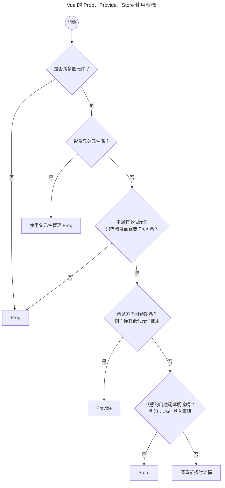

{.cover}

# 關於 Vue 資料流那檔事

實際開發時，常常會遇到怎麼規劃資料流的問題。

::: tip 強烈推薦 TypeScript
有 TypeScript 協助檢查，直接少一大半問題 %(´,,•ω•,,)%
:::

此文筆記了一些曾經遇過的情境，不是規範指南，希望大家可以多多討論，一起進步。%(*´∀`)~♥%

可能某天會發現寫法不好、考量不夠周到，所以本文會持續不定期更新。%(´,,•ω•,,)%

::: tip 軟體開發沒有銀彈
[軟體開發沒有銀彈](https://zh.wikipedia.org/zh-tw/%E6%B2%A1%E6%9C%89%E9%93%B6%E5%BC%B9)，沒有絕對的對錯，只有適不適合，實務上要根據專案規模、需求持續調整。
:::

接下來讓我們根據情境或 Vue API （Vue 3）來討論資料流的概念與實作吧。%੭ ˙ᗜ˙ )੭%

## 依 API

Vue 中基本傳遞資料的方式有 Prop（emit）、Provide、Store

其實官方文件已經有很詳細的[說明](https://vuejs.org/v2/guide/components.html#Passing-Data-with-Props)，這裡只是根據實務經驗整理一下。

我自己列了一個簡易的流程圖，簡化思考。


```mermaid
---
title: Vue 的 Prop、Provide、Store 使用時機
---

flowchart TD
    A((開始)) --> B{是否跨多個元件？}

    B --否--> R1
    B --是--> C{皆為兄弟元件嗎？}

    C --是--> R2
    C --否--> D{中途有多個元件
    只為轉發而宣告 Prop 嗎？}

    D --否--> R1
    D --是--> E{傳遞方向可預期嗎？
    例：僅有後代元件使用}

    E --是--> R3
    E --否--> F{狀態的用途範疇明確嗎？
    例如：User 登入資訊}

    F --是--> R4
    F --否--> 請重新探討架構

    R1[Prop]
    R2[使用父元件管理 Prop]
    R3[Provide]
    R4[Store]
```

### 經典的 Prop

Prop 的目的在於元件不用管外部狀態如何，只關心內部資料如何使用。

透過固定的資料定義，讓元件可以任意拔插。

當然實作上很常遇到「隨著各種追加需求，參數瘋狂增加，為了向下相容，導致參數越來越歪」的問題。

這個未來有機會再另開文章，筆記一下元件設計問題。...(›´ω`‹ )

::: tip Vue 3.5 之後可以直接解構 Prop
以前解構 Prop 會失去響應性，只能乖乖寫 `props.xxx` 或是用 `toRefs`。

3.5 起 [Reactive Props Destructure](https://github.com/vuejs/rfcs/discussions/502) 轉正並預設啟用，直接解構就好，順便還能寫預設值。

```vue
<template>
  <p>{{ message }} x {{ count }}</p>
</template>

<script setup lang="ts">
const { count = 0, message = 'hello' } = defineProps<{
  count?: number;
  message?: string;
}>()
</script>
```

不過要注意解構出來的變數本質是 getter，丟進 `watch` 或 composable 時記得包成 getter，例如 `watch(() => count, ...)`。%(´,,•ω•,,)%
:::

### 甚麼時候使用 store？

這裡的 store 指的是 Vuex、Pinia 這類的狀態管理套件，其資料為全域共享。

除了全域共享外，個人覺得 store 與 Prop 最大的不同在於：「在元件內部依賴指定資料」

意思是此元件不能獨立運作，必須依賴 store 才能正常運作。

好不好需要看情況討論，我的心得是：

- 基礎元件（或稱 [Atom 元件](https://medium.com/@kevinkurniawan97/atomic-design-with-vue-fa1b50a1251e)）不要依賴應用領域狀態

    Button、Input 這類基礎元件內部不要依賴 User 資訊、購物車這種業務資料或外部 API，最好使用 Prop 傳遞

- 傳遞深度未知、需全域共享且領域清晰的資料才用 store

    User 登入資訊、購物車資訊等等

如果需共享的資料來自於外部 API，也可以考慮使用 [Tanstack Query](https://tanstack.com/query/v5/docs/framework/vue/overview#motivation)（舊稱 Vue Query）或 [Pinia Colada](https://pinia-colada.esm.dev/)，不只省去 store，還有很多實用功能。%ˋ( ° ▽、° )%

Pinia Colada 是 Vue 生態自己長出來的方案，比 Tanstack Query 輕，也與後面會提到的 Data Loader 官方整合。API 相當接近，官方甚至有[遷移指南](https://pinia-colada.esm.dev/cookbook/migration-tvq.html)可以參考。

#### Vue 3 不需要 store？

有看過有人說「Vue 3 的響應式系統配合 ES Module，就可以共享資料了，根本不需要使用 store」

這個可以分成兩個部分來看：

- 專案不一定需要 store
- 我不想要用 Pinia、Vuex 作為 store management 方案

不是每個專案規模都需要 store，如果網頁只是一個很簡單的一頁式活動頁面，還真的不需要。

簡單專案中使用 store，反而可能會讓專案變得更複雜。

但是「使用 Pinia、Vuex 以外的 store management 方案」，這個就需要思考了。

的確可以「Vue 3 響應式系統配合 ES Module」實現資料共享，我在[酷酷元件的落雪元件](https://chillcomponent.codlin.me/components/bg-snow/)中就是這樣實作。

這麼做是因為此為內聚性高的獨立元件，若要求使用者在使用此元件前，必須先安裝 Pinia，這樣就太過於繁瑣了。

但若是一般網頁專案，在不確定專案會不會持續增長的情況下，還是建議使用 Pinia。

因為隨著專案成長，你可能會開始需要解決以下問題：

- 如何除錯
- [HMR 問題](https://pinia.vuejs.org/cookbook/hot-module-replacement.html)（保留、更新資料等等）
- [如何測試](https://pinia.vuejs.org/cookbook/testing.html)
- 如何加入 plugin
- 追蹤資料變更

甚至 SSR 相關問題等等。

以上問題解決後會發現：恭喜！重工了一個 Pinia！%ヽ(́◕◞౪◟◕‵)ﾉ%

但是沒辦法使用 Pinia 現有生態系（各種外掛、工具），後續接手的人可能會很痛苦。

Pinia 已設計得相當簡易了，除非你的情境真的很不適合 Pinia，不然還是乖乖用吧。%(´● ω ●`)%

### Provide？

Provide 的用法在[官方文件](https://vuejs.org/guide/components/provide-inject)解釋得很清楚。

主要目的是解決層層傳遞的問題，但是也有與 store 類似的問題，就是依賴耦合問題。

::: tip
從[實作的角度](https://github.com/vuejs/pinia/blob/2071db285569a3119cf62c5be16a63fb7b681b1d/packages/pinia/src/createPinia.ts#L29)來看，store 就是依靠 Provide 從 App 層注入，實現所有元件資料共享功能。
:::

我自己只有在「依賴方向明確，深度未知的強耦合的元件」才會使用 Provide。

例如：

#### Quasar 的 QForm

Quasar 的 [`QForm`](https://quasar.dev/vue-components/form#child-communication) 與 [`useFormChild`](https://quasar.dev/vue-composables/use-form-child)，其內部實作就是使用 Provide。

只要 `QForm` 內部含有 `QField` 或使用 `useFormChild` 之元件，無論元件多深層，提交時若有錯誤，都會自動阻擋，相當方便。

#### 酷酷元件的 card-futuristic

此[元件](https://chillcomponent.codlin.me/components/card-futuristic/)由多個子元件組成，父子元件為強耦合關係。

作為容器的父元件使用 Provide 提供綁定邏輯給子元件，[子元件綁定](https://gitlab.com/side_project/chill-component/-/blob/main/src/components/card-futuristic/use-card-part.ts)完成後由父元件統一調度動畫。

藉此實現酷炫、複雜的動畫效果。

<iframe width="100%" height="500" src="https://www.youtube.com/embed/msMc0czVGWs?si=_BeWpj0GbEE_8xoj&amp;controls=0" title="YouTube video player" frameborder="0" allow="accelerometer; autoplay; clipboard-write; encrypted-media; gyroscope; picture-in-picture; web-share" referrerpolicy="strict-origin-when-cross-origin" allowfullscreen></iframe>

#### 遞迴元件

深度未知最特殊的情境是遞迴元件，例如 Tree、多層選單、留言串。

這種元件的深度由資料決定，你根本不知道會長幾層。使用者多加一層分類，Prop 鏈就得跟著長一節。

```vue
<!-- tree-node.vue，自己呼叫自己 -->
<template>
  <li>
    {{ node.label }}

    <ul v-if="node.childList?.length">
      <tree-node
        v-for="child in node.childList"
        :key="child.id"
        :node="child"
      />
    </ul>
  </li>
</template>

<script setup lang="ts">
defineProps<{ node: TreeNode }>()
</script>
```

節點自己的資料（`node`）用 Prop 沒問題，它本來就只屬於這一層。

但是「目前選到哪個節點」、「點擊後要通知誰」這種**整棵樹共用**的東西，用 Prop 傳就是災難。%( ˘ω˘ )%

狀態本人住在根節點。

```vue
<!-- tree-root.vue -->
<template>
  <ul>
    <tree-node
      v-for="node in nodeList"
      :key="node.id"
      :node="node"
      :selected-id="selectedId"
      @select="selectedId = $event"
    />
  </ul>
</template>

<script setup lang="ts">
import { ref } from 'vue'

defineProps<{ nodeList: TreeNode[] }>()

const selectedId = ref<string>()
</script>
```

`tree-node` 則是收下來，用一份、再往下傳一份。

```vue
<!-- tree-node.vue，Prop 版本 -->
<template>
  <li :class="{ active: node.id === selectedId }">
    <span @click="emit('select', node.id)">
      {{ node.label }}
    </span>

    <ul v-if="node.childList?.length">
      <tree-node
        v-for="child in node.childList"
        :key="child.id"
        :node="child"
        :selected-id="selectedId"
        @select="emit('select', $event)"
      />
    </ul>
  </li>
</template>

<script setup lang="ts">
defineProps<{
  node: TreeNode;
  selectedId?: string;
}>()

const emit = defineEmits<{
  select: [id: string];
}>()
</script>
```

這樣寫可以動，但是事件得一層一層冒上去，第 8 層的點擊真的會跑 8 次 `emit` 才抵達根節點。

不過層層 `emit` 不算甚麼大問題，比較大的問題其實是重繪。

假設再追加拖曳排序，多了一個 `draggingId`，真正在意的只有被拖的節點與游標底下那個。

但是它從根節點一路往下傳，於是拖曳過程每移動一下，整棵樹就重繪一次。%( ﾟдﾟ)%

改用 Provide 就沒這些問題了，先定義一把有型別的鑰匙。

```ts
// tree-key.ts
import type { InjectionKey, Ref } from 'vue'

export const treeKey = Symbol('tree') as InjectionKey<{
  selectedId: Readonly<Ref<string | undefined>>;
  select: (id: string) => void;
}>
```

根節點提供一次。

```vue
<!-- tree-root.vue -->
<script setup lang="ts">
import { provide, readonly, ref } from 'vue'
import { treeKey } from './tree-key'

const selectedId = ref<string>()

function select(id: string) {
  selectedId.value = id
}

provide(treeKey, {
  selectedId: readonly(selectedId),
  select,
})
</script>
```

節點自己拿。

```vue
<!-- tree-node.vue，Provide 版本 -->
<template>
  <li :class="{ active: node.id === selectedId }">
    <span @click="select(node.id)">
      {{ node.label }}
    </span>

    <ul v-if="node.childList?.length">
      <tree-node
        v-for="child in node.childList"
        :key="child.id"
        :node="child"
      />
    </ul>
  </li>
</template>

<script setup lang="ts">
import { inject } from 'vue'
import { treeKey } from './tree-key'

defineProps<{ node: TreeNode }>()

const { selectedId, select } = inject(treeKey)!
</script>
```

- 點擊直接呼叫 `select`，不用冒泡，也就沒有轉發鏈這回事
- 每個節點各自訂閱用得到的東西，`draggingId` 只會更新真的有讀它的節點
- 型別由 `InjectionKey` 一路帶到底，跟 Prop 版本一樣完整

#### Provide 注意事項

Provide 用起來很快樂，也要注意一些細節，不然很容易翻車。%⎝(・ω´・⎝)%

##### 善用 `InjectionKey` 而不是字串

字串鍵沒有型別，打錯也不會有人告訴你。

```ts
import type { InjectionKey, Ref } from 'vue'

export const cartKey = Symbol('cart') as InjectionKey<{
  itemList: Readonly<Ref<CartItem[]>>;
  addItem: (item: CartItem) => void;
}>
```

`provide` 與 `inject` 用同一把鑰匙，型別自動對上，IDE 也會幫忙提示。

##### 資料提供 `readonly`、變更走 function

直接把 ref 丟出去，等於任何後代都能改，出事時完全不知道誰動的手。

```ts
import { readonly, ref } from 'vue'

const itemList = ref<CartItem[]>([])

provide(cartKey, {
  itemList: readonly(itemList), // [!code ++]
  addItem,
})
```

想改資料就呼叫提供者給的 function（本例子為 `addItem`），變更邏輯集中在一處，要加驗證、加 log 都方便。

如此 Provide 才算是「有作用域的依賴注入」，不然它就只是一個藏起來的全域變數而已。%(´,,•ω•,,)%

#### 可是隱式依賴很可怕

也有人認為 Provide 會有「隱式依賴」問題。

元件檔案打開來看不出它需要什麼，必須知道自己被誰包著才能跑，抽出來重用就直接爆炸。%╭(°A ,°`)╮%

這派的主張是寧可忍受 Prop 一路傳，也要讓依賴顯式可見，至少改壞的時候 TypeScript 會叫。

我覺得兩邊都有道理，實務上的折衷是把 inject 包成 composable，並且想清楚「缺了它會怎樣」。

如果元件沒有它就完全沒有意義，則應該附上明確的錯誤訊息。

```ts
function useCart() {
  const cart = inject(cartKey)

  if (!cart) {
    throw new Error('useCart 必須在 cart-provider 內部使用')
  }

  return cart
}
```

但是更理想的情況是準備回退方案，讓元件少了 provider 也能自己撐著。

`inject` 本來就支援預設值，第三個參數表示「預設值是個 factory」，這樣每個元件才會拿到自己的一份，不會共用同一個物件。

```ts
function useTree() {
  return inject(treeKey, () => createStandaloneTree(), true)
}
```

前面提到的 `useFormChild` 就是這種設計，欄位放在 `QForm` 外面照樣能用，只是不參與整體驗證而已。

### 命令式資料流：defineExpose 與 useTemplateRef

前面聊的都是宣告式，資料變了畫面跟著變，但是有些情境天生就是命令式。

例如「按下按鈕讓表單重置」、「跳到影片第 30 秒」、「開啟時自動 focus 輸入框」。

這時候可以由子元件 `defineExpose`，父元件用 `useTemplateRef` 拿到實例後直接呼叫。

```vue
<!-- 子元件 -->
<script setup lang="ts">
function reset() {
  // 重置邏輯
}

defineExpose({ reset })
</script>
```

```vue
<!-- 父元件 -->
<script setup lang="ts">
import { useTemplateRef } from 'vue'

const formRef = useTemplateRef('form')

function onCancel() {
  formRef.value?.reset()
}
</script>
```

::: tip
`useTemplateRef` 是 Vue 3.5 新增的 API，比以前「宣告同名 ref」的寫法更明確，型別也更完善。
:::

判斷情境大概如下：

- **動作型可以**，`focus()`、`reset()`、`play()`、`scrollTo()` 這種一次性動作
- **狀態查詢型不行**，如果你在父元件寫 `formRef.value.isValid`，那就該改用 Prop 或 emit

因為狀態查詢代表資料流反了，而且 template ref 不保證何時有值，掛載前後拿到的東西不一樣，很容易踩雷。%( ›´ω`‹ )%

## 依情境

接下來根據情境來討論資料流的概念與實作。

### 兄弟元件溝通

如果資料只需在兩三個元件間共享且傳遞深度很淺，就不建議使用 store，而是由父元件提供資料。

若元件很深層則可在父元件使用 Provide 提供資料。

例如：拆分成多個 tab 的表單，由父元件提供資料給各分頁即可。

```vue
<template>
  <div>
    <tab-step1
      v-model="data"
      name="step-1"
    />
    <tab-step2
      v-model="data"
      name="step-2"
    />
  </div>
</template>

<script setup>
import { ref } from 'vue'
import TabStep1 from './TabStep1.vue'
import TabStep2 from './TabStep2.vue'

const data = ref({})
</script>
```

### 表單狀態該由誰持有？

上面那個範例只傳了 `data`，但是實務上表單還有一堆狀態，例如驗證錯誤、哪些欄位被動過、有沒有未儲存的變更。

我自己的分法是這樣。

- **驗證狀態**由容器持有，因為送出時要一次看全部
- **dirty / touched** 由欄位自己判斷，容器只負責彙總

::: tip dirty 與 touched 是甚麼？
表單套件常見的兩個詞，dirty 指值被改過（跟初始值不同），touched 指使用者碰過（聚焦後又離開）。

dirty 看值，touched 看互動，所以離開頁面要不要跳「尚未儲存」看 dirty，錯誤訊息要不要現在就顯示則看 touched，避免一進畫面就滿江紅。%( ˘ω˘ )%
:::

如果每個分頁自己記自己的錯誤，送出時容器就得反過來去撈每一頁的狀態，通常會變成這樣。

```ts
const step1Ref = useTemplateRef('step1')
const step2Ref = useTemplateRef('step2')

function submit() {
  if (!step1Ref.value?.validate())
    return
  if (!step2Ref.value?.validate())
    return
  // ...
}
```

這就是前面說過的「狀態查詢型」命令式操作，資料本來該由下往上送，現在變成上面伸手去撈。

而且分頁一旦改成 `v-for` 動態渲染，容器還得自己維護一份 ref 清單，愈長愈歪。%( ›´ω`‹ )%

反過來由容器提供註冊機制，欄位掛載時自己登記，送出時容器一次收割，就乾淨多了。

這也正是前面提到 Quasar `QForm` 與 `useFormChild` 的作法，不想自己造輪子的話，vee-validate、FormKit 這類套件也是把這件事包好了。%( ´ ▽ ` )b%

### 元件內更新或觸發事件不要優先使用 watch

在使用 watch 修改或觸發事件前，先想想有沒有其他方案，真的沒有才用 watch。

詳細說明請參考先前文章：[Vue watch 前先小等一下](https://codlin.me/blog-vue/hang-tight-for-a-sec-before-you-start-watch)

### v-model 與資料流

大家應該都是知道 `v-model` 其實是個語法糖。

元件結構單純時，使用 `v-model` 很容易且簡單，且元件內部實作使用 `defineModel` 爽到不行。%(´,,•ω•,,)%

但是資料開始複雜時，通常不會希望部分資料變更就立即向外部傳遞。

因為若互動元件有複雜的操作邏輯（例：拖動排序、表單驗證），多餘的響應與傳遞，除了性能損耗外，可能會導致操作邏輯出現不自然的跳動或其他副作用。

這個時候就可以考慮把 `v-model` 拆成回 `:model-value` 與 `@update:modelValue` 分別處理。

自行處理資料流，選擇更恰當的時機觸發響應並傳遞資料。%( •̀ ω •́ )✧%

::: tip
不適合使用 `defineModel` 的場合，我自己會選擇使用 `shallowRef` 配合 `triggerRef` 實作。

除了減少不必要的副作用，因為 `triggerRef` 實際由自己掌控，也更容易追蹤資料變更。%ԅ(´∀` ԅ)%
:::

### Composable 共享資料？

有人說可以使用 Composable 共享資料，只要把資料放在 Composable 的 function 外面就可以，像這樣：

```ts
const data = ref(0) // [!code ++]

export function useSharedData() {
  const data = ref(0) // [!code --]
  return { data }
}
```

實際上這個與使用 ES Module 共享資料的方式相同，[官方文件](https://vuejs.org/guide/scaling-up/state-management#simple-state-management-with-reactivity-api)也有提到這種用法。

但是這樣做一樣會遇到先前提到的問題（如何除錯、追蹤資料變更等等）。

::: tip
這樣寫有另一個風險，不過只有 SSR 會遇到，有另外寫了一篇詳細筆記，有興趣的朋友可以參考[AI 可能會寫的 Vue Composable 地雷，你踩過了嗎？](https://codlin.me/blog-vue/vue-composable-outer-variable-trap)
:::

所以我自己的約定是，共享資料統一交給 store，Composable API 專注於組合、邏輯複用。

開發時 store 一定是全域共享，Composable API 則可放心使用，不用怕污染。

避免到處都有全域共享資料，後續接手的人可能會一頭霧水。

如果 Composable 需要共享資料，則在內部使用 store 即可。

::: tip
Pinia 也可以寫成 [setup 風格](https://pinia.vuejs.org/cookbook/composables.html#Setup-Stores)（或稱 Composable API 風格），所以若 Composable 需要共享資料，可以直接使用 setup store 即可。
:::

#### 善用 [`MaybeRefOrGetter`](https://vuejs.org/api/utility-types#maybereforgetter)

傳遞 Composable API 參數時，若同時支援傳入一般數值、`ref` 或 `getter`，可以增加彈性。

不過大家可能會說：「這樣要判斷 3 種情境，很麻煩欸！%(°口°〃)%」

這時候可以使用 Vue 提供的 [`toValue`](https://vuejs.org/api/reactivity-utilities#tovalue)，輕鬆解決。

::: tip
v3.3 版本前的朋友，可以考慮使用 VueUse 提供的 [`toValue`](https://vueuse.org/shared/toValue/#tovalue)。
:::

所以有甚麼好處呢？例如 VueUse 的 [`useIntervalFn`](https://vueuse.org/shared/useIntervalFn/)。

用法與 `setInterval` 相同：

```ts
useIntervalFn(() => {
  // 定時任務
}, 1000)
```

但是如果你把 `1000` 改成 ref 或 getter，就可以動態改變間隔時間。

```ts
const interval = ref(1000)

useIntervalFn(() => {
  // 定時任務
}, interval)
```

這樣就會在 `interval` 變更時，自動調整間隔時間。

官方文件也有這方面的說明，可以參考[這裡](https://vuejs.org/guide/reusability/composables#accepting-reactive-state)。

### 切換頁面傳值

切換 router 有時候需要傳遞資料，一般來說優先使用以下方法：

- query string 或 path params
- Vue Router 之 [`Passing Props`](https://router.vuejs.org/guide/essentials/passing-props.html)

不過有時候可能會需要傳遞複雜一點的物件資料。

例如：從「商品列表」轉跳至「商品細節」，除了 path params 加上商品 ID 外，如果同時傳遞列表頁中的商品資料，細節頁面就不用特別在讀取一次商品資料。

這個時候就可以使用 `history.state` 來傳遞資料。

商品列表頁跳轉邏輯可能如下：

```ts
async function toProductDetail(product: Product) {
  router.push({
    name: 'product-detail',
    state: {
      /**
       * state 不能傳遞複雜類型，structuredClone 確保轉為一般物件
       *
       * [Release Note](https://github.com/vuejs/router/releases/tag/v4.1.0)
       */
      product: structuredClone(product),
    }
  })
}
```

商品細節頁取得資料邏輯可能如下：

```ts
const productId = useRouteParams('id')

function isProduct(data: any): data is Product {
  // 驗證資料是否為 Product
}

const {
  isLoading,
  state: product,
} = useAsyncState(async () => {
  const data = history.state?.product

  if (isProduct(data)) {
    return data
  }

  // 沒有 product 資料，從 API 取得
  return getProduct(productId.value)
}, undefined)
```

::: tip
[history.state 相關功能正在 RFC 中](https://github.com/vuejs/rfcs/discussions/400)，未來可能新增更多 API 支援，大家可以關注關注。
:::

### 傳遞成本也是資料流的一部分

最後補一個容易被忽略的角度，資料流的選擇會直接影響效能。

`ref` 與 `reactive` 都是深層響應，丟一個上萬筆的陣列進去，Vue 會很敬業地幫你把每一層都變成 Proxy。

如果這份資料只會整包替換，不會單獨改某一筆，那用 `shallowRef` 就好。

```ts
const itemList = shallowRef<Item[]>([])

// 整包換掉，一樣會觸發更新
itemList.value = await fetchItemList()
```

地圖實例、圖表實例、Three.js 物件這種第三方實例，則用 `markRaw` 明確告訴 Vue 不要碰。

::: tip
`shallowRef` 與 `ref` 的差別，可以參考先前文章 [Vue 的 shallowRef 是啥？和 ref 有甚麼差別？](https://codlin.me/blog-vue/vue-shallow-ref-and-ref)
:::

順帶一提，Vue 3.6 把 `@vue/reactivity` 改為基於 [alien-signals](https://github.com/stackblitz/alien-signals)，開銷更低、在龐大元件樹下也更耐操。%ヾ(◍'౪`◍)ﾉﾞ%

### 進階資料載入

進階取得資料的方式除了剛剛提到的 [Tanstack Query](https://tanstack.com/query/v5/docs/framework/vue/overview#motivation)，Vue Router 團隊還開發了 [Data Loaders](https://router.vuejs.org/data-loaders/)。

Data Loader 乍看之下 API 與 Tanstack Query 相當接近，最大的差別在於 Data Loader 與 Vue Router 深度整合，將資料載入整合至導航週期。

可以在路由守衛中取得資料，執行更複雜的導航邏輯。

詳細說明可以參考作者的[說明影片](https://www.youtube.com/watch?v=VkSGxuAJwv8&ab_channel=%E5%89%8D%E7%AB%AF%E5%9C%88)，有相當深入淺出的介紹。

::: warning 這段已經過期囉
原本這裡寫著「截至 2025/01/15，Data Loader 還在 RFC 階段」，現在情況不一樣了。

`unplugin-vue-router` 已於 2026/02/24 [併入 vuejs/router](https://github.com/posva/unplugin-vue-router)，倉庫封存，typed routes 與 Data Loader 都進了 Vue Router 核心。

想看實際用法的話，可以參考先前文章[用 Vue Router 的 Data Loader 解決 fetch 瀑布流問題](https://codlin.me/blog-vue/solve-fetch-waterfall-with-data-loader)。%( ˘ω˘ )%
:::

## 總結 🐟

- 元件優先關心 Prop 來的資料，基礎元件不要依賴業務領域狀態
- 依賴方向明確、深度未知、強耦合才用 Provide，搭配 InjectionKey 與 readonly，缺了 provider 要明確報錯或給回退方案
- 遞迴元件的共用狀態交給 Provide，省下層層 emit 與整棵樹重繪
- 命令式資料流只拿來做動作，會想查狀態就代表資料流反了
- 表單的欄位值與驗證狀態由容器持有，欄位不要自己留副本
- 善用 MaybeRefOrGetter，增加 Composable API 彈性
- 跳轉頁面傳遞資料還有 history.state 這個選擇

以上是我自己的心得，不過一樣老話一句，如果你很清楚你在做甚麼，也沒什麼一定不可以就是了。%(・∀・(・∀・(・∀・*)%

大家如果有不同的想法，還請不吝告訴我。%(´▽`ʃ♡ƪ)%

也推薦大家閱讀以下文章：

- [Effective State Management](https://michaelnthiessen.com/effective-state-management)
- [Vue 官方文件，Cross-Request State Pollution](https://vuejs.org/guide/scaling-up/ssr#cross-request-state-pollution)
- [Pinia Colada，Why?](https://pinia-colada.esm.dev/why.html)
- [Vue 官方文件，Provide / Inject](https://vuejs.org/guide/components/provide-inject)
