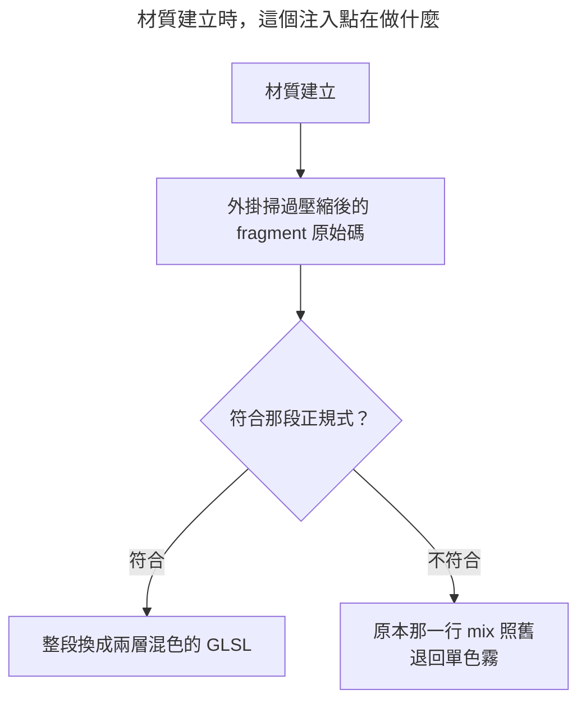

<script setup>
import { defineAsyncComponent } from 'vue'

const DemoFogFlat = defineAsyncComponent(() => import('./aerial-perspective/demo-fog-flat.vue'))
const DemoAerialTwoLayer = defineAsyncComponent(() => import('./aerial-perspective/demo-aerial-two-layer.vue'))
const DemoAerialSkyTint = defineAsyncComponent(() => import('./aerial-perspective/demo-aerial-sky-tint.vue'))
const DemoAerialHeightHaze = defineAsyncComponent(() => import('./aerial-perspective/demo-aerial-height-haze.vue'))
const DemoAerialDawnBoost = defineAsyncComponent(() => import('./aerial-perspective/demo-aerial-dawn-boost.vue'))

const FigureAirLayers = defineAsyncComponent(() => import('./aerial-perspective/figure-air-layers.vue'))
const FigureHeightHaze = defineAsyncComponent(() => import('./aerial-perspective/figure-height-haze.vue'))
</script>

{.cover}

# Minespace - EP07：大氣透視

大家好，我是鱈魚。

引擎附的霧只要三行就打開了。

```ts
scene.fogMode = Scene.FOGMODE_LINEAR
scene.fogStart = 20
scene.fogEnd = 220
scene.fogColor = new Color3(0.9, 0.92, 0.94)
```

很好用，遠處的東西會慢慢化開，世界的邊界也順便藏起來了。

只是它只有一個顏色。%(´･_･`)%

## 一個顏色會出什麼事

不管多遠，一律往那個顏色收。走到底會出現一種現實裡不存在的畫面，遠處的山比它背後的天空還要淡。

<demo-fog-flat />

霧的終點拉近之後，最遠那道山脊整片浮在天空前面，像貼上去的一張紙。天不可能比空氣本身更暗，這件事眼睛認得出來，只是說不上來哪裡怪。%(⊙ o ⊙)%

鱈魚：「那把霧色調暗一點就好啦。」
路人：「那近處的東西不就整片發灰？%(´・ω・`)%」
鱈魚：「說得也是，一個顏色本來就不夠用。」

## 真實的空氣是分段的

站在山上往遠處看，眼前那一段是透明的，中間那一段偏藍，再遠才近乎白。

藍色來自大氣的散射。空氣分子把短波長的光散得比長波長的多，所以隔著一段空氣看東西，那段空氣自己會發藍。天空之所以是藍的，也是同一件事。

白色則是散射早已飽和之後的結果。空氣再厚，該散的都散完了，剩下的就是一片均勻的亮。

所以霧要拆成兩層。中距離往當下的天色偏，遠距離才收進霧色。

<figure-air-layers />

## 第一步：找到 Babylon 那一行

霧的實作在 `fogFragment` 這段 include 裡，總共四行。

```glsl
#ifdef FOG
float fog = CalcFogFactor();
color.rgb = mix(vFogColor, color.rgb, fog);
#endif
```

`fog` 是「還剩幾成原本的顏色」，一代表完全清楚，零代表整片讓霧蓋掉。那一行就是拿它去混。

我們要換掉的正是這一行。

路人：「材質外掛不是只能在幾個指定的位置插程式碼嗎？」
鱈魚：「還有另一種寫法，它可以把既有的程式碼整段換掉。」

## 第二步：`!` 開頭的注入點

`getCustomCode` 回傳的是一張表，鍵是注入點的名字。名字以驚嘆號開頭的時候，Babylon 會把後面那一段當成**正規式**，掃過整份著色器，把每一處符合的地方換成你給的程式碼。

```ts
class AerialPerspectivePlugin extends MaterialPluginBase {
  getCustomCode(shaderType: string) {
    if (shaderType !== 'fragment')
      return null

    return {
      '!color\\.rgb\\s*=\\s*mix\\(\\s*vFogColor\\s*,\\s*color\\.rgb\\s*,\\s*fog\\s*\\);': `
        // 換上去的新程式碼
      `,
    }
  }
}
```

有幾件事要知道。

**空白要自己吞掉。** 著色器進到 `ShaderStore` 之前會壓縮過，實際上那一行長這樣。

```glsl
color.rgb=mix(vFogColor,color.rgb,fog);
```

寫死成有空白的版本會對不上，所以每個縫都補一個 `\s*`。

**替換發生在 include 展開之後。** Babylon 走的是 `processCodeAfterIncludes` 那條路，所以霧那一行雖然是 include 進來的，正規式照樣找得到。

**旗標可以自己指定。** 預設帶 `g`，也就是整份著色器裡每一處都換。想指定別的就寫成 `!gi!...`，想完全不帶旗標就用 `!!` 開頭。

**捕獲群組的 `$n` 每個只准出現一次。** Babylon 代換捕獲群組用的是 `newCode.replace('$' + i, match[i])`，那是字串比對，同一個編號只換掉最前面那一個。後面那些會原封不動留在著色器裡變成 `$` 字元，整支著色器編不過。寧可多切幾個群組，也不要重複用同一個編號。

**注入的那段 GLSL 裡不要寫註解。** Babylon 的前處理器掃條件編譯指令時沒有先把註解拿掉，註解裡只要提到 `#ifdef` 這幾個字，它就當成真的指令，條件層數從此對不起來，後面整段著色器會憑空消失。要解釋就寫在外面的 TypeScript 註解裡。%(›´ω`‹ )%

還有一個很重要的性質。哪天 Babylon 改了那一行的寫法，正規式找不到就靜靜地不做事，畫面退回原本的單色霧。它不會壞掉，只會少一個效果。



## 第三步：兩層混色

換上去的程式碼是這樣。

```glsl
float aerialAmount = clamp(1.0 - fog, 0.0, 1.0);
color.rgb = mix(color.rgb, mix(aerialMidColor, vFogColor, aerialAmount), aerialAmount);
```

`aerialAmount` 就是「這裡被空氣蓋掉幾成」，剛好是 `fog` 的反面。

裡面那個 `mix` 先調出這一段空氣該是什麼顏色。蓋得少的地方靠近 `aerialMidColor`（帶著天色的那一層），蓋得多的地方靠近 `vFogColor`（遠處那片白）。

外面那個 `mix` 再拿同一個量決定蓋多濃。

同一個變數用兩次，一次選顏色、一次定濃度，兩層空氣就出來了。%( •̀ ω •́ )✧%

<demo-aerial-two-layer />

偏移量為零時與內建的單色霧完全相同。這一點很有用，除錯開關要關掉這個效果的時候，著色器裡那段程式碼已經編進去拆不掉了，但把中距離的空氣色設成與霧色相同，兩層混出來的結果就跟原本那一行一模一樣。

## 第四步：中距離的顏色從哪裡來

不必另外調。日夜循環已經算好中空的天色了，直接拿來用。

```ts
export function updateAerialAir(
  fogColor: Color3,
  skyMidColor: Color3,
  clearRatio: number,
): void {
  const strength = MID_AIR_STRENGTH * Math.min(1, Math.max(0, clearRatio))

  airState.red = fogColor.r + (skyMidColor.r - fogColor.r) * strength
  airState.green = fogColor.g + (skyMidColor.g - fogColor.g) * strength
  airState.blue = fogColor.b + (skyMidColor.b - fogColor.b) * strength
}
```

<demo-aerial-sky-tint />

中午是藍、清晨是丁香紫、黃昏是橘，這一層跟著天色一起走，一行色票都不必寫。%ヽ(●`∀´●)ﾉ%

`MID_AIR_STRENGTH` 給 0.75。一往上就會出現「遠山比它背後的天空還白」那種假，七成五剛好讓內圈明顯帶藍，外圈仍然收在霧色裡。

`clearRatio` 是洞裡與雨中要收掉的量。岩壁之間沒有天空可以散射，下雨時天本來就已經是一片鉛灰，兩種情況都該退回純霧色。

## 第五步：高度霧

空氣是有重量的，濁的那一層積在低處。從山上往下看，山谷總是比山脊模糊。

做法是拿這個片元的高度去算一個額外的濃度。

```glsl
float aerialLow = clamp((aerialGround.x - vPositionW.y) * aerialGround.y, 0.0, 1.0);
aerialAmount = clamp(aerialAmount * (1.0 + aerialLow * aerialGround.z), 0.0, 1.0);
```

`aerialGround` 三個分量分別是濁氣的頂、往下加厚的速度，以及要濃多少。

<figure-height-haze />

<demo-aerial-height-haze />

這裡有個關鍵，濃度走的是**乘法**。

近處的東西 `aerialAmount` 本來就接近零，乘上任何數字還是零，完全不受影響。只有本來就有點遠的東西才會再糊一點。改成直接相加的話，腳邊的方塊會憑空罩上一層灰。%( ˘•ω•˘ )%

往下加厚的速度給十二格的倒數。從樹冠到地面是一段連續的漸變，不會出現一條水平的界線。

濁氣的頂抓在沙面上十格。木座、鳥居與矮松都泡在裡面，樹冠與山頭則露在上面，那正是清晨從高處往下看時整片庭園浮在一層薄濁上的樣子。

## 第六步：晨昏加濃

太陽貼著地平線的那段時間，貼地的水氣最看得出來。逆光穿過一層薄霧是晨昏辨識度最高的畫面之一。

```ts
const GROUND_HAZE_BOOST_BASE = 0.6
const GROUND_HAZE_BOOST_DAWN_DUSK = 1.15

function computeGroundHazeBoost(sunHeight: number): number {
  const ratio = (sunHeight - GROUND_HAZE_LOW_SUN_HEIGHT)
    / (GROUND_HAZE_HIGH_SUN_HEIGHT - GROUND_HAZE_LOW_SUN_HEIGHT)
  const clamped = Math.min(1, Math.max(0, ratio))
  const smooth = clamped * clamped * (3 - 2 * clamped)

  return GROUND_HAZE_BOOST_DAWN_DUSK
    + (GROUND_HAZE_BOOST_BASE - GROUND_HAZE_BOOST_DAWN_DUSK) * smooth
}
```

太陽的仰角直接拿平行光的方向來量，`-sunLight.direction.y` 就是。低於 0.12 時濃度給滿，高過 0.55 收回基準值，中間那段用 `smoothstep` 的多項式接起來，太陽爬升的過程才不會看出一道分界。

<demo-aerial-dawn-boost />

## 第七步：掛在哪些材質上

這個外掛沒有任何開關屬性，所以建立時就要一律啟用。

```ts
class AerialPerspectivePlugin extends MaterialPluginBase {
  constructor(material: Material) {
    /** 第六個參數是「一律啟用」 */
    super(material, 'MinespaceAerialPerspective', 200, {}, true, true)
  }
}
```

註冊要在任何材質建立之前。外掛是靠「材質建立」這個事件自己接上去的，晚了的話先建好的那些材質收不到。

```ts
export function registerAerialPerspective(): void {
  RegisterMaterialPlugin('MinespaceAerialPerspective', (material) => {
    if (!(material instanceof StandardMaterial))
      return null

    return new AerialPerspectivePlugin(material)
  })
}
```

工廠只認 `StandardMaterial`。天空與雲用的是自己寫的著色器材質，裡面沒有那條霧的程式碼可以換，也本來就不該有霧。

至於吃霧的那兩百多份材質，注入的整段都在 `#ifdef FOG` 裡面，所以關掉霧的材質一個字都不會被動到。

## 完整實作

整章串起來。

1. 註冊外掛，在任何材質建立之前
2. 每一幀由天氣與日夜循環寫入霧色、中空天色與太陽仰角
3. 材質綁定時把兩個 uniform 送進去
4. 片元著色器裡，正規式換掉的那一段依距離與高度算出兩層空氣

換上去的四行放在一起是這樣。

```glsl
float aerialAmount = clamp(1.0 - fog, 0.0, 1.0);
float aerialLow = clamp((aerialGround.x - vPositionW.y) * aerialGround.y, 0.0, 1.0);
aerialAmount = clamp(aerialAmount * (1.0 + aerialLow * aerialGround.z), 0.0, 1.0);
color.rgb = mix(color.rgb, mix(aerialMidColor, vFogColor, aerialAmount), aerialAmount);
```

四行 GLSL 換掉一行，遠山有了層次，山谷積起了濁氣。%♪( ◜ω◝و(و%

## 總結 🐟

以上程式碼可以[在此取得](https://github.com/Codfisher/cod-aquarium/tree/main/content/aquarium/minespace)

- 內建的霧只有一個顏色，走到底會讓遠處比天空還淡
- 真實的空氣近透明、中段偏藍、遠處近白，所以霧要拆成兩層
- `getCustomCode` 的鍵以 `!` 開頭就是正規式，能把 Babylon 既有的程式碼整段換掉
- 那一行被壓縮過，記得每個縫都補 `\s*`；`$n` 每個編號只准用一次
- 找不到就靜靜地不做事，畫面退回單色霧，不會壞掉
- 高度霧的濃度是倍率，腳邊的方塊才不會憑空罩上一層灰

下一章講水面高光。整套渲染裡只有一個通道能突破亮度上限，正午的池面能不能真的刺眼，全靠它。%( •̀ ω •́ )✧%

::: tip
因為篇幅問題，某些部分簡單帶過。

若想看到更詳細的解釋，請不吝留言或寫信給我喔！%(*´∀`)~♥%
:::

感謝您讀到這裡，如果您覺得有收穫，歡迎分享出去。有錯誤還請多多指教。%(´,,•ω•,,)♡%
