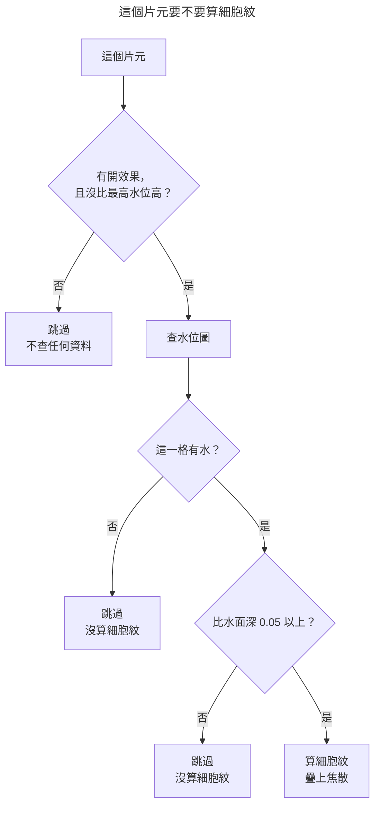

<script setup>
import { defineAsyncComponent } from 'vue'

const DemoCellEdge = defineAsyncComponent(() => import('./water-caustics/demo-cell-edge.vue'))
const DemoCausticLayers = defineAsyncComponent(() => import('./water-caustics/demo-caustic-layers.vue'))
const DemoCausticWatermap = defineAsyncComponent(() => import('./water-caustics/demo-caustic-watermap.vue'))
const DemoCausticDepth = defineAsyncComponent(() => import('./water-caustics/demo-caustic-depth.vue'))
const FigureSmoothMin = defineAsyncComponent(() => import('./water-caustics/figure-smooth-min.vue'))
const FigureCellNeighbor = defineAsyncComponent(() => import('./water-caustics/figure-cell-neighbor.vue'))
</script>

{.cover}

# Minespace - EP10：水下焦散

大家好，我是鱈魚。

上一章讓水在岸邊浮出一圈白沫，這一章要處理水底下那張晃動的亮網。

夏天在泳池邊看過的那個東西就是焦散。水面被風吹皺，每一小片水面都是一面歪掉的透鏡，陽光穿過去之後被聚成一條條光斑打在池底，那些光斑還會隨著水面起伏慢慢流動。%( ˘•ω•˘ )%

少了它，水底的沙石與水面以外的沙石是同一個樣子，那片水在視覺上只剩「藍色的半透明蓋子」這一個作用。

## 老實算是不可能的

焦散的正解要追光線。從太陽出發、在水面折射、打到水底、統計每一塊池底收到多少能量。那是離線算圖在做的事，片段著色器沒有那個預算。

鱈魚：「那就每一幀把水面的法線算出來，一條一條光線折射過去。」
路人：「你在一個方塊世界裡要追幾百萬條光線？」
鱈魚：「⋯⋯好啦，畫一張看起來很像的圖就好。」

「看起來很像」在這裡很好定義。焦散的圖樣是一張細細的亮網，網眼的形狀不規則，網線會隨時間蠕動。

有一種雜訊天生就長這樣。

## 第一步：Voronoi 與它的邊界

Voronoi 的做法是在平面上灑一堆種子點，每一個位置去問「離我最近的種子有多遠」。畫出來是一片碗接著一片碗，種子的位置是碗底。

問題在於我們要的是網線，也就是碗與碗相接的那一圈。而那個相接處在數值上並不特別，只是「最近距離」這條曲線上的一道轉折，挑不出一條線來。

訣竅是再算一次同樣的東西，只是把 `min` 換成平滑的 `min`。

```glsl
float waterSmoothMin(float left, float right, float blend) {
  float weight = max(blend - abs(left - right), 0.0) / blend;
  return min(left, right) - weight * weight * weight * blend / 6.0;
}
```

平滑版在細胞中心與原版完全一致，那裡只有一個碗，沒得平滑。到了兩碗相接處才被抹掉一角。

兩者相減，中心是零、邊界是正值，一條沿著細胞邊界的脊線就浮出來了。%(⊙ o ⊙)%

<figure-smooth-min />

```glsl
float waterCellEdge(vec2 point, float time, float blend) {
  vec2 cell = floor(point);
  vec2 offset = fract(point);

  float nearest = 8.0;
  float smoothNearest = 8.0;

  for (int y = -1; y <= 1; y++) {
    for (int x = -1; x <= 1; x++) {
      vec2 neighbor = vec2(float(x), float(y));
      float cellDistance = length(
        neighbor + waterCellPoint(waterHash2(cell + neighbor), time) - offset
      );

      nearest = min(nearest, cellDistance);
      smoothNearest = waterSmoothMin(smoothNearest, cellDistance, blend);
    }
  }

  return nearest - smoothNearest;
}
```

<demo-cell-edge />

平滑係數給零的時候整張圖是全黑，因為那時兩趟算的是同一件事，相減當然什麼都不剩。%(´,,•ω•,,)%

### 網怎麼會動

動的是細胞中心。

```glsl
vec2 waterCellPoint(vec2 seed, float time) {
  return 0.5 + 0.5 * sin(time + 6.2831 * seed);
}
```

每個中心在自己的格子裡繞圈，繞的相位由那個格子的雜湊決定，所以每個中心各走各的。中心一動，邊界就跟著蠕動。

這裡有個地方不能省。兩趟取樣必須用同一個式子算中心，否則相減出來的只會是一片雜訊。

### 三乘三的鄰居

迴圈跑的是自己這一格加上周圍八格，共九個中心。

一個位置的最近種子有可能落在隔壁格，所以九格是最小的安全範圍。九個中心、兩趟、每趟一次雜湊，一個片元十八次雜湊，這是整個效果最貴的地方。

<figure-cell-neighbor />

### 座標要先量化

還有一刀不能忘。

```glsl
vec2 waterQuantize(vec2 worldPoint) {
  return floor(worldPoint * 16.0) / 16.0;
}
```

這套美術是十六格見方的像素畫，貼圖用最近鄰、法線用最近鄰、刻意不開 FXAA。一張平滑的細胞圖疊上去，全場就只有它帶著平滑曲線，像在一幅點陣圖上蓋了一層向量圖形。

把世界座標先對齊到貼圖的像素格再送進雜湊，出來的紋路就只能沿著格線轉折，與方塊表面那些方方正正的像素同一個節奏。

## 第二步：兩層疊起來才會流動

單層的網已經會蠕動，看久了卻不太對勁。整片水底是同一個尺度、同一個節奏，比較像一張在抖的網子。

真正的水面是好幾組不同尺度的波疊在一起，所以再疊一層。第二層的細胞小一點、速度快一點，時間給負的讓它往反方向走。

```glsl
float caustic = smoothstep(threshold - softness, threshold + softness, edge);

float edgeSecond = waterCellEdge(point * scale * 0.63, time * speed * -1.7, blend);
caustic = max(caustic, smoothstep(threshold - softness, threshold + softness, edgeSecond) * ratio);
```

這裡取最大值。兩層的亮線相加會在交會處爆出一塊白，而焦散的亮線交會時本來就只是「比較亮的那一條」。

<demo-caustic-layers />

門檻與柔邊也在這裡定。柔邊要給得很窄，焦散是一張細細的亮網，門檻放低會變成水底整片發光。%(›´ω`‹ )%

```ts
const CAUSTIC_EDGE_THRESHOLD = 0.075
const CAUSTIC_EDGE_SOFTNESS = 0.02
```

網的疏密則抓一格約一個半的細胞。焦散比水面本身的紋路細，粗了會變成水底鋪著幾塊亮斑。

## 第三步：只在水面下才算

現在有一張很好看的亮網，而它鋪滿整個世界。

原因很單純，片段著色器問不到世界資料，它只知道自己在哪裡。「這個點在不在水下」對它來說是個無解的問題。

所以答案要先算好送進去。

### 一張烘好的水位圖

地形生成之後水就不再變動，所以整份資料掃一次烘成一張貼圖就好，每一格柱一個像素。

通道這樣分。

- **R、G**：水面高度，兩個位元組湊十六位元
- **B**：這一格有沒有水
- **A**：留給別的用途

高度要用兩個通道。只用一個通道的話一階是四分之一格，而深度門檻本身只有 0.05 格，那個精度會讓岸邊一階一階地跳。

```ts
const encoded = Math.round(level / WATER_LEVEL_ENCODE_RANGE * 65535)

data[texel] = encoded >> 8
data[texel + 1] = encoded & 255
data[texel + 2] = 255
data[texel + 3] = 255
```

`WATER_LEVEL_ENCODE_RANGE` 給六十四。世界只有四十格高，除以六十四一定落在零到一之間，而六十四是二的冪，除下去不會有浮點數的零頭。

藍色通道也不能省。用「高度是零」代表沒有水是不行的，世界的最底層本來就在零附近。

取樣一律用最近鄰。相鄰兩格若一格有水一格沒有，內插出來的是「半有水」，藍色通道會落在門檻附近，岸邊那一圈於是時有時無；而高度是拆成兩個位元組存的，內插高位元組更是毫無意義。%(´థ‸థ)%

```ts
const texture = RawTexture.CreateRGBATexture(
  createWaterLevelTextureData(waterMap),
  WORLD_SIZE,
  WORLD_SIZE,
  scene,
  false,
  false,
  Texture.NEAREST_SAMPLINGMODE,
)
```

### 著色器那邊查一次

```glsl
vec4 causticWater = texture2D(causticWaterSampler, vPositionW.xz * INV_WORLD_SIZE);

if (causticWater.b > 0.5) {
  float causticSurfaceY = (causticWater.r * 65280.0 + causticWater.g * 255.0)
    / 65535.0 * 64.0;
  float causticDepth = causticSurfaceY - vPositionW.y;
  ...
}
```

`65280` 是 `255 * 256`，把高位元組乘回它該有的位置。

<demo-caustic-watermap />

關掉水位圖之後，判斷條件只剩「比水面矮」，於是水池旁邊那個乾的坑整片亮起了水底才有的網。%(・∀・)%

### 三層條件由外往內收

細胞紋很貴，所以最貴的那一段要排在最裡面。

```glsl
if (causticParam.y > 0.0 && vPositionW.y < causticParam.w) {
  // 查圖

  if (causticWater.b > 0.5) {
    // 算深度

    if (causticDepth > 0.05) {
      // 細胞紋在這裡
    }
  }
}
```

第一道刷掉沒開這個效果的時候。第二道刷掉「比全世界最高的水面還高」的片元，那是整個世界絕大多數的片元，而且不必查圖。撐到第三道才真的去問那張水位圖。



```ts
causticState.maxSurfaceY = getMaxWaterLevel(waterMap) + 0.5
```

那個 0.5 是留給水面本身那一格的餘裕，門檻剛好卡在水面上會讓最淺的一層閃掉。

## 第四步：深了要淡，夜裡要收

兩項收尾，兩項都只有一行。

光穿過水會被吸收，所以深處的光斑本來就淡。

```glsl
baseColor.rgb += CAUSTIC_COLOR * caustic * exp(-causticDepth * falloff) * strength;
```

指數衰減這一項還順手解掉一個實務問題。淺灘的焦散最清楚，而淺灘正是人看得最清楚的地方。

<demo-caustic-depth />

日照則是把整張網一起收放。

```ts
const dayRatio = Math.min(1, Math.max(0, getDayRatio()))
const isEnabled = devToggle.waterCaustics && preset.value.waterCaustics && dayRatio > 0.01

causticState.strength = isEnabled ? CAUSTIC_STRENGTH * dayRatio : 0
```

陽光穿過水才有焦散，夜裡沒有東西可以聚。強度歸零之後著色器第一道條件就出去了，等於這個外掛不存在。

顏色挑偏青的白。

```ts
const CAUSTIC_COLOR: [number, number, number] = [0.72, 0.95, 1]
```

這一段是加法而不是混合，所以不必像上一章的白沫那樣先把水的藍色調乘回去。而它疊在漫射色上，所以亮網一樣會跟著天色走，那是第二道保險。

## 完整實作

專案裡的 `water-caustics.ts` 同樣是 `MaterialPluginBase`（機制見 EP05），由材質工廠替每一份方塊材質掛上。

有一份材質是例外，液體自己不掛。

水面那一份已經有上一章的 `water-surface`，而兩者共用同一段細胞紋的 GLSL。同時掛上去等於把同一個函式宣告兩次，整份材質會編譯失敗，而失敗的樣子是那一批方塊整個不畫。%(・_・;)%

低畫質也整套不做。一片元十八次雜湊，而這個外掛掛在每一份方塊材質上，就算多數片元在前兩道條件就出去了，那一檔本來就在跟填充率計較。

順帶一提，水位圖那張是共用的。潮汐磯的湧浪要問「這一格離岸邊多遠」，焦散要問「我頭頂上有沒有水」，兩者都是逐格柱、都不會變、都是同一份掃描結果，各烘一張只是把三十萬個位元組算兩遍再存兩份。

## 總結 🐟

以上程式碼可以[在此取得](https://github.com/Codfisher/cod-aquarium/tree/main/content/aquarium/minespace)

- 焦散是陽光穿過皺起來的水面聚成的亮網，追光線是不可能的，用細胞紋近似就好
- Voronoi 的邊界要靠「平滑的 min 減掉一般的 min」才挑得出來
- 取樣座標先量化到貼圖的像素格，紋路才跟得上像素風
- 「哪裡有水、水面多高」烘成一張最近鄰的貼圖，著色器查一次就知道
- 三層條件由外往內收，最貴的細胞紋排在最裡面

下一章講水面上那一半。倒影的做法是把整個場景以水面為鏡面再畫一次，而那件事貴得驚人，所以還得決定什麼時候才畫。%♪( ◜ω◝و(و%

::: tip
因為篇幅問題，某些部分簡單帶過。

若想看到更詳細的解釋，請不吝留言或寫信給我喔！%(*´∀`)~♥%
:::

感謝您讀到這裡，如果您覺得有收穫，歡迎分享出去。有錯誤還請多多指教。%(´,,•ω•,,)♡%
